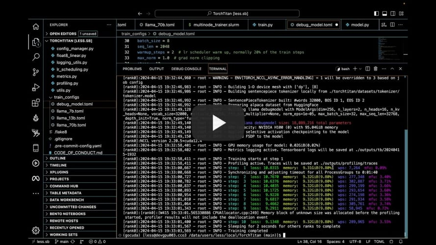

# torchtitan

`torchtitan` is currently in a pre-release state and under extensive development.

`torchtitan` is a proof-of-concept for Large-scale LLM training using native PyTorch. It is (and will continue to be) a repo to showcase PyTorch's latest distributed training features in a clean, minimal codebase. torchtitan is complementary to and not a replacement for any of the great large-scale LLM training codebases such as Megatron, Megablocks, LLM Foundry, Deepspeed, etc. Instead, we hope that the features showcased in torchtitan will be adopted by these codebases quickly. torchtitan is unlikely to ever grow a large community around it.

Here were our guiding principles when building `torchtitan`

* Designed to be easy to understand, use and extend for different training purposes.
* Minimal changes to the model code when applying 1D, 2D, or (soon) 3D Parallel.
* Modular components instead of a monolithic codebase.
* Get started in minutes, not hours!

### Intro video - learn more about torchtitan in under 4 mins:

[](https://youtu.be/ee5DOEqD35I?si=_B94PbVv0V5ZnNKE "Welcome to TorchTrain!")

## Pre-Release Updates:
#### (4/25/2024): `torchtitan` is now public but in a pre-release state and under development.
Currently we showcase pre-training **Llama 3 and Llama 2** LLMs of various sizes from scratch. `torchtitan` is tested and verified with the PyTorch nightly version `torch-2.4.0.dev20240412`. (We recommend latest PyTorch nightly).

Key features available:</br>
1 - [FSDP2 (per param sharding)](docs/fsdp.md) </br>
2 - [Tensor Parallel](https://pytorch.org/docs/stable/distributed.tensor.parallel.html) (FSDP + Tensor Parallel)</br>
3 - Selective layer and operator activation checkpointing </br>
4 - Distributed checkpointing </br>
5 - 2 datasets pre-configured (45K - 144M)</br>
6 - GPU usage, MFU, tokens per second and other metrics all reported and displayed via TensorBoard.</br>
7 - Fused RMSNorm (optional), learning rate scheduler, meta init, and more.</br>
8 - All options easily configured via [toml files](train_configs/).</br>
9 - [Performance](docs/performance.md) verified on 64 A100 GPUs.</br>
10 - [Save pre-trained torchtitan model weights](docs/checkpoint.md) and load directly into [`torchtune`](https://github.com/pytorch/torchtune) for fine tuning. </br>


## Coming soon features:
1 - Async checkpointing </br>
2 - FP8 support </br>
3 - Context Parallel </br>
4 - 3D (Pipeline Parallel) </br>
5 - `torch.compile` support </br>
6 - Scalable data loading solution </br>


## Installation

Install PyTorch from source or install the latest pytorch nightly, then install requirements by

```python
pip install -r requirements.txt
```

### Downloading a tokenizer.model

`torchtitan` currently supports training Llama 3 (8B, 70B), and Llama 2 (7B, 13B, 70B) out of the box. To get started training these models, we need to download a tokenizer.model. Follow the instructions on the official [meta-llama](https://huggingface.co/meta-llama/Meta-Llama-3-8B) repository to ensure you have access to the Llama model weights.

Once you have confirmed access, you can run the following command to download the Llama 3 / Llama 2 tokenizer to your local machine.

```
# pass your hf_token in order to download tokenizer.model

# llama3 tokenizer.model
python torchtitan/datasets/download_tokenizer.py --repo_id meta-llama/Meta-Llama-3-8B --tokenizer_path "original" --hf_token=...

# llama2 tokenizer.model
python torchtitan/datasets/download_tokenizer.py --repo_id meta-llama/Llama-2-13b-hf --hf_token=...
```

Run Llama 3 8B model locally on 8 GPUs:

```
CONFIG_FILE="./train_configs/llama3_8b.toml" ./run_llama_train.sh
```


## TensorBoard

To visualize TensorBoard metrics of models trained on a remote server via a local web browser:

1. Make sure `metrics.enable_tensorboard` option is set to true in model training (either from a .toml file or from CLI).

2. Set up SSH tunneling, by running the following from local CLI
```
ssh -L 6006:127.0.0.1:6006 [username]@[hostname]
```

3. Inside the SSH tunnel that logged into the remote server, go to the torchtitan repo, and start the TensorBoard backend
```
tensorboard --logdir=./outputs/tb
```

4. In the local web browser, go to the URL it provides OR to http://localhost:6006/.


## Multi-Node Training
For training on ParallelCluster/Slurm type configurations, you can use the multinode_trainer.slurm file to submit your sbatch job.</br>
Note that you will need to adjust the number of nodes and gpu count to your cluster configs.</br>
<b>To adjust total nodes:</b>
```
#SBATCH --ntasks=2
#SBATCH --nodes=2
```
should both be set to your total node count.
Then update the srun launch parameters to match:
```
srun torchrun --nnodes 2
```
where nnodes is your total node count, matching the sbatch node count above.

<b>To adjust gpu count per node:</b>

If your gpu count per node is not 8, adjust:

```--nproc_per_node```

 in the torchrun command and

```#SBATCH --gpus-per-task```

in the SBATCH command section.

## License

This code is made available under [BSD 3 license](./LICENSE). However you may have other legal obligations that govern your use of other content, such as the terms of service for third-party models, data, etc.
