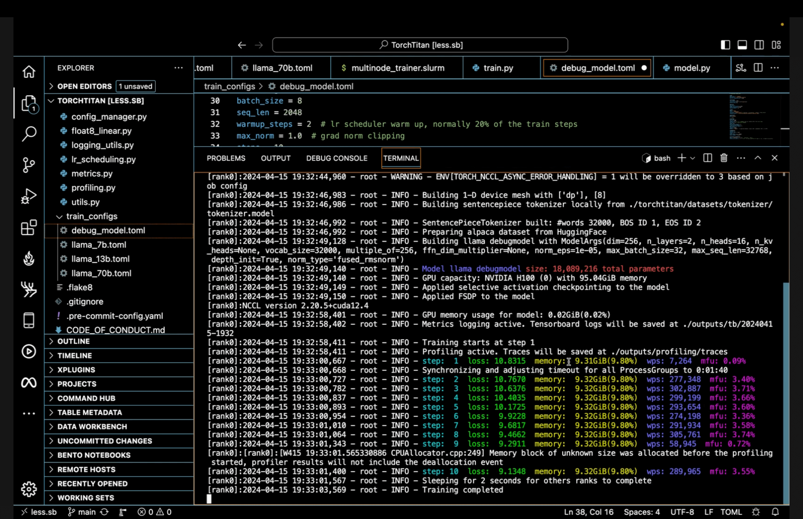

<div align="center">

# torchtitan

#### A PyTorch native library for large-scale model training

[](https://github.com/pytorch/torchtitan/actions/workflows/integration_test_8gpu.yaml?query=branch%3Amain)
[](https://arxiv.org/abs/2410.06511)
[](docs/)
[](https://discuss.pytorch.org/c/distributed/torchtitan/44)
[](./LICENSE)

</div>

`torchtitan` is currently in a pre-release state and under extensive development. Currently we showcase pre-training **Llama 3.1** LLMs of various sizes from scratch. To use the latest features of `torchtitan`, we recommend using the most recent PyTorch nightly.

## Overview

`torchtitan` is a proof-of-concept for large-scale LLM training using native PyTorch. It is (and will continue to be) a repo to showcase PyTorch's latest distributed training features in a clean, minimal codebase. `torchtitan` is complementary to and not a replacement for any of the great large-scale LLM training codebases such as Megatron, MegaBlocks, LLM Foundry, DeepSpeed, etc. Instead, we hope that the features showcased in `torchtitan` will be adopted by these codebases quickly. `torchtitan` is unlikely to ever grow a large community around it.

Our guiding principles when building `torchtitan`:

* Designed to be easy to understand, use and extend for different training purposes.
* Minimal changes to the model code when applying multi-dimensional parallelism.
* Modular components instead of a monolithic codebase.
* Get started in minutes, not hours!

### Intro video - learn more about `torchtitan` in under 4 mins

[](https://youtu.be/ee5DOEqD35I?si=_B94PbVv0V5ZnNKE "Welcome to torchtitan!")

### Key features available

1. Multi-dimensional composable parallelisms
   - [FSDP2](docs/fsdp.md) with per-parameter sharding
   - [Tensor Parallel](https://pytorch.org/docs/stable/distributed.tensor.parallel.html) (including [async TP](https://discuss.pytorch.org/t/distributed-w-torchtitan-introducing-async-tensor-parallelism-in-pytorch/209487))
   - [Pipeline Parallel](https://discuss.pytorch.org/t/distributed-w-torchtitan-training-with-zero-bubble-pipeline-parallelism/214420)
   - [Context Parallel](https://discuss.pytorch.org/t/distributed-w-torchtitan-breaking-barriers-training-long-context-llms-with-1m-sequence-length-in-pytorch-using-context-parallel/215082)
2. Selective layer and operator activation checkpointing
3. [Distributed checkpointing](https://discuss.pytorch.org/t/distributed-w-torchtitan-optimizing-checkpointing-efficiency-with-pytorch-dcp/211250) (including async checkpointing)
   - [Interoperable checkpoints](docs/checkpoint.md) which can be loaded directly into [`torchtune`](https://github.com/pytorch/torchtune) for fine-tuning
4. `torch.compile` support
5. [Float8](https://discuss.pytorch.org/t/distributed-w-torchtitan-enabling-float8-all-gather-in-fsdp2/209323) support ([how-to](docs/float8.md))
6. DDP and HSDP
7. Checkpointable data-loading, with the C4 dataset pre-configured (144M entries) and support for [custom datasets](docs/datasets.md)
8. Learning rate scheduler, meta-init, (optional) fused RMSNorm kernel
9. Loss, GPU memory, throughput (tokens/sec), and MFU displayed and logged via [Tensorboard or Weights & Biases](/docs/metrics.md)
10. [Debugging tools](docs/debugging.md) including CPU/GPU profiling, memory profiling, Flight Recorder, etc.
11. All options easily configured via [toml files](train_configs/)
12. [Helper scripts](scripts/) to
    - convert original Llama 3 checkpoints into the expected DCP format
    - estimate FSDP/HSDP memory usage without materializing the model
    - run distributed inference with Tensor Parallel

We report [performance](docs/performance.md) on up to 512 GPUs, and verify [loss converging](docs/converging.md) correctness of various techniques.

### Dive into the code

You may want to see how the model is defined or how parallelism techniques are applied. For a guided tour, see these files first:
* [train.py](train.py) - the main training loop and high-level setup code
* [torchtitan/parallelisms/parallelize_llama.py](torchtitan/parallelisms/parallelize_llama.py) - helpers for applying Data Parallel, Tensor Parallel, activation checkpointing, and `torch.compile` to the model
* [torchtitan/parallelisms/pipeline_llama.py](torchtitan/parallelisms/pipeline_llama.py) - helpers for applying Pipeline Parallel to the model
* [torchtitan/checkpoint.py](torchtitan/checkpoint.py) - utils for saving/loading distributed checkpoints
* [torchtitan/float8.py](torchtitan/float8.py) - utils for applying Float8 techniques
* [torchtitan/models/llama/model.py](torchtitan/models/llama/model.py) - the Llama 3.1 model definition


## Installation

```bash
git clone https://github.com/pytorch/torchtitan
cd torchtitan
pip install -r requirements.txt
pip3 install --pre torch --index-url https://download.pytorch.org/whl/nightly/cu124 --force-reinstall
```

### Downloading a tokenizer

`torchtitan` currently supports training Llama 3.1 (8B, 70B, 405B) out of the box. To get started training these models, we need to download a tokenizer.model. Follow the instructions on the official [meta-llama](https://huggingface.co/meta-llama/Llama-3.1-8B) repository to ensure you have access to the Llama model weights.

Once you have confirmed access, you can run the following command to download the Llama 3.1 tokenizer to your local machine.

```bash
# Get your HF token from https://huggingface.co/settings/tokens

# Llama 3.1 tokenizer.model
python torchtitan/datasets/download_tokenizer.py --repo_id meta-llama/Meta-Llama-3.1-8B --tokenizer_path "original" --hf_token=...
```

### Start a training run
Llama 3 8B model locally on 8 GPUs

```bash
CONFIG_FILE="./train_configs/llama3_8b.toml" ./run_llama_train.sh
```

### Multi-Node Training
For training on ParallelCluster/Slurm type configurations, you can use the `multinode_trainer.slurm` file to submit your sbatch job.

To get started adjust the number of nodes and GPUs
```
#SBATCH --ntasks=2
#SBATCH --nodes=2
```

Then start a run where `nnodes` is your total node count, matching the sbatch node count above.

```
srun torchrun --nnodes 2
```

If your gpu count per node is not 8, adjust `--nproc_per_node` in the torchrun command and `#SBATCH --gpus-per-task` in the SBATCH command section.

## Citation

We provide a detailed look into the parallelisms and optimizations available in `torchtitan`, along with summary advice on when to use various techniques:  [TorchTitan: One-stop PyTorch native solution for production ready LLM pre-training](https://arxiv.org/abs/2410.06511).
```
@misc{torchtitan,
      title={TorchTitan: One-stop PyTorch native solution for production ready LLM pre-training},
      author={Wanchao Liang and Tianyu Liu and Less Wright and Will Constable and Andrew Gu and Chien-Chin Huang and Iris Zhang and Wei Feng and Howard Huang and Junjie Wang and Sanket Purandare and Gokul Nadathur and Stratos Idreos},
      year={2024},
      eprint={2410.06511},
      archivePrefix={arXiv},
      primaryClass={cs.CL},
      url={https://arxiv.org/abs/2410.06511},
}
```

## License

This code is made available under [BSD 3 license](./LICENSE). However you may have other legal obligations that govern your use of other content, such as the terms of service for third-party models, data, etc.
