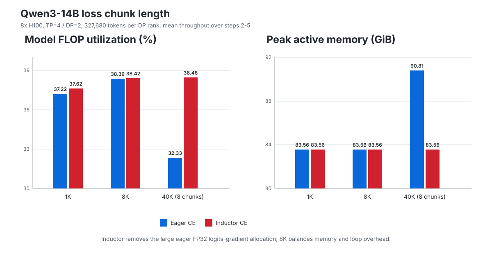

# Chunked loss

`ChunkedLossWrapper.Config.chunk_len` bounds the number of tokens processed by
the LM head and loss at once. The default is 8,192 tokens.

The following measurements used Qwen3-14B on 8 H100 GPUs with TP=4, DP=2,
327,680 tokens per DP rank, variable-length attention, full activation
checkpointing, and a maximum context length of 8,192. Throughput is the mean of
steps 2-5; step 1 includes warmup, and no checkpoint was written at step 5.
The Inductor runs compile the cross-entropy loss, not the LM head.

| Loss chunking | Eager MFU | Inductor MFU | Eager tokens/s | Inductor tokens/s | Eager / Inductor peak active |
| --- | ---: | ---: | ---: | ---: | ---: |
| 1,024 tokens | 37.22% | 37.62% | 3,537 | 3,575 | 83.56 / 83.56 GiB |
| 8,192 tokens | 38.39% | 38.42% | 3,648 | 3,651 | 83.56 / 83.56 GiB |
| 8 chunks (40,960 tokens) | 32.33% | 38.46% | 3,072 | 3,655 | 90.81 / 83.56 GiB |

Moving eager loss chunking from 8 chunks to 8,192 tokens raises MFU by 6.06
points and lowers peak active memory by 7.25 GiB. The 40,960-token eager loss
rewrites cross-entropy backward into a logits-shaped FP32 expression with a
5.80 GiB allocation; Inductor fuses that expression and eliminates the
allocation. A length of 8,192 keeps the loss below the model's peak while
avoiding the additional loop and collective overhead of 1,024-token chunks. A
16,384-token chunk was not measured.
