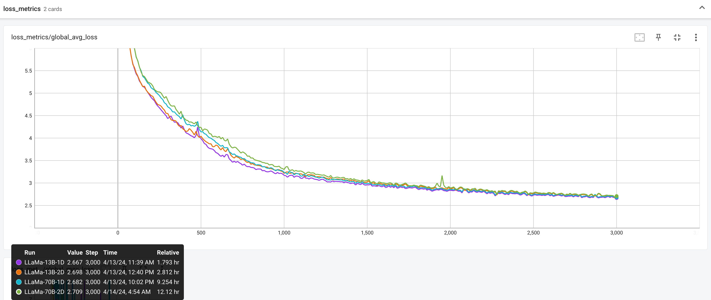

This note clarifies the recommended practices to follow when testing the loss converging of a new feature.

### Disclaimers
1. We assume the vanilla 1D FSDP to be “correct”, and would serve as the baseline for comparisons. The correctness of FSDP can be verified by comparing with DDP on small models, which has been widely adopted and believed to be correct.

2. The focus is on the correctness of new distributed training techniques. For a new model size / architecture, the demonstration of loss-converging is not in the scope of this note.

3. Different tests can be run with different random seeds, as
    - It’s closer to the production environment.
    - One anyway cannot hope to achieve exact reproducibility when working with different distributed settings[^1][^2].

## Guidelines

To validate the correctness of a distributed training technique, one should try to **keep the determinism in the input data to minimize the differences it could cause**. To make sure the global batch size and in general #tokens per iteration stay the same, one can fix the local batch size (`training.batch_size`) in the toml config, and at the same time fix the data parallel degree.

If the technique is a parallelism (TP/PP/CP/etc)
- The control set is a 1D FSDP job on `dp` GPUs (or any other verified setups), with a trusted training config (e.g. those under train_configs).
- The minimal test set is a 2D job on `dp*p` GPUs, where `p >= 2` is the degree of the experimented parallelism.
  - For some parallelisms, larger `p` may cause larger discrepancies in numeric due to various reasons. For example, current implementation of CP uses `torch.bfloat16` (under default mixed precision training configs) when accumulating intermediate results. A higher `p` is desired to ensure the parallelism works properly, at the cost of more hardware resources.
  - Certain parallelisms may impose additional requirements on the batch size. For instance, PP requires local batch size to be at least the number of microbatches (or equivalently, the number of pipeline stages) to reduce bubbles. A valid comparison example would be 1D FSDP on N GPUs with local batch size 8, and 2D FSDP + PP on 4N GPUs (DP N, PP 4) with Interleaved 1F1B schedule (also with local batch size 8), where each PP rank gets two pipeline stages.
- N-D parallelisms should be tested on more (e.g. `dp*tp*pp*cp*p`) GPUs.
  - For mutually compatible parallelisms, one can assume the converging of a higher dimensional combination implies that of a lower dimensional subset. For example, in order to verify the converging of FSDP, TP, PP, and CP, in principle one can just run two jobs, the control set being 1D FSDP and the test set being 4D including all.
  - A lower dimensional combination can be helpful for enlarging the degrees of some parallelisms and for debugging purposes in general.

If the technique is not a parallelism
- The control set is a 1D FSDP job on `dp` GPUs (or any other verified setups), without the technique enabled.
  - One may argue that to test an optimization technique for other / higher dimensional parallelism, we could directly use that parallelism as the control set. E.g. to test Async TP, the baseline could be the verified 2D FSDP + TP. We use 1D FSDP for two reasons: (1) in general loss-converging correctness should be transitive; and (2) depending on the definition of correctness, small discrepancies are sometimes acceptable (e.g. due to randomness, mixed precision, etc.), but the discrepancies could add up to be unacceptable after many transitive links.
- The minimal test set is a job with the technique, on top of proper parallelisms & training techniques. For example:
  - For Async TP, the basic test set is a FSDP + TP + `torch.compile` job on `dp*tp` GPUs.
  - For a PP schedule, the basic test is a FSDP + PP job on on `dp*pp` GPUs.
- Similar to parallelism testing, maximal composability should be tested on multi-dimensional parallelism settings, with multiple optimization techniques enabled.

## Example

This is a series of loss-converging tests covering both parallelisms and training optimizations.
Results are obtained on 2025/01/21, with the latest `torch`, `torchao`, and `torchtitan`.

### Setup
- Base config: [train_configs/llama3_8b.toml](../train_configs/llama3_8b.toml)
- `training.batch_size = 4`, which is a minimum for Pipeline Parallel with `pipeline_parallel_degree = 2` and `pipeline_parallel_schedule = "Interleaved1F1B"`
- `training.data_parallel_shard_degree = 8`, resulting in global batch size 32
- `training.steps = 3000`, `training.warmup_steps = 600`

| Parallelism | Techniques | Remarks |
| ----- | ----- | ----- |
| FSDP 8 | default | 1D control set |
| FSDP 8, TP 2, PP 2 | torch.compile, Float8, async TP | 3D test set |
| FSDP 8, TP 2, CP 2, PP 2 | torch.compile, Float8, async TP, Interleaved 1F1B | 4D test set |
| FSDP 8, CP 8 | default | to verify CP with a larger degree |

### Test results

[^1]: Model initialization in a sharded setting can hardly match that in a single-device setting (or a differently sharded setting), because each time a random operator is called, the underlying RNG state offset is advanced by a quantized amount, often not aligned with the amount of randomness needed, thus “wasting” different amount of randomness on differently sharded settings.

[^2]: With a seed checkpoint, one can guarantee that the model initialization matches across different distributed jobs. But still, it’s hard to obtain identical results due to (1) other random ops in the model due to similar reasons as above, and (2) subtle differences in accumulation orders in computation.
