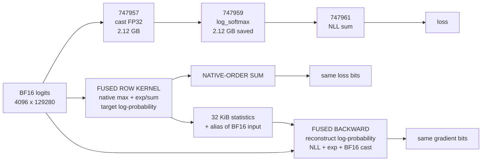
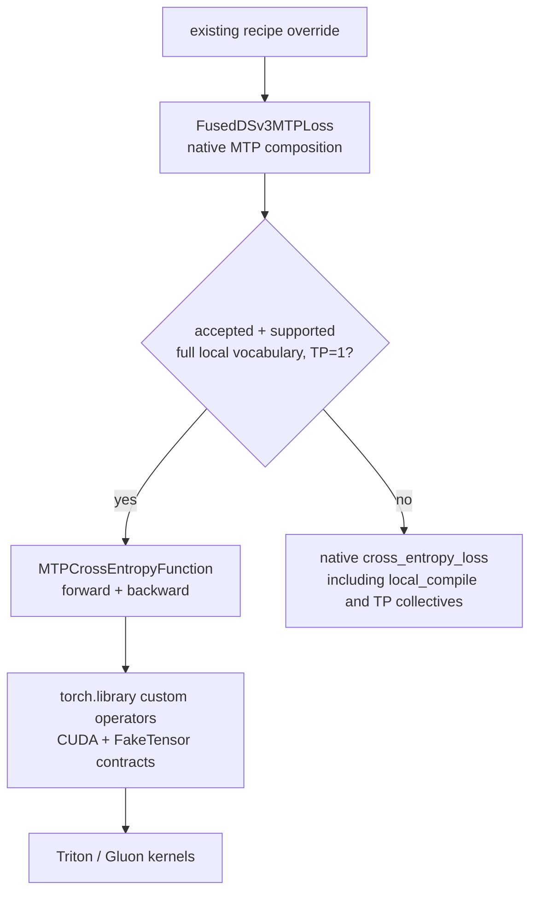

# DSv3 MTP cross entropy

**Experimental: bitwise parity and memory pass; forward misses the 90% roofline
gate.** `ACCEPTED = False` keeps model dispatch on native cross entropy.



The handoff's **747954** is `MTPLoss._compute_chunked_loss_term`; **747955** is
its cross-entropy call. Views **747956/747958** flatten predictions
`[1,4096,129280]` and labels `[1,4096]` into `[4096,129280]` and `[4096]`.
**747960** is the saved log-probability alias. Logits are contiguous BF16,
labels int64, with `weight=None`, `reduction="sum"`, and `ignore_index=-100`.

The public checkout now composes `ChunkedLossWrapper` with `MTPLoss`.
[The override](../torchtitan_recipes/overrides/fused_dsv3_mtp_loss.py) replaces
only `MTPLoss.fn`, the raw CE callback. Native MTP weighting, each depth's token
denominator, label alignment, metrics, chunking, and `lm_head` remain in place.
There are no new parameters or checkpoint keys.



The operator layer is
[`_dsv3_mtp_cross_entropy/ops.py`](../torchtitan_recipes/overrides/_dsv3_mtp_cross_entropy/ops.py).
Device code is in
[`kernels.py`](../torchtitan_recipes/overrides/_dsv3_mtp_cross_entropy/kernels.py)
and [`ce_exp.py`](../torchtitan_recipes/overrides/_dsv3_mtp_cross_entropy/ce_exp.py).
This fourth override needs no CUDA C++ extension build.

Forward preserves ATen's 1024 virtual lanes, four-element loads, sequential
accumulators, warp trees, and separate scalar NLL reduction. Backward preserves
FP32 subtraction boundaries, exponential rounding, FMA, and the BF16 cast.
Saved state is the original logits and labels by alias, plus two FP32 values
per row. The temporary target vector is 16 KiB; saved statistics are 32 KiB.

**Current-runtime measurements**, milliseconds per complete local loss region:

| Phase | Native | Fused | Speedup | Worst-round p90 roof |
| --- | ---: | ---: | ---: | ---: |
| Forward | 1.757 | 0.242 | 7.26x | 68.1%, fail |
| Backward | 1.984 | 0.311 | 6.38x | 94.4%, pass |
| Forward + backward | 3.734 | 0.554 | 6.74x | 79.5%, fail |

Peak allocated memory for F+B is **6.90 -> 1.97 GiB**, including input and
returned gradient. Reserved and CUDA graph private-pool memory also decrease.
Forward launches **3 -> 2** kernels. Backward launches **3 kernels + 1 memset
-> 1 kernel** on this runtime. Forward/backward compiler metadata is **60/79
registers, 0/0 spills, 128/0 shared-memory bytes**.

Measured on GB300, Torch `2.16.0.dev20261007+cu130`, CUDA 13.0, Triton `3.9.0`.
These are fresh public-checkout timings; the handoff's older fbpackage has a
different native baseline. They are not full-model training-step timings.

Each CUDA graph captures eight complete operations. Ten replay warmups precede
40 timed samples in each of two rounds with reversed native/fused order.
Reported medians pool both rounds. Input storage alone exceeds twice L2.
Backward preparation is outside backward-only timing; F+B includes fresh
autograd gradients with upstream `0.1 / (32 * 4095 * 128)`.

Independent same-GPU controls measure **7.199 TB/s HBM**, **76.28 TFLOP/s FP32**,
and **3.200 trillion exp/s**. The necessary roof uses required I/O, FP32 work,
exp counts, and launch latency, without credit for eliminated intermediates.
Acceptance requires at least 90% at p90, CV at most 5%, and consistent
calibration. Reduction and mixed-pipeline limits are not separately certified.

**Usage and contract**

```bash
--override torchtitan_recipes.overrides.fused_dsv3_mtp_loss.fused_dsv3_mtp_loss
```

The factory selects the loss inside the existing recipe's chunk wrapper and
preserves its settings. It warns that the acceptance gate is closed. Merely
selecting this override does not enable the experimental kernel. TP>1 keeps
native vocabulary-parallel CE, including all three forward all-reduces.
DP/CP token partitions are supported; local and global SPMD typechecks are tested.

Direct experimental measurement bypasses the model's acceptance gate:

```python
from torchtitan_recipes.overrides._dsv3_mtp_cross_entropy.ops import cross_entropy_sum

loss = cross_entropy_sum(pred.flatten(0, 1), labels.flatten(0, 1))
loss.backward()
```

Model dispatch requires contiguous `[4096,129280]` BF16 logits and `[4096]`
int64 labels on the exact validated GB300 runtime. Direct tests also cover
smaller positive token counts through 4096. Labels must be valid vocabulary
IDs or the ignore index. Autograd is first-order only. Unsupported shapes,
dtypes, layouts, devices, runtimes, vocabulary shards, and reductions use the
native model path.

**Validation**

**53 CE tests pass; 217 tests and 22 subtests pass across the four-commit stack.**

CPU tests cover config selection, preserved MTP/chunk settings, the closed
acceptance gate, native fallback, and reduction/error behavior. GPU tests check
raw loss/gradient bits at production shape with four seeds including 42,
FP32 intermediate boundaries, signed zeros, nonfinite values, ignored labels,
large int64 ignore indices, saved aliases, retained backward, FakeTensor
metadata, fullgraph compilation, and CUDA graph replay. The packed exponential
matches libdevice on 8,388,608 dense-range values and 16,777,216 random IEEE
patterns.

Integration tests temporarily open the gate to exercise the candidate. They
compare multi-depth MTP loss and gradients, zero/clamped denominators, chunked
hidden and `lm_head` gradients, local/global SPMD types, and the native TP
collective sequence. These test patches do not change the shipped gate.

```bash
python -m pytest --import-mode=importlib \
  tests/unit_tests/cpu/test_fused_dsv3_mtp_loss.py \
  tests/unit_tests/gpu/test_fused_dsv3_mtp_loss.py
python -m benchmarks.calibrate_dsv3_mtp_loss
python -m benchmarks.fused_dsv3_mtp_loss
```

Benchmarks write JSON with raw samples, source hashes, device UUID, profiles,
memory, and compiler metadata under `results/fused_dsv3_mtp_loss/` by default.
Keep the calibration and candidate on the same physical GPU and idle device.
