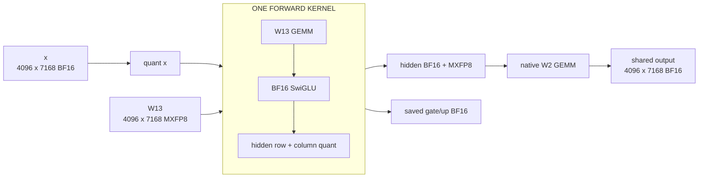
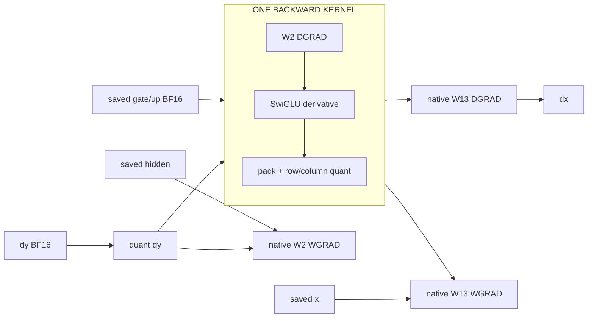

# DSv3 shared-expert GEMM epilogues

An opt-in port of the `MOE_SHARED_EXPERT_89685_HANDOFF.md` experiment to the
public TorchTitan override API. **Experimental: the 90% roofline gate fails.**
Both flags default off and `ACCEPTED = False`.





Original capture: `layers.25.moe.shared_experts`, wrapper **89685**, with
**89699 + 89707 + 89715** fused. Input quantization **89691** and W2 **89723**
remain. Backward nodes are identified by dependencies, not IDs from other
exports. Routed experts and the outer routed/shared/residual additions remain
in their existing modules.

| Boundary | Shape | Dtype/layout |
| --- | --- | --- |
| x, output, dy, dx | `[4096,7168]` or `[1,4096,7168]` | contiguous BF16 |
| W13 parameter | `[2,2048,7168]` | native BF16 compute wrapper |
| W13 prepared payload | `[4096,7168]` | E4M3; flattened stacked weight |
| W2 parameter/payload | `[7168,2048]` | BF16 / E4M3 |
| Saved gate/up | `[4096,4096]` | BF16, gate then up |
| Hidden payloads | `[4096,2048]` | E4M3, strides `(2048,1)` / `(1,4096)` |
| Hidden scales, each | `[262144]` | blocked E8M0 |
| Packed-gradient payloads | `[4096,4096]` | E4M3, strides `(4096,1)` / `(1,4096)` |
| Packed-gradient scales, each | `[524288]` | blocked E8M0 |

The physical W13 parameter keeps the public model's stacked checkpoint shape.
Both weight gradients use the native GEMMs and `grad_dtype`, including native
in-place accumulation. The selected BF16/MXFP8 activation-save policies are
preserved. `prepared_input` means quantized **x**; hidden operands are separate.

## Integration

The recipe must already select **MXFP8 linears and the existing `FusedSwiGLU`**.
Ordinary `SwiGLU` has different rounding and is left native. Configure the
existing activation during recipe construction, then apply the parent override:

```python
from torchtitan.config import apply_overrides, OverrideConfig

apply_overrides(
    OverrideConfig(imports=[(
        "torchtitan_recipes.overrides.fused_dsv3_shared_expert.fused_dsv3_shared_expert",
        {"forward_quant": True, "backward_quant": True},
    )]),
    model_config,
)
```

Equivalent CLI, after that recipe preparation:

```bash
--override 'torchtitan_recipes.overrides.fused_dsv3_shared_expert.fused_dsv3_shared_expert={"forward_quant":true,"backward_quant":true}'
```

Choose forward only, backward only, or both independently. The factory claims
only `*.moe.shared_experts`; it composes with either router/loss override in
this stack. Do not also claim a child activation in the same override pass.

The public entry point selects the module. `_dsv3_shared_expert/ops.py` defines
the custom operators and FakeTensor contracts; `autograd.py` implements
`FusedDSv3SharedExpertFunction`; `kernels/` contains Triton/Gluon device code.
No CUDA C++ extension build is needed for this third override.
W13/SwiGLU/hidden quantization is prepared before `.apply()`; the Function
runs inside the normal W2 call and owns backward for the complete shared FFN.

Fast path: GB300, training, this exact BF16 shape, MXFP8 without bias, TP=CP=1,
no autocast or observable user hooks. Other inputs use the native modules.
An independently FSDP-wrapped W13 or selective remat policy also uses native
linear boundaries. W2 is called normally, after its unshard hook. Prepared
FP8 operands stay outside FSDP's recursive input cast. A dependency-only
autograd view preserves W2-before-W13 gradient-hook ordering; the full FFN
Function computes the gradients. Undefined gradients stay undefined, avoiding
a bookkeeping zero-fill. No collective or parallelism setting changes.

## Measurements and limits

GB300, PyTorch `2.16.0.dev20261007+cu130`, TorchAO
`0.19.0.dev20261007+cu130`, Triton `3.9.0`. This uses the **public stack's native
MXFP8 + FusedSwiGLU baseline**. It is not a timing of the older pinned fbpackage.

The port inherits native floating-point contraction and matches public
TorchAO's NaN propagation. Those differ from the older handoff runtime;
silently reusing its arithmetic or timing numbers would be incorrect.

Streaming medians, microseconds per complete shared FFN:

| Mode | Forward | Backward | Forward + backward |
| --- | ---: | ---: | ---: |
| Native | 161.21 | 318.95 | 480.64 |
| Forward fused | 152.31 | 318.07 | 473.64 |
| Backward fused | 160.68 | 312.28 | 474.04 |
| Both fused | 152.55 | 311.53 | 468.42 |

Both fusions reduce streaming F+B by **2.54%**.

Five independent banks exceed twice L2; 30 samples in each of two reversed-order
rounds follow graph warmup. All activation quantization, saves, dx, and both
WGRADs are included. Weight preparation, collectives and fake-loss construction
are outside the timing. Backward retains its forward graph; gradients are fresh.
The benchmark reports raw samples, touched saved storage, graph-pool reservations
and peak allocated memory. These are shared-FFN times, not full-model TPS.

Public launch counts: forward **8 -> 4**, backward **13 -> 9**, with W13's BF16
save policy and W2's MXFP8 save policy. Public TorchAO uses separate scale-swizzle
kernels, and public SwiGLU backward already packs its output; the pinned
handoff's **5 -> 3 / 8 -> 5** counts therefore do not describe this runtime.

Independent same-GPU compute/HBM/launch controls give p90 roof fractions
**81.3% forward / 61.2% backward**. Both fail 90%; combined SFU/conversion
throughput and real distributed scaling remain unqualified. Do not add these
savings to overlapping GEMM/SwiGLU fusions.

Compiler metadata: forward 160 registers, 0 spills; backward 144 registers, 8 spills.
Both use 384 threads per CTA; the benchmark records shared-memory and graph-pool sizes.

```bash
python -m pytest --import-mode=importlib \
  tests/unit_tests/cpu/test_fused_dsv3_shared_expert.py \
  tests/unit_tests/gpu/test_fused_dsv3_shared_expert.py \
  tests/unit_tests/gpu/test_fused_dsv3_shared_expert_fsdp.py
python -m benchmarks.fused_dsv3_shared_expert \
  --output shared-expert.json --banks 5 --samples 30 --rounds 2 --profiles
```

**135 tests and 22 subtests pass across the full stack**, including 52 tests
for this shared-expert override. Tests compare raw BF16/FP8/E8M0 bits,
including all 65,536 BF16 patterns, both ordered and shuffled, in the
quantizer; cover all gradient paths, FP32 gradient accumulation, frozen operands,
strided upstream values, retained backward, prepared x, hooks, checkpointing,
compilation, CUDA replay with updated inputs/upstream gradients, and exact fake layouts. FakePG tests at ranks 0/127 check FSDP128
refill, gradient synchronization and collective ordering. Their zero buffers
prove lifecycle behavior; separate nonzero tests establish numerical parity.

Local SPMD types match native. Global typechecking in this runtime is blocked
even for the native MXFP8 layer by TorchAO's missing
`triton_mx_block_rearrange` sharding strategy; it is not a validated scaling run.
