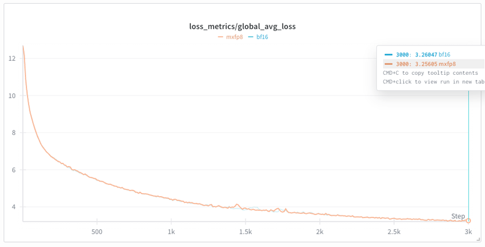

## MXFP8 Training on B200 GPUs

MXFP8 training can provide substantial training speedups for models where the majority of GEMMs are sufficiently large. MXFP8 is a microscaling format from the [MX OCP spec](https://www.opencompute.org/documents/ocp-microscaling-formats-mx-v1-0-spec-final-pdf) that uses block-based scaling to maintain numerical accuracy while leveraging low-precision tensor cores. On NVIDIA B200 GPUs, MXFP8 training achieves up to **28% speedup** over bfloat16 baseline with minimal accuracy degradation.

> **📖 For a comprehensive case study of using TorchTitan MXFP8 to train dense models at scale**, see our blog post: [Accelerating 2K+ Scale Pre-training up to 1.28x with TorchAO MXFP8 and TorchTitan on Crusoe B200 Cluster](https://pytorch.org/blog/accelerating-2k-scale-pre-training-up-to-1-28x-with-torchao-mxfp8-and-torchtitan-on-crusoe-b200-cluster/)

### Table of Contents

- [Requirements](#requirements)
- [How MXFP8 Works](#how-mxfp8-works)
- [MXFP8 for Linear Modules](#mxfp8-for-linear-modules)
  - [Usage](#usage)
- [MXFP8 for Grouped GEMMs (MoE)](#mxfp8-for-grouped-gemms-moe)
  - [Usage](#usage-1)
- [Example Python Configuration](#example-python-configuration)
- [Performance](#performance)
  - [Dense Models](#dense-models)
  - [MoE models](#moe-models)
- [Composability](#composability)
- [Known Limitations](#known-limitations)
- [Additional Resources](#additional-resources)

### Requirements

- NVIDIA B200 (SM100 or SM100a)
- PyTorch nightly
- TorchAO v0.14.0 or newer ([TorchAO Installation Guide](https://github.com/pytorch/ao#installation))

Note: GB200 is also supported but requires building torchao from source (see installation guide above).

### How MXFP8 Works

MXFP8 differs from standard Float8 training in its scaling approach:

- **Granular scaling factor**: Instead of using a single scale factor per tensor (tensorwise) or per row/column (rowwise), MXFP8 uses a more granular, block-based scaling with a default block size of 1x32 elements. Each block of 32 elements shares a common scale factor. The data dtype is `torch.float8_e4m3fn`, and the scale factor dtype is `torch.float8_e8mfnu`.
- **Native hardware support**: On NVIDIA B200 (Blackwell) GPUs, MXFP8 GEMMs and Grouped GEMMs are accelerated using cuBLAS and CUTLASS kernels exposed via `torch._scaled_mm` and `torch._scaled_grouped_mm`, achieving up to 2x speedup over bfloat16 on common shapes.
- **Dynamic quantization**: For every MXFP8 Linear or Grouped GEMM, activations and weights are dynamically quantized to MXFP8, then a MXFP8 GEMM/Grouped GEMM is performed, resulting in a net speedup.

### MXFP8 for Linear Modules

#### Usage

To enable MXFP8 training for linear layers, configure it in your config_registry function:

```python
from torchtitan.components.quantization.mx import MXLinearConverter
from torchtitan.protocols.model_converter import ModelConvertersContainer

# In your config_registry function:
model_converters=ModelConvertersContainer.Config(
    converters=[
        MXLinearConverter.Config(recipe_name="mxfp8_cublas"),
    ],
),
compile=CompileConfig(enable=True),
```

**Configuration Options:**

* `recipe_name="mxfp8_cublas"`: Use the cuBLAS-based MXFP8 recipe for best performance on B200 GPUs. Alternative: `"mxfp8_cublas_rceil"` uses round-ceiling mode for scale calculation.
* `mxfp8_dim1_cast_kernel_choice="triton"`: Choose the kernel for dimension-1 quantization. Options: `"triton"` (default), `"cuda"`, or `"torch"`.
* `filter_fqns` (optional): List of fully qualified names of modules not to convert to MXFP8 training.
  * Example: `filter_fqns=["attention.wq", "attention.wk", "attention.wv", "output"]`
  * This allows you to selectively apply MXFP8 only to layers that will benefit from it.
* `compile.enable` (required for competitive performance): Use `torch.compile` to fuse the MXFP8 scaling/casting kernels.

**Hardware Requirements:**

MXFP8 training requires NVIDIA B200 (SM100) or newer GPUs.

### MXFP8 for Grouped GEMMs (MoE)

For Mixture-of-Experts (MoE) models, MXFP8 can accelerate the expert computation through dynamically quantized grouped GEMMs.

#### Usage

To enable MXFP8 for MoE expert layers, configure it in your config_registry function:

```python
from torchtitan.components.quantization.mx import MXGroupedMMConverter
from torchtitan.protocols.model_converter import ModelConvertersContainer

# In your config_registry function:
model_converters=ModelConvertersContainer.Config(
    converters=[
        MXGroupedMMConverter.Config(fqns=["experts"], recipe_name="mxfp8"),
    ],
    print_after_conversion=True,
),
compile=CompileConfig(enable=True),
```

**Combined usage**: You can use MXFP8 for both linear modules and grouped GEMMs simultaneously by specifying both converters:
  ```python
  from torchtitan.components.quantization.mx import MXLinearConverter, MXGroupedMMConverter

  converters=[
      MXLinearConverter.Config(recipe_name="mxfp8_cublas"),
      MXGroupedMMConverter.Config(fqns=["experts"], recipe_name="mxfp8"),
  ]
  ```

**Configuration Options:**

* `fqns`: List of fully qualified names of MoE modules to apply MXFP8 dynamic quantization on grouped GEMM operations. Any module that matches the FQN will be converted, if it has (1) experts represented as 3d nn.Parameter instances (which is the case for TorchTitan MoEs), and (2) a `torch._grouped_mm` op performs the actual routed expert computation using those 3d expert weights.
  * You can specify multiple FQNs to target different MoE layers in your model.
* `recipe_name="mxfp8"`: Quantization recipe for grouped GEMMs (currently only `"mxfp8"` is supported).
* `compile.enable`: Use `torch.compile` for best performance.

**Important Notes:**

* **Token group alignment**: For MoE training with MXFP8, token group sizes must be multiples of 32 (the MXFP8 block size). This is automatically configured [here](https://github.com/pytorch/torchtitan/blob/b39377f9fe33865fefb9bf64a33f6d74a598be87/torchtitan/components/quantization/mx.py#L131) when you enable MXFP8 grouped GEMMs in TorchTitan.

* **torch.compile recommendation**: All benchmarks in this document were run with `torch.compile` enabled. We recommend using `torch.compile` for best performance.

### Example Python Configuration

Here's an example configuration for MXFP8 training in a config_registry function:

```python
from torchtitan.components.quantization.mx import MXLinearConverter, MXGroupedMMConverter
from torchtitan.protocols.model_converter import ModelConvertersContainer

# In your config_registry function:
model_converters=ModelConvertersContainer.Config(
    converters=[
        MXLinearConverter.Config(
            recipe_name="mxfp8_cublas",
            mxfp8_dim1_cast_kernel_choice="cuda",
            filter_fqns=["output", "router.gate"],
        ),
        MXGroupedMMConverter.Config(
            recipe_name="mxfp8",
            fqns=["experts"],
        ),
    ],
),
compile=CompileConfig(
    enable=True,
    components=["model"],
),
```

### Performance

#### Dense Models

Single-node training on 8x power limited B200 GPUs, batch size 1, sequence length 8192, steps 100, torch.compile, FSDP2, per-op SAC:

| Scaling Method          | Peak Memory (GB) | Median tokens/s | Speedup over BF16 |
|------------------------|------------------|-----------------|-------------------|
| None (bfloat16)        | 33.71           | 8307.5          | -                 |
| mxfp8_cublas           | 33.88           | 9969.0          | +20.0%            |
| mxfp8_cublas_rceil     | 33.88           | 9642.0          | +16.1%            |
| float8 tensorwise      | 33.38           | 10417.0         | +25.4%            |

- pytorch version: `2.9.0.dev20250815+cu128`
- torchao version: `0.13.0+gite4e681be`
- torchtitan commit: `6fc499f6f5b32151a799188be2208cfb09faed30`

*Source: [TorchAO MX Formats Benchmarks](https://github.com/pytorch/ao/tree/main/torchao/prototype/mx_formats#training-e2e-benchmarks-on-nvidia-b200)*

#### MoE models

512 GPU training on 64 node GB200 cluster:

| Scaling Method          | Median tokens/s | Speedup over BF16 |
|------------------------|-----------------|-------------------|
| None (bfloat16)        | 6169            | -                 |
| mxfp8                  | 7401            | +20.3%            |

Training runs on 64 node GB200 cluster with TorchTitan Llama4 Scout show that MXFP8 MoE training has equivalent convergence to bfloat16 training baseline. In fact, after 3,000 steps it finishes with slightly *lower* loss than bfloat16! This is consistent with our scaling experiments with [MXFP8 training for dense models](https://pytorch.org/blog/accelerating-2k-scale-pre-training-up-to-1-28x-with-torchao-mxfp8-and-torchtitan-on-crusoe-b200-cluster/).



*Training loss curves over 3,000 steps showing MXFP8 achieves equivalent convergence to bfloat16 baseline.*

Training and model configurations for this run:
- Model: Llama4 Scout
- Dataset: C4
- Sequence length: 8192
- Local batch size: 10
- Learning rate: 1e-4
- LR scheduler warmup steps: 2000
- Parallelisms (64 nodes of 4 devices each = 256 chips):
    - FSDP=256 (on attention layers, shared experts, dense layer FFNs) and 256/4=64 (on routed experts)
    - EP=16 (on routed experts)
- Activation checkpointing mode: `none` (ideally this should use selective per op AC but there was a bug at the time preventing us from using it).
- `torch.compile` enabled
- `mxfp8` applied to routed experts computation (grouped GEMMs)
- `mxfp8` applied to all linear layers except: `output`, `router.gate`, `attention.wk`, `attention.wv` (Wk and Wv too small to benefit from mxfp8)

### Composability
For distributed training, MXFP8 is compatible with:
- `torch.compile`
- FSDP2/TP/EP/PP
- Full activation checkpointing

All distributed communication for MXFP8 training is currently done in high precision.

### Known Limitations
- Currently in prototype stage - no BC guarantees.
- Requires torch nightly - important bug fixes have landed since 2.9.1
- For GB200s, requires building torchao from source

### Additional Resources

- [Accelerating 2K+ Scale Pre-training up to 1.28x with TorchAO MXFP8 and TorchTitan on Crusoe B200 Cluster](https://pytorch.org/blog/accelerating-2k-scale-pre-training-up-to-1-28x-with-torchao-mxfp8-and-torchtitan-on-crusoe-b200-cluster/) - Blog post on accelerating dense model training with MXFP8
- [TorchAO MX Formats Documentation](https://github.com/pytorch/ao/tree/main/torchao/prototype/mx_formats)
- [TorchAO MoE Training Documentation](https://github.com/pytorch/ao/tree/main/torchao/prototype/moe_training)
