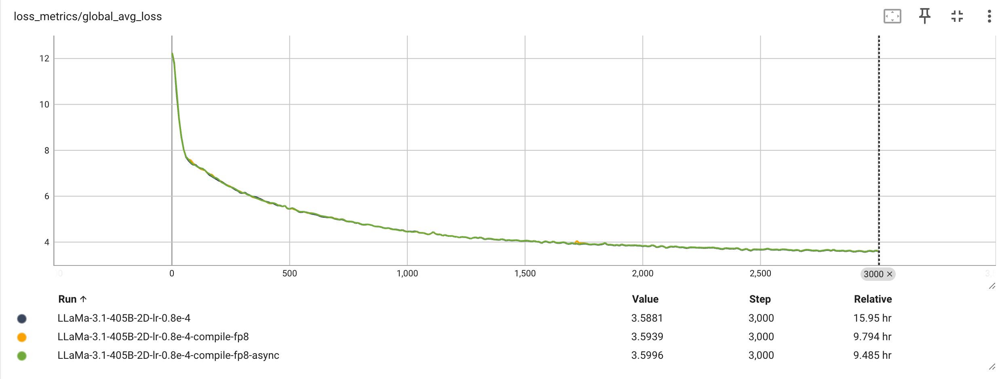

To demonstrate the effectiveness of PyTorch distributed training techniques used in torchtitan, we report both the infra metrics and loss curves of Llama 3 (8B and 70B) training on 64 A100 (80GB memory) GPUs and Llama 3.1 (405B) on 128 H100 (94GB memory).
We report infra metrics achieved by [FSDP2](fsdp.md) (1D parallelism) under various configurations, and loss curves for both 1D parallelism (FSDP2) and 2D parallelism (FSDP2 + Tensor Parallel) training. (We only report 2D for 405B)

## Llama 3.1 performance numbers

Below are the WPS (word per second, or more accurately, token per second) and MFU (model FLOPS utilization) results which torchtitan achieves on the 405B model released in [Llama 3.1](https://llama.meta.com/docs/model-cards-and-prompt-formats/llama3_1). The way we compute WPS and MFU can be found in `train.py`. Because the model now is larger, we run on 128 H100 GPUs to test both performance and loss curves. Below is the performance result of 405B model with optimizations we have developed. We do see OOM for 1D parallelism (FSDP2), so we only tested 2D parallelism (FSDP2 + Tensor Parallel).

| Model size | Batch size | Activation checkpointing | WPS | MFU | Optimizations |
| ----- | ----- | ----- | ----- | ----- | ----- |
| 405B | 2 | full | 109 | 29.0%[^1] | None
| 405B | 2 | full | 177 | 23.46%[^2] | Float8
| 405B | 2 | full | 185 | 24.52% | Float8 + Async TP

Here, we use local batch size 2 (global batch size = local batch size 2 * number of FSDP ranks 16 = 32).

Next, we show the loss curves, all models are trained 3000 steps on the [C4 dataset](https://huggingface.co/datasets/allenai/c4), with global batch size 32. We have to use full AC to save memory usage. The results are shown in the picture (a TensorBoard screenshot) below.

## Llama 3 performance numbers

Below are the WPS and MFU results which torchtitan achieves on Llama 3 models with FSDP2 on 64 A100 (80GB) GPUs.

| Model size | Batch size | Activation checkpointing | WPS | MFU |
| ----- | ----- | ----- | ----- | ----- |
| 8B | 1 | selective layer | 2904 | 56.8% |
| 8B | 1 | selective op | 2973 | 58.2% |
| 70B | 1 | full | 331 | 51.7% |

We use local batch size 1 (global batch size = local batch size 1 * number of FSDP ranks 64 = 64), because it mimics the small local batch size in large scaled training, and moreoever allows us to compare 1D (FSDP) and 2D (FSDP + TP) training under the same global batch size on both 8B and 70B Llama 3 models, without the out-of-memory (OOM) issue.

Next we show the loss curves for Llama 3 8B and Llama 3 70B training with both 1D parallelism (FSDP2) and 2D parallelism (FSDP2 + Tensor Parallel). All four models are trained the same way as mentioned above with global batch size 64. In terms of activation checkpointing (AC) configs, the Llama 3 8B training jobs use selective op AC, whereas the Llama 3 70B training jobs use full AC. The results are shown in the picture (a TensorBoard screenshot) below.

[^1]: We used HBM2e based lower TDP SXM H100(95GB) for our test, the actual peak TFLOPs number is between SXM and NVL, and we don't know its exact value. So this MFU number is lower than actual MFU because we use the peak number of SXM directly.

[^2]: Since for Float8, we are not converting all the matmuls to Float8 because our fused attention implementation is not done in Float8, so this number is lower than expected.

[^3]: Since the 70B training with local batch size 2 will cause an OOM error when selective activation checkpointing is used, we report the local batch size 1 case instead.

[^4]: One may have noticed that for both 13B and 70B training, 1D parallelism has slightly better convergence than 2D parallelism in the first half of training. We believe this is caused by the stronger shuffling effect introduced by having more FSDP ranks in the 1D parallelism, and the difference in convergence speed should go away after switching to a randomized data loading solution.
