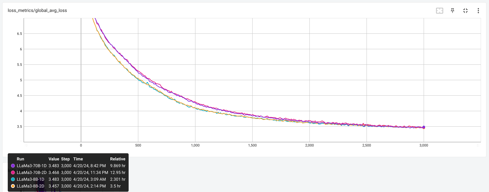
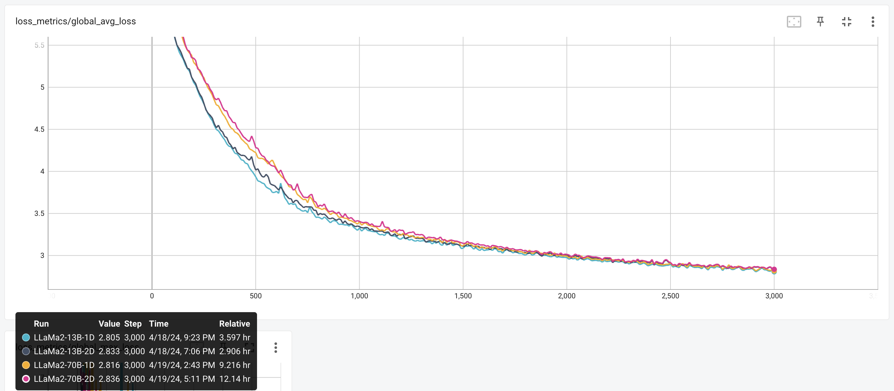

To demonstrate the effectiveness of PyTorch distributed training techniques used in torchtitan, we report both the infra metrics and loss curves of Llama 2 (13B and 70B) and Llama 3 (8B and 70B) training on 64 A100 (80GB memory) GPUs.
We report infra metrics achieved by [FSDP2](fsdp.md) (1D parallelism) under various configurations, and loss curves for both 1D parallelism (FSDP2) and 2D parallelism (FSDP2 + Tensor Parallel) training.

## Llama 3 performance numbers

Below are the WPS (word per second, or more accurately, token per second) and MFU (model FLOPS utilization) results which torchtitan achieves on Llama 3 models with FSDP2 on 64 A100 (80GB) GPUs. The way we compute WPS and MFU can be found in `train.py`.

| Model size | Batch size | Activation checkpointing | WPS | MFU |
| ----- | ----- | ----- | ----- | ----- |
| 8B | 1 | selective layer | 2904 | 56.8% |
| 8B | 1 | selective op | 2973 | 58.2% |
| 70B | 1 | full | 331 | 51.7% |

We use local batch size 1 (global batch size = local batch size 1 * number of FSDP ranks 64 = 64), because it mimics the small local batch size in large scaled training, and moreoever allows us to compare 1D (FSDP) and 2D (FSDP + TP) training under the same global batch size on both 8B and 70B Llama 3 models, without the out-of-memory (OOM) issue.

Next we show the loss curves for Llama 3 8B and Llama 3 70B training with both 1D parallelism (FSDP2) and 2D parallelism (FSDP2 + Tensor Parallel). All four models are trained 3000 steps on the [C4 dataset](https://huggingface.co/datasets/allenai/c4), with global batch size 64. In terms of activation checkpointing (AC) configs, the Llama 3 8B training jobs use selective op AC, whereas the Llama 3 70B training jobs use full AC. The results are shown in the picture (a TensorBoard screenshot) below.

## Llama 2 performance numbers

Below are the WPS and MFU results which torchtitan achieves on Llama 2 models with FSDP2 on 64 A100 (80GB) GPUs.

| Model size | Batch size | Activation checkpointing | WPS | MFU |
| ----- | ----- | ----- | ----- | ----- |
| 13B | 2 | no | 2162 | 61.1%	|
| 13B | 2 | selective layer | 1914 | 54.1% |
| 13B | 2 | selective op | 1904 | 53.8% |
| 70B | 1[^1] | selective op | 355 | 50.8% |
| 70B | 2 | full | 353 | 50.5% |

We primarily use local batch size 2 (global batch size 128) in the experiments, to keep the same number of tokens per training iteration between Llama 2 and Llama 3 (since the default sequence length in Llama 2 is 4096 which is halved compared with Llama 3). In fact, for Llama 2 70B model with full activation checkpointing, the MFU can go up to 54% when local batch size is higher (but before an OOM happens).

Next we show the loss curves for Llama 2 13B and Llama 2 70B training with both 1D parallelism (FSDP2) and 2D parallelism (FSDP2 + Tensor Parallel). All four models are trained 3000 steps with global batch size 128.
In terms of activation checkpointing (AC) configs, the Llama 2 13B training jobs use selective op AC, whereas the Llama 70B training jobs use full AC. The results are shown in the picture (a TensorBoard screenshot) below[^2].

[^1]: Since the 70B training with local batch size 2 will cause an OOM error when selective activation checkpointing is used, we report the local batch size 1 case instead.

[^2]: One may have noticed that for both 13B and 70B training, 1D parallelism has slightly better convergence than 2D parallelism in the first half of training. We believe this is caused by the stronger shuffling effect introduced by having more FSDP ranks in the 1D parallelism, and the difference in convergence speed should go away after switching to a randomized data loading solution.
