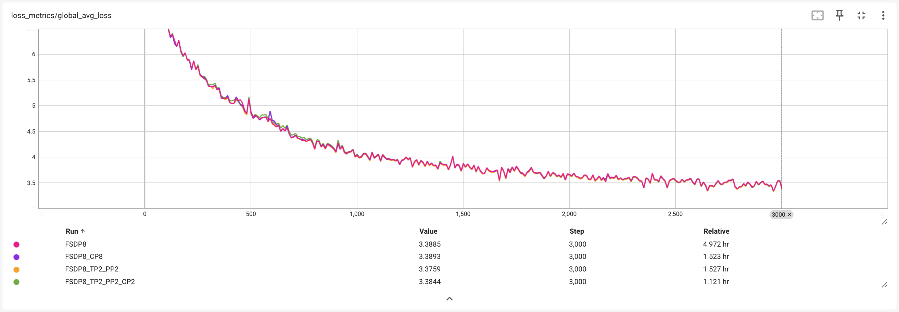

To demonstrate the effectiveness of techniques used in the torchtitan, we report both the infra metrics and loss curves of the LLaMa 13B and the LLaMa 70B training on 64 A100 (80GB memory) GPUs. We report infra metrics achieved by FSDP2 (1D parallelism) under various configurations, and loss curves for both 1D parallelism (FSDP2) and 2D parallelism (FSDP2 + Tensor Parallel) training.

Below is the WPS (word per second, or more accurately, token per second) and MFU (model FLOPS utilization) results which torchtitan achieves with FSDP2 on 64 A100 (80GB) GPUs. The way we compute WPS and MFU can be found in `train.py`.

| Model size | Batch size | Activation checkpoiting | WPS | MFU |
| ----- | ----- | ----- | ----- | ----- |
| 13B | 2 | no | 2162 | 61.1%	|
| 13B | 2 | selective layer | 1914 | 54.1% |
| 13B | 2 | selective op | 1904 | 53.8% |
| 70B | 2 | selective layer | OOM | OOM |
| 70B | 2 | selective op | OOM | OOM |
| 70B | 1[^1] | selective op | 355 | 50.8% |
| 70B | 2 | full | 353 | 50.5% |

We mostly use local batch size 2 (global batch size = local batch size 2 * number of FSDP ranks 64  = 128) in the experiments, because it mimics the small local batch size in large scaled training, and moreoever allows us to compare 1D (FSDP) and 2D (FSDP + TP) training under the same global batch size on both 13B and 70B LLaMa models, without the out-of-memory (OOM) issue. In fact, for the 70B model with full activation checkpointing, the MFU can go up to 54% when local batch size is higher (but before OOM happens).

Next we show the loss curves for LLaMa 13B and LLaMa 70B training with both 1D parallelism (FSDP2) and 2D parallelism (FSDP2 + Tensor Parallel). All the four models are trained 3000 steps on [openwebtext](https://huggingface.co/datasets/Skylion007/openwebtext), with global batch size 128. In terms of activation checkpointing (AC) configs, the LLaMa 13B training jobs use selective op AC, whereas the LLaMa 70B training jobs use full AC. The results are shown in the picture (a TensorBoard screenshot) below[^2].

[^1]: Since the 70B training with local batch size 2 will cause OOM error when selective activation checkpointing is used, we report the local batch size 1 case instead.

[^2]: One may have noticed that for both 13B and 70B training, 1D parallelism has slightly better convergence than 2D parallelism in the first half of training. We believe this is caused by the stronger shuffling effect introduced by having more FSDP ranks in the 1D parallelism, and the difference in convergence speed should go away after switching to a randomized data loading solution.
