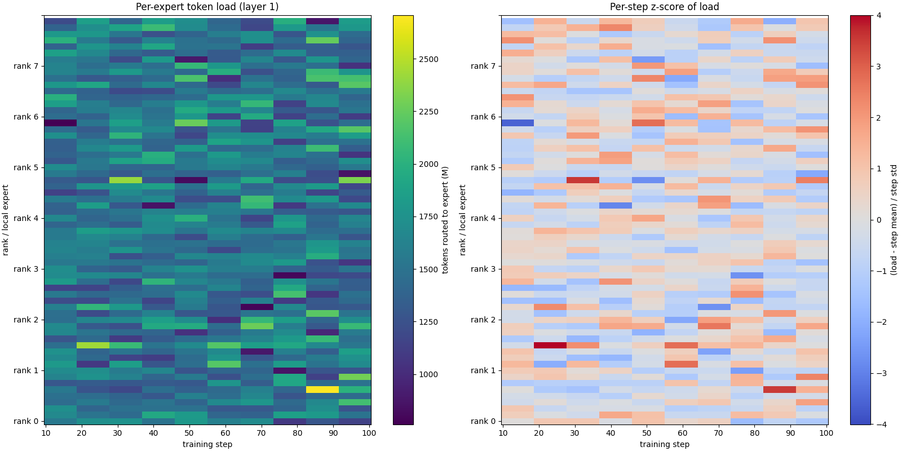
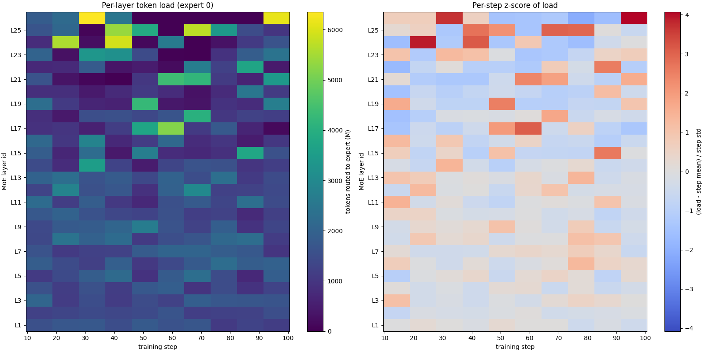
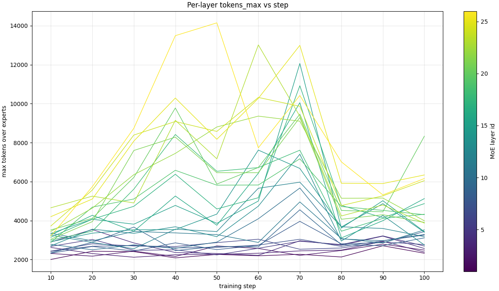

# RFC: Collect Grouped GEMM Shapes and MoE Runtime Metrics

| Field   | Value                                                           |
| ------- | --------------------------------------------------------------- |
| Status  | Draft                                                           |
| Author  | (your name / @your-gh-handle)                                   |
| Created | 2026-05-26                                                      |
| Scope   | `torchtitan/models/common/moe.py`, `token_dispatcher.py`, `torchtitan/components/metrics.py` |

## 1. Summary

Add an opt-in instrumentation layer that captures per-step Mixture-of-Experts
(MoE) runtime metrics — most importantly the **shapes of every grouped GEMM**
issued inside `GroupedExperts._experts_forward`, together with the
load-balancing and dispatch statistics needed to interpret them. The data is
exposed through:

1. an in-process `MoEMetricCollector` that other components (loggers,
   profilers, kernel autotuners, capacity planners) can consume, and
2. an optional CSV/JSONL sink and TensorBoard scalars driven from
   `torchtitan/components/metrics.py`.

The feature is disabled by default and has zero overhead when off.

## 2. Motivation

TorchTitan now ships several MoE models (`deepseek_v3`, `llama4`, `gpt_oss`,
`qwen3`) whose hot path is dominated by three `torch._grouped_mm` calls per
layer per micro-batch. Today we have no first-class way to answer questions
such as:

- What are the actual `(G, M_g, N, K)` shapes hitting `_grouped_mm` across
  steps, layers, and ranks?
- How skewed is the per-expert token distribution and how does it evolve as
  the router warms up / as the expert bias rebalances?
- How much padding does the alpha/DeepEP/HybridEP token dispatcher introduce,
  and what fraction of FLOPs are "wasted" on padded rows?
- For a given parallelism config (TP×EP×PP×DP), which expert is the
  straggler, and is the imbalance an artifact of routing or of placement?

These questions arise repeatedly during (a) kernel selection and autotuning
for grouped GEMM backends (cuBLAS, CUTLASS, Triton, oneDNN, custom Intel
kernels), (b) capacity planning for new MoE configs, (c) debugging
convergence regressions where the router collapses, and (d) authoring papers
or perf write-ups that need reproducible shape distributions.

The information is already implicit in tensors that flow through
`MoE.forward` (`num_tokens_per_expert`, `num_tokens_per_expert_group`,
`offsets`, padded layouts produced by `*TokenDispatcher`). We just need a
well-defined collection point and a stable schema.

## 3. Non-Goals

- Replacing the existing `tokens_per_expert` accumulator used for router-bias
  updates. That counter stays as-is.
- Profiling kernel execution time. That is the job of
  `torch.profiler` / Kineto; this RFC only captures **shapes and counts**,
  not timings (though timings can be cross-joined offline using the same
  step/layer keys).
- Modifying numerical behavior of MoE forward / backward.
- Adding a new dependency. Everything is plain `torch` + stdlib.

## 4. Proposed Design

### 4.1 Data Model

One record per `GroupedExperts._experts_forward` invocation:

```python
@dataclass(frozen=True)
class GroupedGemmRecord:
    step: int                       # global training step
    layer_id: int                   # decoder block index
    micro_batch_id: int             # 0 when PP disabled
    rank: int                       # global rank
    ep_rank: int                    # rank within the EP group
    ep_size: int
    num_local_experts: int          # G in grouped_mm
    # Per-expert active token counts after dispatch (length = num_local_experts)
    tokens_per_local_expert: tuple[int, ...]
    # Per-expert padded token counts (== tokens_per_local_expert when no padding)
    padded_tokens_per_local_expert: tuple[int, ...]
    # Shapes of the three grouped GEMMs in _experts_forward
    # (M_total, K, N) — M_total = sum(padded_tokens_per_local_expert)
    gemm_w1: tuple[int, int, int]   # x @ w1ᵀ
    gemm_w3: tuple[int, int, int]   # x @ w3ᵀ
    gemm_w2: tuple[int, int, int]   # h @ w2ᵀ
    dtype: str                      # e.g. "bfloat16"
    dispatcher: str                 # "naive" | "alltoall" | "deepep" | "hybridep"
```

Derived metrics (computed lazily by the collector, never stored per-row):

- `tokens_active = sum(tokens_per_local_expert)`
- `tokens_padded = sum(padded_tokens_per_local_expert) - tokens_active`
- `padding_ratio = tokens_padded / max(1, tokens_padded + tokens_active)`
- `imbalance = max(t)/mean(t) - 1` over non-empty experts
- `expert_util = (tokens_per_local_expert > 0).float().mean()`

### 4.2 Collection Point

A single shim inside `GroupedExperts._experts_forward`:

```python
# torchtitan/models/common/moe.py
from torchtitan.components.moe_metrics import maybe_record_grouped_gemm

def _experts_forward(self, x, num_tokens_per_expert):
    ...
    offsets = torch.cumsum(num_tokens_per_expert, dim=0, dtype=torch.int32)
    maybe_record_grouped_gemm(
        module=self,
        x=x, w1=w1, w2=w2, w3=w3,
        num_tokens_per_expert=num_tokens_per_expert,
        offsets=offsets,
    )
    h = F.silu(torch._grouped_mm(x.bfloat16(), w1.bfloat16().transpose(-2, -1), offs=offsets))
    h = h * torch._grouped_mm(x.bfloat16(), w3.bfloat16().transpose(-2, -1), offs=offsets)
    return torch._grouped_mm(h, w2.bfloat16().transpose(-2, -1), offs=offsets).type_as(x)
```

`maybe_record_grouped_gemm` is a single `if not enabled: return` check on the
hot path. When enabled it issues exactly one `.cpu().tolist()` on the
already-on-device `num_tokens_per_expert` tensor; no extra D2H sync occurs
when disabled.

Per-token-dispatcher padded counts are surfaced by adding an optional
`padded_tokens_per_expert` field to the `metadata` dict already returned by
`*TokenDispatcher.dispatch(...)` (see
[token_dispatcher.py](torchtitan/models/common/token_dispatcher.py)). All
existing dispatchers fall back to `num_tokens_per_expert` when no padding is
applied, so the field is purely additive.

### 4.3 The Collector

```python
# torchtitan/components/moe_metrics.py
class MoEMetricCollector:
    def __init__(self, *, sample_every: int = 1, max_records: int | None = None,
                 sinks: list[MoEMetricSink] = ()):
        ...
    def is_enabled(self) -> bool: ...
    def record(self, rec: GroupedGemmRecord) -> None: ...
    def flush(self) -> None: ...           # invoked from train loop end-of-step
    def aggregate(self) -> dict[str, float]: ...  # for TB scalars
```

Sinks (each optional, each behind a small protocol):

- `JsonlSink(path)` — appends one record per line; cheapest, rank-local.
- `CsvSink(path)` — flat schema, convenient for pandas / the existing
  `collective_reports/` style tooling.
- `TensorBoardSink(writer)` — pushes the aggregated scalars (mean/max/p99
  padding ratio, imbalance, total grouped-GEMM FLOPs) under
  `moe/<layer_id>/...`.

A single global collector is constructed by `MetricsProcessor` (already the
owner of TB writers in [metrics.py](torchtitan/components/metrics.py#L1))
based on config, then handed to MoE modules via a context var so we don't
have to thread it through every constructor.

### 4.4 Config

Extend `torchtitan/config/configs.py`:

```toml
[metrics.moe]
enabled        = false      # master switch
sample_every   = 1          # record every N steps once enabled
collect_shapes = true       # the grouped-GEMM (M,K,N) tuples
collect_imbalance = true    # load-balance scalars to TB
sinks          = ["jsonl"]  # any of {"jsonl","csv","tb"}
output_dir     = "outputs/moe_metrics"
max_records_per_rank = 100000
ranks          = "all"      # "all" | "rank0" | "<comma-sep rank list>"
```

Sensible default: **off**. When on with defaults, only rank 0 writes JSONL,
keeping disk overhead bounded.

### 4.5 Interaction With Existing Features

- **Activation checkpointing.** The existing comment in `MoE.forward` notes
  that AC double-counts `tokens_per_expert`. The new collector is invoked
  from `_experts_forward`, which is also re-run under AC. To avoid double
  counting we tag records with a monotonically increasing `forward_uid` and
  the sink de-duplicates on `(step, layer_id, micro_batch_id, forward_uid,
  rank)`. Backward-pass recomputation is detected via
  `torch.is_grad_enabled()` and `torch._C._current_autograd_node()` (cheap,
  no allocation) and suppressed by default.
- **`torch.compile` / graph trainer.** The collector call lives outside the
  hot Triton/Inductor region (no tensor ops, just a Python guard). Under
  `fullgraph=True` we expose a `torch.compiler.allow_in_graph`-friendly
  no-op stub.
- **DeepEP / HybridEP.** Those dispatchers already return
  `num_tokens_per_expert_group` after the all-to-all. We extend their
  `metadata` payload with `padded_tokens_per_expert` and `dispatcher` tag;
  no comm changes.
- **PP / TP / EP.** Records carry `(rank, ep_rank, ep_size)` so an offline
  join recovers the full parallel layout.

### 4.6 Overhead Analysis

When disabled: one Python-level `if collector is None` per
`_experts_forward` call (≈ tens of ns), no GPU sync.

When enabled with default settings:

- One `.cpu().tolist()` on a tensor of shape `(num_local_experts,)`
  (typically ≤ 256 elements). Triggers one D2H, but `num_tokens_per_expert`
  is already needed CPU-side for the existing `tokens_per_expert.add_` path,
  so we reuse that synchronization point.
- One dataclass construction + one `sink.write` per layer per step
  (~O(N_layers) Python work per step).
- Total measured overhead target: **< 0.5 %** of step time on Llama4-17Bx16E
  at 8×H100.

A microbenchmark and an opt-in regression test under
`tests/integration_tests/` will gate this.

## 5. Alternatives Considered

1. **Pure `torch.profiler` post-processing.** Kineto traces contain the
   grouped-GEMM kernel shapes but recovering the per-expert token counts and
   the dispatcher/EP context requires custom JSON munging per backend
   (cuBLAS vs CUTLASS vs Triton emit different op names). Brittle and
   offline-only.
2. **TensorBoard histograms of `num_tokens_per_expert` only.** Easy, but
   loses the GEMM-shape × dispatcher × rank correlation needed for kernel
   autotuning and capacity planning.
3. **Hook on `torch._grouped_mm` via `__torch_dispatch__`.** Catches every
   call site, but loses the higher-level MoE context (layer id, expert
   indices, padding) and is invasive for users who already have a
   `__torch_dispatch__` mode active.

## 6. Compatibility & Migration

- Public API additions only. No existing call signatures change.
- `TokenDispatcher.dispatch` already returns a `metadata` dict; adding keys
  is backward compatible.
- Off-by-default → zero impact on existing training scripts, CI, and
  reference loss curves.

## 7. Testing Plan

- **Unit:** `tests/unit_tests/test_moe_metrics.py`
  - records shape matches `_grouped_mm` inputs on a toy model;
  - de-dup logic suppresses AC double counts;
  - JSONL / CSV sinks round-trip;
  - config gating (disabled → collector is `None`, no records).
- **Integration:** extend `tests/integration_tests/h100.py` with one MoE
  config run for 5 steps with `enabled=true`, asserting that a non-empty
  JSONL is produced and that step-time regression vs baseline is ≤ 1 %.
- **Lint/format:** standard `format.sh` pass.

## 8. Rollout

1. Land collector skeleton + config + tests (no production hooks).
2. Wire `_experts_forward` and `TokenDispatcher.metadata` additions.
3. Add TB sink + docs under [docs/metrics.md](docs/metrics.md).
4. Announce in release notes; keep default off for one release before
   flipping rank-0 JSONL on by default in dev configs.

## 9. Open Questions

- Should we also record the **router** logits histogram (top-k margins)?
  Useful for collapse diagnostics, but ~`(num_experts,)` floats per token
  is larger; leaning toward a separate opt-in flag.
- Do we want a Parquet sink for production-scale runs, or is JSONL+offline
  conversion sufficient? Inclined to start with JSONL.
- Naming: `moe_metrics` vs reusing `metrics.moe` namespace. The RFC assumes
  the latter to stay consistent with `MetricsProcessor` ownership.

## 10. Example output

Sample TensorBoard images from a DeepSeek-V3 16B run (8x B200, TP=8 / EP=8,
100 steps).

Per-layer expert load (`moe_expert_load/layer_{L}`) -- rank/local-expert x step
heatmap with a per-step z-score companion:



Per-expert layer load (`moe_layer_load/expert_{E}`) -- MoE-layer x step heatmap
for a single expert row:



Per-layer spread curves (`moe_layer_spread/{tokens_max,...}`) -- one line per MoE
layer vs step for a chosen statistic:



## 11. References

- [torchtitan/models/common/moe.py](torchtitan/models/common/moe.py)
- [torchtitan/models/common/token_dispatcher.py](torchtitan/models/common/token_dispatcher.py)
- [torchtitan/components/metrics.py](torchtitan/components/metrics.py)
- [docs/metrics.md](docs/metrics.md)
