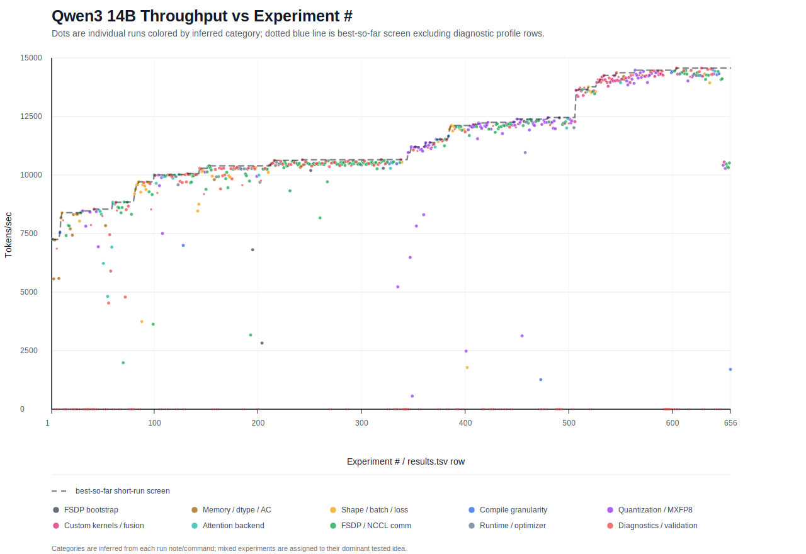

# Qwen3 Autoresearch Final Summary

Review context:

- Branch at review time: `autoresearch-parallelize/may15-qwen3-14b-8xb200`
- HEAD at review time: `07024d5c` (`Update Qwen3 autotune experiment logs`)
- No training job was active during the final review.
- The source tree was clean before this summary file was added.

## Experiment Summary

The autoresearch run tuned Qwen3 14B on 8x B200 GPUs, starting from the initial FSDP bootstrap and iterating through activation checkpointing, compile, Float8 conversion, FSDP precision, optimizer state layout, and several parallelism/runtime experiments.

The final kept result in `results.tsv` is:

| Commit | Tokens/sec | MFU | Peak memory | Status | Notes |
| --- | ---: | --- | ---: | --- | --- |
| `ab6f0226` | `9384` | `N/A` | `137.47 GiB` | `keep` | Repeat-confirmed fused bfloat16 optimizer-state run; loss fell from `12.47566` to `10.07680`. |

The first valid FSDP bootstrap result was `5774` tokens/sec. The final result is `9384` tokens/sec, an improvement of `3610` tokens/sec, or about `62.5%` (`1.63x`) over the starting point.

## Throughput Progression

[Line chart: Qwen3 throughput progression](qwen3_throughput_progression.svg)



| Step | Tokens/sec | Delta vs previous | Main change |
| --- | ---: | ---: | --- |
| Bootstrap FSDP | `5774` | - | Initial Qwen3 FSDP path |
| No FSDP reshard after forward | `5872` | `+1.7%` | `--parallelism.fsdp_reshard_after_forward=never` |
| Selective activation checkpointing | `6808` | `+15.9%` | AC reduced memory pressure enough to improve throughput |
| Model compile | `7898` | `+16.0%` | `--compile.enable --compile.components model` |
| Float8 rowwise | `8399` | `+6.3%` | Float8 linear conversion |
| Memory-budget AC `0.9` | `8877` | `+5.7%` | Better AC policy than selective AC |
| Memory-budget AC `0.95` | `8897` | `+0.2%` | Slightly higher budget, marginal gain |
| `rowwise_with_gw_hp` Float8 recipe | `9229` | `+3.7%` | Better Float8 recipe |
| bfloat16 FSDP reduce | `9332` | `+1.1%` | `training.mixed_precision_reduce="bfloat16"` |
| Memory-budget AC `0.925` | `9364` | `+0.3%` | More stable midpoint budget |
| Fused bfloat16 optimizer states | `9384` | `+0.2%` | `--optimizer.implementation fused_opt_states_bf16` |

The biggest individual wins were activation checkpointing, model compile, Float8 conversion, and the improved Float8 recipe. Later knobs mattered less individually, but together they pushed the run from roughly `9.2k` to `9.38k` tokens/sec while preserving falling short-run loss.

## Knobs That Mattered

Significant improvements:

- Model compile was one of the largest wins, moving from `6808` to `7898` tokens/sec.
- Activation checkpointing was essential. Selective AC gave the first large jump, and memory-budget AC later beat selective AC once Float8 and compile were enabled.
- Float8 linear conversion provided a clear gain, especially after moving to `rowwise_with_gw_hp`.
- Disabling FSDP reshard after forward was a small but reliable improvement and remained in the final recipe.
- bfloat16 FSDP reduction provided a modest improvement and became part of the final config.
- Fused bfloat16 optimizer states produced only a small throughput gain, but it was repeat-confirmed and kept as the final best row.

Knobs that did not land:

- A more aggressive memory budget of `0.9375` reached `9393` tokens/sec, but loss rose from `12.45222` to `17.76889`, so it was rejected.
- NCCL Simple protocol matched the top throughput band but had rising loss and no durable advantage.
- HSDP `2x4` was slower and used much more memory.
- Context parallelism crashed in Inductor memory-budget partitioning.
- Varlen attention crashed importing the FA3 `flash_attn_interface`.
- Root FSDP splitting was slower or had bad loss behavior, and the source changes were reverted.
- Generic and NVGEMM-only Inductor GEMM autotuning both crashed before step 1 on the FP8 scaled-mm path.
- Runtime NCCL knobs and no-RNG-preservation AC did not produce a better valid result.

## Final Configuration

The final command landed on for the best validated benchmark row is:

```bash
NGPU=8 MODULE=qwen3 CONFIG=qwen3_14b ./run_train.sh \
  --training.steps=10 \
  --parallelism.fsdp_reshard_after_forward=never \
  --activation_checkpoint.mode=memory_budget \
  --activation_checkpoint.memory_budget=0.925 \
  --compile.enable \
  --compile.components model \
  --optimizer.implementation fused_opt_states_bf16
```

The `qwen3_14b` registry config contributes the rest of the important setup:

- Float8 converter recipe: `rowwise_with_gw_hp`
- Float8 exclusions: `lm_head`, `attention.qkv_linear.wkv`
- Model compile enabled in the converter config.
- `local_batch_size=4`
- `seq_len=4096`
- `steps=3000` in config, overridden to `10` for benchmark rows.
- `mixed_precision_reduce="bfloat16"`
- `data_parallel_shard_degree=-1`
- `tensor_parallel_degree=1`
- `context_parallel_degree=1`
- `pipeline_parallel_degree=1`

## Parallelize And Sharding State

`torchtitan/models/qwen3/parallelize.py` is intentionally DP-only today.

Current behavior:

- Rejects tensor parallel, context parallel, pipeline parallel, expert parallel, and HSDP with explicit `NotImplementedError`s.
- Applies activation checkpointing before compile.
- Applies per-layer compile when `--compile.enable --compile.components model` is set.
- Uses the `fsdp` mesh from `ParallelDims`.
- Builds the FSDP mixed precision policy from `training.mixed_precision_param` and `training.mixed_precision_reduce`.
- Applies `fully_shard` to each transformer layer, then applies `fully_shard` to the root model.
- Honors `parallelism.fsdp_reshard_after_forward`; the best run uses `never`.

`torchtitan/models/qwen3/sharding.py` is currently a no-op scaffold. It does not attach DTensor sharding configs and does not define tensor-parallel or sequence-parallel placement rules. That matches the current `parallelize_qwen3` implementation, which rejects TP and CP before any sharding plan would be used.

The final winning sharding strategy is therefore simple:

- One FSDP data-parallel shard group over all 8 GPUs.
- Per-layer FSDP units.
- Root model FSDP unit.
- No TP, CP, PP, EP, HSDP, or custom DTensor sharding contracts.

## Key Learnings

The successful path was not adding more parallelism. The best result came from making the simple FSDP path faster: compile the model, use Float8 carefully, tune activation checkpointing, avoid resharding after forward, and reduce communication precision to bfloat16.

The failed profile-inspired experiments also gave useful boundaries. More aggressive partitioning and parallelism ideas either crashed, increased memory, slowed the run, or broke the short-run loss trend. The final source state is cleaner because those experiments were reverted instead of being left as fragile options.

This result should be treated as an empirical 10-step benchmark win, not a convergence proof. Full convergence, numerical comparison, and checkpoint compatibility still need validation before treating the recipe as production-ready.
