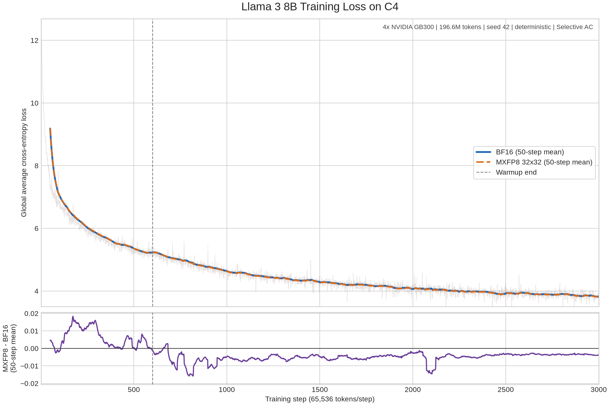

## MXFP8 Training on B200 GPUs

MXFP8 training can provide substantial training speedups for models where the majority of GEMMs are sufficiently large. MXFP8 is a microscaling format from the [MX OCP spec](https://www.opencompute.org/documents/ocp-microscaling-formats-mx-v1-0-spec-final-pdf) that uses block-based scaling to maintain numerical accuracy while leveraging low-precision tensor cores. On NVIDIA B200 GPUs, MXFP8 training achieves up to **28% speedup** over bfloat16 baseline with minimal accuracy degradation.

> **📖 For a comprehensive case study of using TorchTitan MXFP8 to train dense models at scale**, see our blog post: [Accelerating 2K+ Scale Pre-training up to 1.28x with TorchAO MXFP8 and TorchTitan on Crusoe B200 Cluster](https://pytorch.org/blog/accelerating-2k-scale-pre-training-up-to-1-28x-with-torchao-mxfp8-and-torchtitan-on-crusoe-b200-cluster/)

### Table of Contents

- [Requirements](#requirements)
- [How MXFP8 Works](#how-mxfp8-works)
  - [TorchAO and TorchTitan Responsibilities](#torchao-and-torchtitan-responsibilities)
  - [FSDP-Managed Weights](#fsdp-managed-weights)
- [MXFP8 for Linear Modules](#mxfp8-for-linear-modules)
  - [Input Activation Storage](#input-activation-storage)
  - [Usage](#usage)
- [MXFP8 for Grouped GEMMs (MoE)](#mxfp8-for-grouped-gemms-moe)
  - [Grouped Weight Operands](#grouped-weight-operands)
  - [Usage](#usage-1)
- [Example Python Configuration](#example-python-configuration)
- [Performance](#performance)
  - [Dense Models](#dense-models)
  - [MoE models](#moe-models)
- [Composability](#composability)
- [Known Limitations](#known-limitations)
- [Additional Resources](#additional-resources)

### Requirements

- NVIDIA B200 (SM100 or SM100a)
- PyTorch nightly
- TorchAO 0.18.0 or later, with `nvidia-cutlass-dsl` and `apache-tvm-ffi`

### How MXFP8 Works

MXFP8 differs from standard Float8 training in its scaling approach:

- **Granular scaling factor**: Instead of using a single scale factor per tensor (tensorwise) or per row/column (rowwise), MXFP8 uses a more granular, block-based scaling with a default block size of 1x32 elements. Each block of 32 elements shares a common scale factor. The data dtype is `torch.float8_e4m3fn`, and the scale factor dtype is `torch.float8_e8mfnu`.
- **Native hardware support**: On NVIDIA B200 (Blackwell) GPUs, MXFP8 GEMMs and Grouped GEMMs are accelerated using cuBLAS and CUTLASS kernels exposed via `torch.nn.functional.scaled_mm` and `torch._scaled_grouped_mm`, achieving up to 2x speedup over bfloat16 on common shapes.
- **Dynamic activation quantization**: Linear and Grouped GEMM activations use
  standard 1x32 MXFP8 scaling and are dynamically quantized for each operation.
  Forward scales are computed independently within each token row, so scale
  calculation cannot carry information between causal positions. Linear WGRAD
  can either retain the high-precision input and quantize it columnwise in
  backward, or retain a columnwise MXFP8 operands produced in forward.
  Neither choice affects causal forward outputs.
- **FSDP-managed dense weights**: After FSDP all-gathers a dense Linear weight
  in BF16, TorchTitan's post-all-gather hook quantizes it with square 32x32
  scale tiles to create FPROP and DGRAD operands. FSDP owns those
  buffers, so their lifetime follows the normal reshard-after-forward and
  reshard-after-backward policies. The temporary BF16 all-gather output is
  released after the independent MXFP8 operands is constructed.

Dense MXFP8 linear layers combine 32x32 square scale tiles for weights with
1x32 tiles for activations. Square weight tiles still introduce quantization
error, but they are orientation-symmetric: FPROP and DGRAD use the same
quantized values and share one cached qdata allocation. This avoids choosing
two independently quantized weight operands for the two GEMM
orientations.

#### TorchAO and TorchTitan Responsibilities

The dense linear integration keeps a narrow boundary between TorchAO and
TorchTitan. TorchTitan uses these kernel-level operations from TorchAO:

- `mxfp8_quantize_cuda` for rowwise and columnwise activation quantization.
- `triton_to_mxfp8_32x32_swizzle_dim0_qdata_dim01_scale` for 32x32 weight
  quantization with one shared qdata allocation and both scale layouts.
- `triton_mx_block_rearrange` for scale layout conversion.

TorchTitan owns the pieces coupled to the training system:

- MXFP8 linear autograd.
- The generic FSDP unsharded-tensor lifecycle and its MXFP8 specialization.
- Quantized-weight storage and lifetime.
- Model-specific input-activation storage policy.

This keeps FSDP and parallelism policy in TorchTitan while allowing additional
kernel fusion to be implemented independently in TorchAO.

#### FSDP-Managed Weights

The FSDP post-all-gather hook quantizes each unsharded BF16 weight and returns
independent MXFP8 qdata and scale tensors for FSDP to manage. There is no
separate module-level or autograd-level weight cache. The unsharded tensor
therefore follows the normal FSDP lifecycle:

| `reshard_after_forward` | Behavior |
| --- | --- |
| `False` | Quantize on the first unshard and reuse the MXFP8 operands until FSDP releases them after backward. Pipeline parallelism can reuse them across microbatches. |
| `True` | Reshard after forward. Backward performs another BF16 all-gather and post-all-gather quantization. |

FSDP keeps the storage-free logical weight stable and allocates, releases, or
refills its inner qdata and scale tensors. The module keeps an ordinary
`nn.Parameter` when FSDP is not used and quantizes it dynamically. FSDP setup
installs the unsharded-tensor wrapper immediately before sharding. This reuses
the existing FSDP state machine instead of introducing another cache lifecycle
in `MXFP8Linear`.

The hook currently constructs both FPROP and DGRAD weight operands on every
actual unshard. This is already optimal when `reshard_after_forward=False`
because the operands are constructed once and reused. With
`reshard_after_forward=True`, phase-specific construction would require FSDP to
expose whether an unshard is serving forward, backward, or checkpoint
recomputation.

### MXFP8 for Linear Modules

Dense weights always use square 32x32 scale tiles, and both local weight
dimensions must be divisible by 32. Activations use standard 1D scaling.

#### Input Activation Storage

Weight-gradient computation needs the linear input during backward.
`MXFP8Linear` supports two ways to retain it:

| Save format | Forward quantization | Saved for WGRAD | Backward work |
| --- | --- | --- | --- |
| `bf16` (default) | Rowwise only | Original BF16 input | Quantize the input columnwise |
| `mxfp8` | Rowwise and columnwise | Columnwise qdata and scales | Reuse the saved MXFP8 operand |

Saving MXFP8 reduces activation storage and avoids a backward quantization pass
only when no other operation retains the same BF16 input. If a preceding
operation already saves its output for backward, as flash attention does, the
BF16 tensor is already available as the linear input. Saving an additional
MXFP8 operands would then increase peak memory. Since this ownership is
model-dependent, `bf16` is the conservative default and audited modules opt in
through `linears_saving_inputs_for_backward_in_mxfp8`.

##### Interaction with activation checkpointing

Without activation checkpointing, the selected operands remains live
from forward until WGRAD. Saving BF16 is preferable when another operation
already retains the same tensor; otherwise, saving MXFP8 can replace that BF16
storage and avoid columnwise quantization during backward.

With full activation checkpointing, neither operands is retained from
the original forward; it is reconstructed during backward recomputation. The
current implementation applies the configured format to both executions. An
MXFP8-selected linear therefore produces rowwise and columnwise operands
during the original forward, discards the columnwise result, and produces it
again during recomputation. Ideally, it would produce only the rowwise operand
in the original forward and produce both operands during recomputation. We keep
one policy for both executions to avoid adding recomputation detection and a
second execution-dependent autograd contract.

More granular `torch.remat` policies introduce additional choices about which
operations and tensors are saved or recomputed. The optimal format is therefore
both model-dependent and activation-checkpointing-policy-dependent. The current
model policy deliberately remains fixed across those modes.

The built-in policies currently select:

| Model | Modules saving MXFP8 inputs |
| --- | --- |
| Llama 3 | `attention.qkv_linear.wqkv`, `feed_forward.w2` |
| DeepSeek V3 | `attention.wkv_b`, `feed_forward.w2`, `shared_experts.w2` |
| Flux | None |

All other converted linears save BF16 inputs. Trainer and GraphTrainer share
these model policies.

#### Usage

Quantization is applied at config time in your `model_registry()` function via the `quantization` parameter. Each converter walks the model config tree and swaps config types so that quantized modules are built directly.

To enable MXFP8 training for linear layers, configure it in your config_registry function:

```python
from torchtitan.components.quantization import MXFP8LinearConverter

# In your model_registry call:
model_spec = model_registry(
    "flux-schnell",
    quantization=[
        MXFP8LinearConverter.Config(
            fqns=["double_blocks", "single_blocks"],
            # Add audited single-consumer inputs here. Flux uses BF16 by default.
            linears_saving_inputs_for_backward_in_mxfp8=[],
            model_compile_enabled=True,
        ),
    ],
)
```

**Hardware Requirements:**

MXFP8 training requires NVIDIA B200 (SM100) or newer GPUs.

### MXFP8 for Grouped GEMMs (MoE)

For Mixture-of-Experts (MoE) models, MXFP8 accelerates the expert computation
through scaled grouped GEMMs. Expert weights follow the same FSDP-managed
lifecycle as dense weights: the post-all-gather hook quantizes each grouped
weight with square 32x32 tiles, and FSDP owns the resulting operands across
resharding and pipeline microbatches. Routed activations use standard 1D
scaling.

#### Grouped Weight Operands

Dense weights need only one qdata allocation because
`torch._scaled_mm` accepts a transposed second operand, so DGRAD can read a
transpose view of the FPROP qdata. The grouped GEMM instead requires its second
operand to be column-major *within each expert*, so the `(E, K, N)` operand
consumed by FPROP and the `(E, N, K)` operand consumed by DGRAD are two
different physical layouts:

| Operand | Shape | Consumer |
| --- | --- | --- |
| `weight_qdata_fprop_EKN` | `(E, K, N)` | FPROP |
| `weight_scale_fprop_swizzled` | swizzled E8M0 | FPROP |
| `weight_qdata_dgrad_ENK` | `(E, N, K)` | DGRAD |
| `weight_scale_dgrad_swizzled` | swizzled E8M0 | DGRAD |

Square tiles still make the two qdata tensors hold identical *values*, so the
duplication is layout-only, and FSDP manages four inner tensors per grouped
weight instead of the dense case's three.

This is a current limitation of the PyTorch op rather than something inherent.
`torch._scaled_grouped_mm_v2` takes a `contraction_dim`, but does not lift it
today: passing one allocation for both rejects with `Expected mat2 to be
transposed`, and a non-default contraction dim with `Currently contraction dims
must be (-1, -2) only`. If the op accepts a strided second operand, TorchTitan
can drop to one qdata allocation here exactly as the dense path already does,
saving `E * N * K` bytes per expert weight.

#### Usage

To enable MXFP8 for MoE expert layers, configure it in your config_registry function:

```python
from torchtitan.components.quantization import MXFP8GroupedExpertsConverter

model_spec = model_registry(
    "debugmodel",
    quantization=[
        MXFP8GroupedExpertsConverter.Config(
            model_compile_enabled=True,
        ),
    ],
)
```

**Combined usage**: You can use MXFP8 for both linear modules and grouped GEMMs simultaneously by specifying both converters:
  ```python
  from torchtitan.components.quantization import MXFP8LinearConverter, MXFP8GroupedExpertsConverter

  quantization=[
      MXFP8LinearConverter.Config(
          fqns=["double_blocks", "single_blocks"],
          model_compile_enabled=True,
      ),
      MXFP8GroupedExpertsConverter.Config(
          model_compile_enabled=True,
      ),
  ]
  ```

**Configuration Options:**

* `input_activation_format_for_backward`: `"bf16"` (default) saves the routed
  BF16 input and quantizes it columnwise during backward; `"mxfp8"` saves the
  columnwise qdata and scales produced during forward. The same trade-off as
  [Input Activation Storage](#input-activation-storage) applies. BF16 is the
  default because the routed input feeds more than one expert projection, so
  its BF16 form stays alive regardless.
* `pad_multiple`: token-group padding, 128 by default.
* `model_compile_enabled`: set to `True` when `torch.compile` is enabled for the model.

**Important Notes:**

* **Token group alignment**: token group sizes must be multiples of 128. Two
  constraints combine here. Columnwise WGRAD quantization scales 32 rows
  together, so a scale block must not span two experts; and the blocked scale
  layout consumed by the grouped GEMM starts each group on a 128-row block
  boundary. The token dispatcher is automatically swapped to a padded variant
  (`TorchAOTokenDispatcher` or `DeepEPTokenDispatcher`) by
  `swap_token_dispatcher()` when the converter runs. Expert parallelism (EP)
  must be enabled.

* **torch.compile recommendation**: All benchmarks in this document were run with `torch.compile` enabled. We recommend using `torch.compile` for best performance.

### Example Python Configuration

Here's an example configuration for MXFP8 training in a config_registry function:

```python
from torchtitan.components.quantization import MXFP8LinearConverter, MXFP8GroupedExpertsConverter

# In your model_registry call:
model_spec = model_registry(
    "671B",
    quantization=[
        MXFP8LinearConverter.Config(
            fqns=["double_blocks", "single_blocks"],
            model_compile_enabled=True,
        ),
        MXFP8GroupedExpertsConverter.Config(
            model_compile_enabled=True,
        ),
    ],
)

# In your Trainer.Config:
compile=CompileConfig(enable=True),
```

### Performance

#### Dense Models

Single-node training on 8x power limited B200 GPUs, batch size 1, sequence length 8192, steps 100, torch.compile, FSDP2, per-op SAC:

| Scaling Method          | Peak Memory (GB) | Median tokens/s | Speedup over BF16 |
|------------------------|------------------|-----------------|-------------------|
| None (bfloat16)        | 33.71           | 8307.5          | -                 |
| mxfp8_cublas           | 33.88           | 9969.0          | +20.0%            |
| mxfp8_cublas_rceil     | 33.88           | 9642.0          | +16.1%            |
| float8 tensorwise      | 33.38           | 10417.0         | +25.4%            |

- pytorch version: `2.9.0.dev20250815+cu128`
- torchao version: `0.13.0+gite4e681be`
- torchtitan commit: `6fc499f6f5b32151a799188be2208cfb09faed30`

*Source: [TorchAO MX Formats Benchmarks](https://github.com/pytorch/ao/tree/main/torchao/prototype/mx_formats#training-e2e-benchmarks-on-nvidia-b200)*

#### MoE models

512 GPU training on 64 node GB200 cluster:

| Scaling Method          | Median tokens/s | Speedup over BF16 |
|------------------------|-----------------|-------------------|
| None (bfloat16)        | 6169            | -                 |
| mxfp8                  | 7401            | +20.3%            |

Training runs on 64 node GB200 cluster with TorchTitan Llama4 Scout show that MXFP8 MoE training has equivalent convergence to bfloat16 training baseline over 3,000 steps. In fact, it finishes with slightly *lower* loss than bfloat16! This is consistent with our scaling experiments with [MXFP8 training for dense models](https://pytorch.org/blog/accelerating-2k-scale-pre-training-up-to-1-28x-with-torchao-mxfp8-and-torchtitan-on-crusoe-b200-cluster/).

Training and model configurations for this run:
- Model: Llama4 Scout
- Dataset: C4
- Sequence length: 8192
- Local batch size: 10
- Learning rate: 1e-4
- LR scheduler warmup steps: 2000
- Parallelisms (64 nodes of 4 devices each = 256 chips):
    - FSDP=256 (on attention layers, shared experts, dense layer FFNs) and 256/4=64 (on routed experts)
    - EP=16 (on routed experts)
- Activation checkpointing mode: `none` (ideally this should use selective per op AC but there was a bug at the time preventing us from using it).
- `torch.compile` enabled
- `mxfp8` applied to routed experts computation (grouped GEMMs)
- `mxfp8` applied to all linear layers except: `output`, `router.gate`, `attention.wk`, `attention.wv` (Wk and Wv too small to benefit from mxfp8)

#### Dense model convergence

A deterministic 3,000-step comparison on C4 shows that Llama 3 8B with
32x32 MXFP8 weights closely tracks the BF16 baseline over 196.6M tokens. The
lower panel shows the difference between the 50-step mean losses, making the
small numerical divergence visible rather than implying bitwise-identical
training.



*Training loss over 3,000 steps; faint lines are per-step values and bold lines
are 50-step moving averages.*

Training and model configurations for this run:

- Model: Llama 3 8B
- Dataset: C4
- Hardware: 4x NVIDIA GB300
- Training: 3,000 steps, 65,536 tokens/step, 196.6M tokens total
- Sequence length: 8192
- Learning rate: 3e-4
- LR scheduler warmup steps: 600
- Parallelism: FSDP=4
- Activation checkpointing: selective
- Seed: 42 with deterministic mode enabled
- `torch.compile` enabled
- MXFP8 weights use 32x32 scaling; BF16 is the baseline

### Composability
For distributed training, MXFP8 is compatible with:
- `torch.compile`
- FSDP2/TP/EP/PP
- Full activation checkpointing

All distributed communication for MXFP8 training is currently done in high precision.

### Known Limitations
- Currently in prototype stage - no BC guarantees.
- Requires torch nightly - important bug fixes have landed since 2.9.1

### Additional Resources

- [Accelerating 2K+ Scale Pre-training up to 1.28x with TorchAO MXFP8 and TorchTitan on Crusoe B200 Cluster](https://pytorch.org/blog/accelerating-2k-scale-pre-training-up-to-1-28x-with-torchao-mxfp8-and-torchtitan-on-crusoe-b200-cluster/) - Blog post on accelerating dense model training with MXFP8
- [TorchAO MX Formats Documentation](https://github.com/pytorch/ao/tree/main/torchao/prototype/mx_formats)
- [TorchAO MoE Training Documentation](https://github.com/pytorch/ao/tree/main/torchao/prototype/moe_training)
