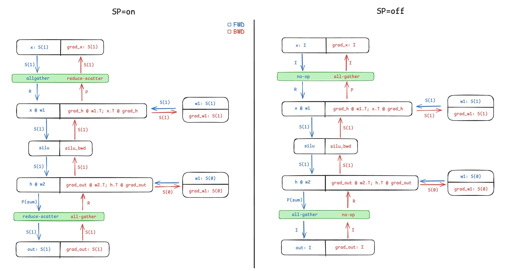

# `spmd_types` integration

This note explains why TorchTitan has a `spmd_types` backend, and how to think
about it when working with model code and distributed semantics.

## Why global SPMD, and why spmd_types?

TorchTitan has a unified model definition goal: the same `forward()` should work
for single-GPU, 1D, and ND distributed training and inference.
Model architecture and distributed execution should be separable.

Global SPMD provides this programming model: multi-device code is written as if
on a single device, with an orthogonal mechanism for expressing tensor sharding
and collectives. The `forward()` describes the "global view" of model compute, regardless
of distributed setup, while placements describe the underlying tensor shardings,
implying the operations and collectives that are valid.

Placement-based annotation also makes the code easier to reason about. At any point, an
activation or parameter may be sharded, replicated, pending an all-reduce over a mesh dimension,
or in some other weird form. DTensor is the familiar PyTorch-native example of global SPMD:
APIs like `redistribute` express placement-based collectives, while DTensor's sharding propagator
and redistribution engine decide which operations comply with global SPMD.

`spmd_types` combines this placement-based programming model with added benefits:
- Typechecking for local and global SPMD: Ensures global SPMD type annotations are
consistent with the code, and that compute on sharded tensors follows operator sharding
rules. Inexpressible regions can drop into local SPMD or disable typechecking.
- No runtime overhead in erasure mode: no cost in checking sharding rules or computing collectives
with the typechecker disabled. All collectives are explicit in code.
- Tied FWD/BWD typing: Gradient placements are always known from FWD placements:
  - `Replicate` FWD == `Partial` BWD
  - `Partial` FWD == `Replicate` BWD
  - `Invariant` FWD == `Invariant` BWD
  - `Varying/Shard(dim)` FWD == `Varying/Shard(dim)` BWD.

  This makes BWD behavior explicit, while regions with decoupled FWD-BWD placement semantics can drop into
custom autograd functions.

For more background, see the [`spmd_types` repository](https://github.com/meta-pytorch/spmd_types)
and its reference docs.

## Tensor-parallel MLP example

Consider a tensor-parallel (TP) MLP in `spmd_types`, that handles both sequence-parallel on/off:

```python
# annotate input, parameter types before computation
# x: sequence-sharded if SP=on
# w1: colwise TP
# w2: rowwise TP
x_tp = spmd.S(1) if sequence_parallel else spmd.I
x_BLD = spmd.assert_type(x_BLD, {tp_group: x_tp})
w1_DF = spmd.assert_type(w1_DF, {tp_group: spmd.S(1)})
w2_FD = spmd.assert_type(w2_FD, {tp_group: spmd.S(0)})

# compute block:
# redistribute -> colwise mm -> silu -> rowwise mm -> redistribute
x_BLD = spmd.redistribute(x_BLD, tp_group, src=x_tp, dst=spmd.R)  # all-gather if SP=on, convert(I->R) if SP=off
x1_BLF = x_BLD @ w1_DF  # S(-1)
hidden_BLF = F.silu(x1_BLF)  # pointwise op propagates S(-1)
out_BLD = hidden_BLF @ w2_FD  # Partial(sum) pending reduction
out_BLD = spmd.redistribute(
    out_BLD,
    tp_group,
    src=spmd.P,
    dst=x_tp,
)  # reduce-scatter if SP=on, all-reduce if SP=off
```

With sequence parallelism on, the inter-block activation is sequence-sharded on TP.
- In FWD, computation is your standard TP MLP: all-gather -> colwise MM -> silu,
rowwise MM -> reduce-scatter.
- In BWD, gradient compute is "mirrored": all-gather ->
colwise MM -> silu BWD -> rowwise MM -> reduce-scatter.

`spmd_types` tied typing encodes this:
- a `S(1)->R` FWD all-gather is a `P->S(1)` BWD reduce-scatter.
- a `P->S(1)` FWD reduce-scatter is a `S(1)->R` BWD all-gather.
- sharded activations & weights correspond to gradients sharded on the same tensor dimension.

With sequence-parallel off, the only change is the redistribution to/from
inter-block activations: they are Invariant (`I`) instead of sequence-sharded.
This `I->R` no-op is mirrored by a `P->I` all-reduce.



Because TorchTitan separates parallelism from model definition, placement annotations and
redistributions are not handwritten inside `forward()`. Instead, the MLP is expressed with
`ShardingConfig`, which declares module-boundary redistributions and parameter shardings:

```python
def set_tp_mlp_sharding(tp_mlp_cfg, *, sequence_parallel: bool) -> None:
    x_tp = spmd.S(1) if sequence_parallel else spmd.I
    tp_mlp_cfg.sharding_config = ShardingConfig(
        in_src_shardings={"x": SpmdLayout({TP: x_tp})},
        in_dst_shardings={"x": SpmdLayout({TP: spmd.R})},
        out_src_shardings=SpmdLayout({TP: spmd.P}),
        out_dst_shardings=SpmdLayout({TP: x_tp}),
    )
    tp_mlp_cfg.w1.sharding_config = colwise_config()
    tp_mlp_cfg.w2.sharding_config = rowwise_config()

def colwise_config() -> ShardingConfig:
    return ShardingConfig(
        # Linear.weight is stored as [out_features, in_features].
        # S(0) due to transposed weight
        state_shardings={"weight": SpmdLayout({TP: spmd.S(0)})},
        out_src_shardings=SpmdLayout({TP: spmd.S(-1)}),
    )

def rowwise_config() -> ShardingConfig:
    return ShardingConfig(
        # Linear.weight is stored as [out_features, in_features].
        state_shardings={"weight": SpmdLayout({TP: spmd.S(1)})},
        out_src_shardings=SpmdLayout({TP: spmd.P}),
    )
```

The MLP-level config owns the input `x_tp -> R` and output `P -> x_tp` redistributions
at module boundaries, while the colwise and rowwise linear configs own their parameter shardings.
At initialization, if `--parallelism.tensor_parallel_degree > 1`, the trainer reads this config,
shards weights, and replaces the `forward()` with a wrapper that performs module-boundary collectives.
This allows modules to work well for single-GPU, multi-GPU in any TP degree, and compose well
with other parallelisms.

## How TorchTitan exposes this

The current user-facing surface is `--parallelism.spmd_backend = default | full_dtensor | spmd_types`.

`default` and `full_dtensor` backends use DTensor for parallelism, and the same declarative sharding
config system works for them; TorchTitan translates `spmd_types` placements into DTensor ones.

For a new model or module, the preferred flow is:

1. Write the single-device module first.
2. Write sharding configs in `sharding.py`, expressing module boundary collectives, parameter, and buffer shardings,
   relying on explicit handwritten collectives in local SPMD regions when inexpressible.
3. Define a parallelization caller in `parallelize.py` that calls `model.parallelize(parallel_dims)`,
   invoking the ShardingConfig, and wire AC, compile, FSDP, and other features, using existing implementations as reference.
4. Define a trainer/dataloader-side function that annotates SPMD types for model inputs, if not covered by existing trainers.
   Note that any input shardings or splits should be implemented on the dataloader side.
5. Wire the parallelization function into `parallelize_fn`, in model registries.

During development, the `--debug.spmd_typechecking` should invoke the global SPMD typechecker over trainer FWD steps, catching
any incorrect or unannotated distributed computation. Real usage should avoid this flag, as it adds significant overhead.

The expectation when a new model, module, or override is contributed is that ......

## Writing sharding configs

`SpmdLayout` describes a layout using mesh axis names, e.g. this is an inter-block activation for SP=off:

```python
SpmdLayout({DP: spmd.S(0), CP: spmd.S(1), TP: spmd.R})
```

Use `PartitionSpec` for tensor-dim orienting sharding, or when more than one mesh
axis shards a single tensor dim, e.g. for SP=on activations:

```python
SpmdLayout(
    {DP: spmd.V, CP: spmd.V, TP: spmd.V},
    partition_spec=(DP, (CP, TP), None),
)
```

These placements consider data-parallel, context-parallel, and tensor-parallel - the default dense mesh in TorchTitan.
Current MoE models transition to the `[dp_replicate, efsdp, ep]` sparse mesh in expert-parallel regions; MoE grouped expert
params are defined on that mesh. Pipeline parallel is available in TorchTitan and composable with other parallelism,
but not part of the compute mesh as it doesn't follow the SPMD paradigm.

The files `torchtitan/models/common/decoder_sharding.py` and `torchtitan/models/common/moe_sharding.py` contain reusable sharding
configs for dense & sparse model regions; it is likely some of these are reusable for not-too-novel architectures.

The `local_map` field takes a `LocalMapConfig`, and designates if the region should be under local SPMD typechecking,
wrapping the forward with `@spmd.local_map()`. Existing callers use this for non-global SPMD regions
and non-trivial collective implementations, e.g. attention, vocab-parallel embedding, MoE dispatch/grouped-experts/combine.

## When ShardingConfig is not enough

Some guidance on escape hatches, based on existing models:

- Custom ops/overrides/external library calls
  - Wrap with `spmd.local_map()`,
  or `spmd.no_typecheck` in some cases, and correctly assert input & output
  SPMD types.
- Custom autograd functions
  - Decorate with `@spmd.register_local_autograd_function` if the implementation follows
    local SPMD semantics, and the typechecker is happy, or:
  - Decorate with `@spmd.register_autograd_function` and define a `typecheck_forward`
    method that blackboxes the function and asserts input & output types.
- Regions with local semantics
  - Some compute is inherently local SPMD, e.g.
    broadcasts/views of local shapes or tensor chunking, and in other cases the global
    SPMD typechecker is not yet smart enough to propagate types.
    Typical guidance is a `spmd.local()` context around the region + output
    re-annotation.
- `mutate_type`
  Some tensors may have the wrong inferred type for a known-safe reason. For example,
  tensor constructors typically create `spmd.R`, and `V`/`P` may be interchangeable in
  specific metadata paths. `spmd.mutate_type(tensor, axis, src, dst)` makes that override
  explicit.
- Metadata or no-gradient regions
  - Any compute outside of the autograd graph is fine to skip typechecking for.

## Mesh transitions

MoE models in TorchTitan operate on 2 different meshes: the dense `[dp, cp, tp]` mesh
for the main transformer backbone, and the sparse `[dp_replicate, efsdp, ep]` mesh
where where EP region activations & parameters live. These are 2 different views
of the same GPUs, but allows expert-parallel sharding to map onto GPUs in a way
that is not necessarily clean in the dense-mesh view.

Transitioning between the 2 requires cross-mesh communication. Concretely at runtime,
this is implementation via EP dispatch/combine collectives. In SPMD typechecking,
this requires switching ambient mesh state, and reinterpreting relevant tensors
onto the new mesh.

The `with set_current_spmd_mesh(...)` context pushes a new DeviceMesh onto TorchTitan's
SPMD mesh stack, and updates the typechecker's active mesh context.
`spmd.reinterpret_mesh(tensor, type_or_mesh)` switches tensors onto the new current mesh,
checking for type compatiblity on the new mesh - e.g. sharding on a mesh axis will likely
error under a reinterpret, unless that axis directly maps 1-1 onto the new mesh.

In code, this looks roughly like:

```python
with set_current_spmd_mesh(dense_mesh):
    spmd.assert_type(x_BLD, dense_activation_type)

    # Dense-mesh compute.
    ...

    with set_current_spmd_mesh(sparse_mesh):
        # Retag local tensor presentation for the sparse mesh region.
        x_BLD = spmd.reinterpret_mesh(x_BLD, sparse_mesh)

        # Sparse-mesh communication/compute is explicit.
        routed_input_ND = moe_dispatch(x_BLD)
        routed_output_ND = experts(routed_input_ND)
        out_BLD = moe_combine(routed_output_ND)

    # The active mesh is dense again. Retag back before dense code consumes it.
    out_BLD = spmd.reinterpret_mesh(out_BLD, dense_mesh)
    spmd.assert_type(out_BLD, dense_activation_type)

    # More dense-mesh compute.
    ...
```

## Compatibility expectations

...... typechecks? bitwise? compared to?
