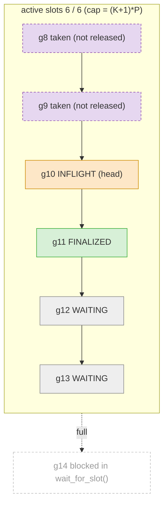
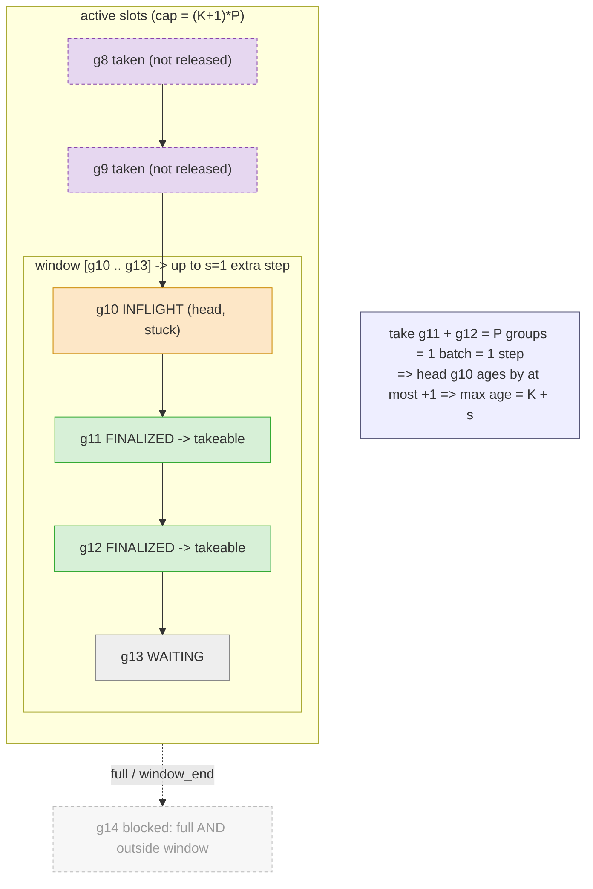

# RL Training with TorchTitan and vLLM

This directory contains code for RL training using TorchTitan model definitions with vLLM inference engine for fast rollout generation.

> **Note:** This experiment is under active development. APIs and configurations may change.

## Overview
The integration consists of the following components:

1. **vLLM Model Wrapper** (`models/vllm_wrapper.py`): Adapts TorchTitan models for vLLM's inference engine
2. **RL Training Loop** (`train.py`): GRPO-based RL training with Monarch actors (single-turn only for now)


### Rollout work buffer (`components/work_buffer.py`)

`RolloutGroupWorkBuffer` is a run-ahead FIFO (ordered by `group_id`) shared by the data-input,
rollout, and batcher loops. Each entry (`RolloutGroupWork`) moves through a lifecycle:

`WAITING` (admitted) -> `INFLIGHT` (a rollout worker is generating) -> `FINALIZED` (rollouts done,
result stored) -> removed when the batcher takes it.

**"active" is not the same as `INFLIGHT`.** `INFLIGHT` is an entry *state* (currently generating).
"active" is a *slot* accounting concept: a slot is charged at `add_work` and freed only by
`release_active_groups` (trainer after its weight pull, or batcher on an untrainable group) -- so
an active slot may be in any state, including already taken by the batcher but not yet released.
Active slots count against the off-policy window across the whole pipeline (buffer + queue +
training), capped at `max_active_rollout_groups = (max_offpolicy_steps + 1) * num_prompts_per_train_step`.

Two independent knobs, both counted in optimizer steps where **1 step = P groups**
(`P = num_prompts_per_train_step`):
- `K = max_offpolicy_steps` -> **capacity** `(K+1)*P` active slots (how far generation runs ahead).
- `s = window_lookahead_steps` -> **extra off-policy steps** a stuck straggler head may incur, so
  `max policy age = K + s`.

**Capacity: active slots = (K+1)*P** (example `K=2, P=2` -> 6, shown full; `g8/g9` were taken by the
batcher but still hold a slot until released):



**Windowed FIFO: `s` = extra off-policy steps tolerated.** Head `g10` is a stuck straggler; strict
FIFO (`s=0`) blocks on it. With `s=1` the batcher may bypass it far enough to complete 1 extra
batch (= 1 step), no more. `window_end = h + (s+1)*P - r0 - 1`, where `r0` is the head's phase
(`partial_batch_trainable_count` snapshotted when it became head). Here `s=1, P=2, r0=0` -> `g13`:



- Take-ability = `FINALIZED` **and** within `[head, window_end]` (position-based, not version-based).
- The window is sized in *groups* (`(s+1)*P - r0`) because `1 step = P groups`; `r0` =
  `partial_batch_trainable_count` = trainable groups already accumulated toward the in-progress batch
  when the head became head. It is snapshotted per head, so the window slides right only when the head
  itself is consumed.


## Key features available

1. **Unified model definition**: Canonical TorchTitan model definition shared by both trainer (TorchTitan) and generator (vLLM), enabling fast iteration, shared optimizations, and straightforward bitwise parity verification
2. **[Monarch](https://github.com/meta-pytorch/monarch) as controller**: Distributed actor framework for orchestrating trainer and generator on separate GPU meshes with async communication
3. **[TorchStore](https://github.com/meta-pytorch/torchstore) for weight sync**: Efficient weight synchronization between trainer and generator, supporting direct GPU-to-GPU RDMA transfers

## Quick Start
### Prerequisites

0. Create and activate environment with uv:
```bash
pip install uv
uv venv --python 3.12 titan-rl
source titan-rl/bin/activate
```

1. Install Monarch, TorchStore, and Renderers from main:
```bash
uv pip install torchmonarch
uv pip install --no-deps "git+https://github.com/meta-pytorch/torchstore.git@main"
uv pip install pygtrie portpicker
uv pip install "git+https://github.com/PrimeIntellect-ai/renderers.git@main"
```

2. Install Flash Attention 3 kernels:
```bash
# Flash Attention v3 (recommended for H100/H200 and newer GPUs)
uv pip install flash-attn-3 --extra-index-url=https://download.pytorch.org/whl/test/cu130
```

**NOTE:** FA2 is bundled with PyTorch and will be used automatically on older GPUs (e.g. A100) that don't support FA3.

3. Install batch-invariant ops if you need to run batch-invariant mode (Triton kernels for bitwise-reproducible training):
```bash
uv pip install --no-deps "git+https://github.com/thinking-machines-lab/batch_invariant_ops.git@main"
```

4. Install PyTorch nightly, pre-built vllm wheel (based on PyTorch nightly version), and torchcomms nightly.
```bash
# Install vllm with nightly torch
uv pip install torch vllm torchcomms  --pre \
--extra-index-url https://download.pytorch.org/whl/nightly/cu130 \
--index-strategy unsafe-best-match
```

**NOTE:** The pre-built vLLM wheels are only compatible with CUDA 13.0, though they should work with most older CUDA versions. Alternatively, you can install the corresponding vLLM pre-built wheels directly from https://download.pytorch.org/whl/nightly/cu130, for example: `uv pip install vllm-1.0.0.dev20260219+cu130-<suffix>.whl`. Ensure the build version number (e.g., `dev20260219`) matches your PyTorch nightly installation.


5. From the TorchTitan repository root, add the checkout to `PYTHONPATH`. Monarch-spawned RL worker processes inherit this environment variable, so they can import the local `torchtitan` package:
```bash
cd {your_local_torchtitan_root_path}
export PYTHONPATH="$PWD:${PYTHONPATH:-}"
```

6. Download `Qwen/Qwen3-0.6B` (or `Qwen/Qwen3-1.7B`) checkpoint from HuggingFace to `torchtitan/experiments/rl/example_checkpoint` folder.
```bash
python scripts/download_hf_assets.py --repo_id Qwen/Qwen3-0.6B --local_dir torchtitan/experiments/rl/example_checkpoint --all --hf_token=...

python scripts/download_hf_assets.py --repo_id Qwen/Qwen3-1.7B --local_dir torchtitan/experiments/rl/example_checkpoint --all --hf_token=...
```

7. Run simple GRPO RL loop to learn sum digits task. This also serves as an end-to-end smoke test that your environment is set up correctly.
```bash
python -m torchtitan.experiments.rl.train --module alphabet_sort --config rl_grpo_qwen3_0_6b_varlen
```

**NOTE:** If you downloaded your HF model to a different path than the one in step 4, specify it in your command with `--hf_assets_path=<path_to_model_checkpoint>`.

**Metrics:** W&B is on by default — run `wandb login` first, or pass `--metrics.no-enable-wandb` to disable. TensorBoard is also supported via `--metrics.enable-tensorboard`.

We use a unified model definition from torchtitan for the trainer and generator, ensuring bitwise-identical models to address a class of subtle correctness bugs in RL for LLMs.

## Reproducibility

We provide two independent tools for debugging and reproducibility. They address different sources of non-determinism and can be used separately or together.

### Batch-invariant mode

Batch-invariant mode guarantees that a model's output for a given input is **identical regardless of what other inputs are in the batch**. This is critical for RL training because the generator computes log-probs in one batch composition (e.g. 8 completions), while the trainer recomputes them in a different batch composition (e.g. 2 completions after DP sharding). Without batch-invariant mode, the same input can produce different log-probs in different batch contexts due to floating-point accumulation order differences.

When enabled, batch-invariant mode will:
- Replaces `mm`, `addmm`, `log_softmax`, and `mean.dim` with Triton kernels that use a fixed tile iteration order (via [batch_invariant_ops](https://github.com/thinking-machines-lab/batch_invariant_ops))
- Forces deterministic NCCL collectives (single channel, simple protocol, tree allreduce) matching vLLM's settings
- Disables reduced-precision reductions and TF32 to prevent batch-size-dependent rounding
- Forces `num_splits=1` in flash attention to prevent non-deterministic split-k reductions


### Verifying generator/trainer logprob parity
If you want to run true on-policy mode in TorchTitan RL and debug generator/trainer log-prob parity, you should enable `batch-invariant-mode` to eliminate potential numerical differences caused by batch-size discrepancies between the generator and trainer. The `batch-invariant-mode` provides run-to-run determinism for both the trainer and generator. If the model has randomness (e.g., dropout), you should also ensure consistent behavior between the trainer and generator by specifying a `seed`.

Now we only support logprob bitwise parity when trainer and generator are under the same parallelism.
Example:
```bash
python -m torchtitan.experiments.rl.train --module alphabet_sort --config rl_grpo_qwen3_0_6b_varlen_batch_invariant
```

This config sets `DebugConfig(batch_invariant=True, deterministic=True)`. The trainer must compute its forward in bfloat16 to match the generator. This is achieved with FSDP mixed precision: the trainer keeps fp32 master weights and FSDP casts them to bfloat16 (`training.mixed_precision_param="bfloat16"`, the default) for the forward, which is bitwise identical to the generator's bfloat16 forward. The trainer always wraps the model in FSDP, so this cast happens even at `data_parallel_shard_degree=1` (where FSDP acts purely as a mixed-precision boundary) -- no extra GPUs are needed.
