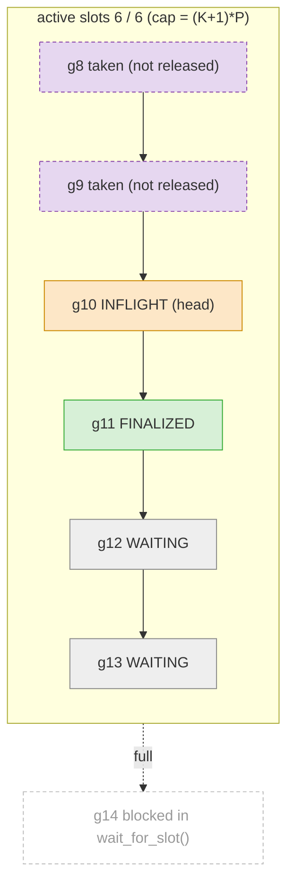
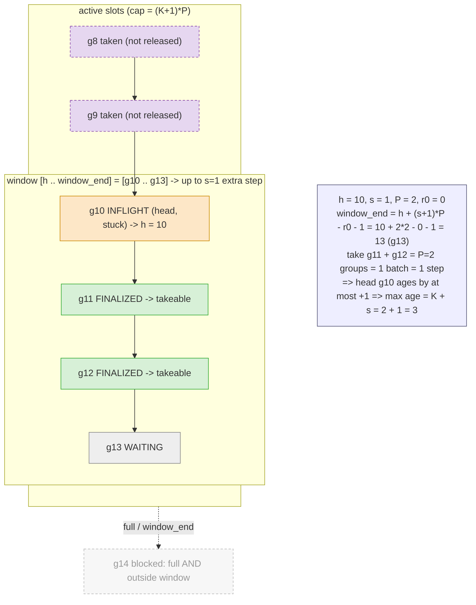

# Rollout work buffer (`components/work_buffer.py`)

`RolloutGroupWorkBuffer` is a run-ahead FIFO (ordered by `group_id`) shared by the data-input,
rollout, and batcher loops. Each entry (`RolloutGroupWork`) moves through a lifecycle:

`WAITING` (admitted) -> `INFLIGHT` (a rollout worker is generating) -> `FINALIZED` (rollouts done,
result stored) -> removed when the batcher takes it.

**"active" is not the same as `INFLIGHT`.** `INFLIGHT` is an entry *state* (currently generating).
"active" is a *slot* accounting concept: a slot is charged at `add_work` and freed only by
`release_active_groups` (trainer after its weight pull, or batcher on an untrainable group) -- so
an active slot may be in any state, including already taken by the batcher but not yet released.
Active slots count against the off-policy window across the whole pipeline (buffer + queue +
training), capped at `max_active_rollout_groups = (max_offpolicy_steps + 1) * num_prompts_per_train_step`.

Two independent knobs, both counted in optimizer steps where **1 step = P groups**
(`P = num_prompts_per_train_step`):
- `K = max_offpolicy_steps` -> **capacity** `(K+1)*P` active slots (how far generation runs ahead).
- `s = window_lookahead_steps` -> **extra off-policy steps** a stuck straggler head may incur, so
  `max policy age = K + s`.

**Capacity: active slots = (K+1)*P** (example `K=2, P=2` -> 6, shown full; `g8/g9` were taken by the
batcher but still hold a slot until released):



**Windowed FIFO: `s` = extra off-policy steps tolerated.** Head `g10` is a stuck straggler; strict
FIFO (`s=0`) blocks on it. With `s=1` the batcher may bypass it far enough to complete 1 extra
batch (= 1 step), no more. `window_end = h + (s+1)*P - r0 - 1`, where `r0` is the head's phase
(`partial_batch_trainable_count` snapshotted when it became head). Here `s=1, P=2, r0=0` -> `g13`:



- Take-ability = `FINALIZED` **and** within `[head, window_end]` (position-based, not version-based).
- The window is sized in *groups* (`(s+1)*P - r0`) because `1 step = P groups`; `r0` =
  `partial_batch_trainable_count` = trainable groups already accumulated toward the in-progress batch
  when the head became head. It is snapshotted per head, so the window slides right only when the head
  itself is consumed.

## The `window_end` formula

```
window_end = h + (s + 1) * P - r0 - 1
```

The batcher may take any `FINALIZED` group whose `group_id` lies in `[h, window_end]`. Each term:

| symbol | name | meaning |
|--------|------|---------|
| `h` | head `group_id` | Position of the oldest entry still in the buffer (the window's left edge). `group_id` is a contiguous, monotonically increasing position assigned by `_data_input_loop`. |
| `s` | `window_lookahead_steps` | The knob: extra off-policy optimizer steps a stuck straggler head may be bypassed by. `s = 0` is strict FIFO (window = head only); larger `s` widens the window. Bounds max policy age to `K + s`. |
| `P` | `num_prompts_per_train_step` | Groups trained per optimizer step, i.e. `1 step = P groups`. Converts the step-denominated knob `s` into a group-denominated window width. |
| `r0` | head phase snapshot | `partial_batch_trainable_count` captured when the current entry became head: trainable groups already accumulated toward the not-yet-packed batch (`0 <= r0 < P`). Snapshotted per head and held fixed until the head is consumed, so the window doesn't shrink from the right as non-head groups are taken. Shrinks the window because those `r0` groups already count toward the in-progress step. |
| `-1` | inclusive edge | Makes `window_end` an inclusive `group_id` bound; the window width is `W = (s + 1) * P - r0`. |

Two cases (`take_finalized`, work_buffer.py):

```
s == 0  ->  window_end = h                             (strict FIFO: head only, W = 1)
s >= 1  ->  window_end = h + (s + 1) * P - r0 - 1       (W = (s + 1) * P - r0)
```

**Worked example** (the windowed-FIFO diagram above): `h = g10`, `s = 1`, `P = 2`, `r0 = 0`
→ `window_end = 10 + (1 + 1) * 2 - 0 - 1 = g13`, window width `W = (1 + 1) * 2 - 0 = 4` (covers
`g10..g13`). Taking `g11 + g12` completes `P = 2` groups = 1 batch = 1 step, so the stuck head `g10`
ages by at most `+1` → max policy age `= K + s`.
