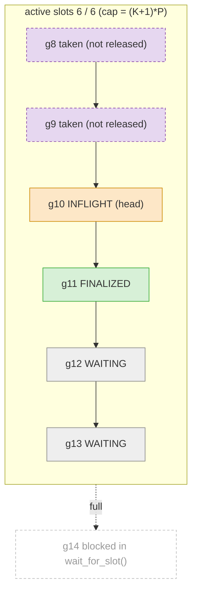
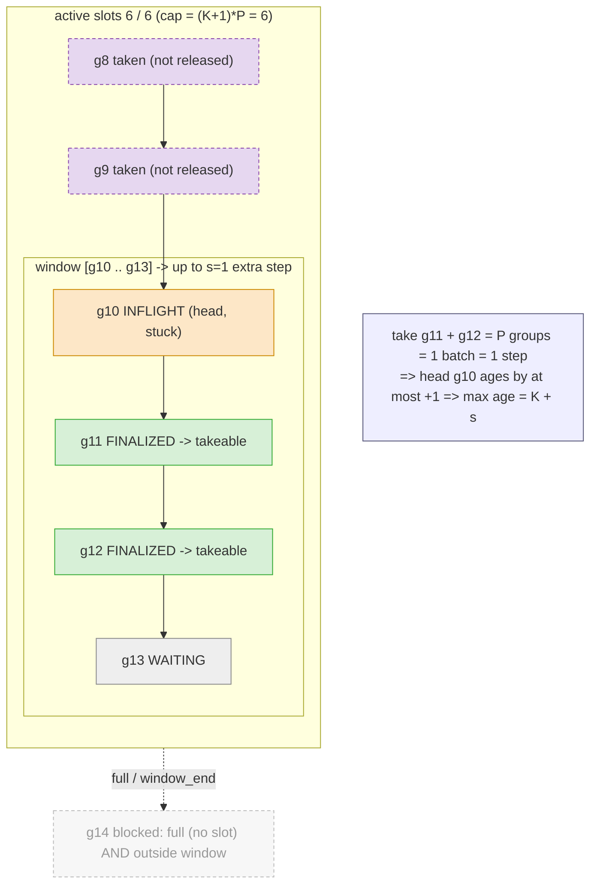

# Inside the RolloutGroupWorkBuffer

Run-ahead FIFO (`_work_by_group_id`, ordered by `group_id`). Entry lifecycle:
`WAITING -> INFLIGHT -> FINALIZED -> removed` (batcher takes it).

Two independent knobs:
- `K = max_offpolicy_steps` -> **capacity** = `(K+1)*P` active slots (how far generation runs ahead).
- `s = window_lookahead_steps` -> **extra off-policy steps** a stuck head may incur. `max age = K + s`.

Both are counted in *optimizer steps*, and **1 step = P groups** (`P = num_prompts_per_train_step`).

## 1. Capacity: active slots = (K+1)*P

Active slot = charged at `add_work`, freed only by `release_active_groups` (so it includes groups
already taken by the batcher but not yet released). Example `K=2, P=2` -> cap 6, shown full:

## 2. Windowed FIFO: s = extra off-policy steps tolerated

Same active slots as above (`g8/g9` taken-but-unreleased still count). The **window** is a sub-range
of the *dict entries*, anchored at the head. Head `g10` is a stuck straggler (INFLIGHT); with `s=1`
the batcher may bypass it far enough to complete **1 extra batch = 1 extra step**, no more.

`window_end = h + (s+1)*P - r0 - 1`   (here `s=1, P=2, r0=0` -> `g10 + 4 - 1 = g13`)

- **active slots** (whole box, incl. taken `g8/g9`) = capacity `(K+1)*P`; **window** (inner box) = the
  take-ahead range within the current dict entries.
- Take-ability = `FINALIZED` **and** within `[head, window_end]` (position-based, not version-based).
- The window is sized in *groups* (`(s+1)*P - r0`) because `1 step = P groups`; `r0` = trainable
  groups already accumulated toward the in-progress batch when the head became head.
- `s` is snapshotted per head and the window slides right only when the head itself is consumed.
