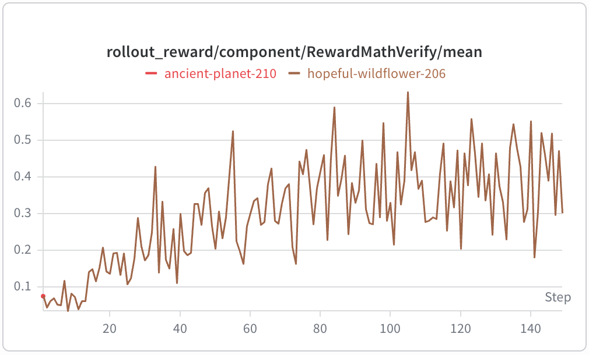
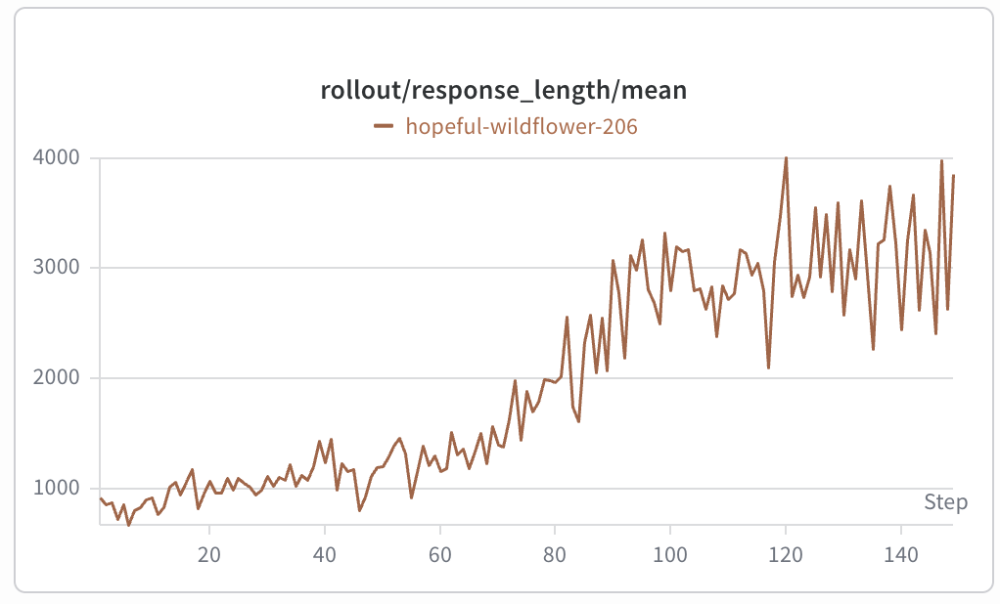

# DAPO Math

[DAPO-Math-17k](https://huggingface.co/datasets/BytedTsinghua-SIA/DAPO-Math-17k) is the verifiable math dataset released with [DAPO](https://arxiv.org/abs/2503.14476). This environment trains Qwen3-4B-Base with DAPO loss on a filtered version of that dataset.

## Environment

Each episode is single-turn:

```text
user math problem -> one assistant solution -> binary Math-Verify reward
```

The prompt asks for step-by-step reasoning followed by a final `Answer:` expression. [Math-Verify](https://github.com/huggingface/Math-Verify) parses that expression and assigns a reward of one when it is mathematically equivalent to the reference answer, or zero otherwise.

An abridged episode from the reference run looks like this:

```text
Question:
Let r_1, r_2, ..., r_47 be the roots of x^47 - 1 = 0. Compute
the sum of r_i^2020 over all 47 roots.

Response:
The roots are the 47th roots of unity. Since 2020 is congruent to -1
modulo 47, raising every root to the 2020th power permutes the roots.
Their sum is therefore zero.

Answer: \boxed{0}

Reward: 1
```

## Datasets

Training uses the 12,643-row [filtered DAPO-Math dataset](https://huggingface.co/datasets/hamishivi/DAPO-Math-17k-Processed_filtered). Each row contains one user prompt and its verifiable final answer.

Validation uses all 30 problems from [AIME 2025](https://huggingface.co/datasets/opencompass/AIME2025). The same single-turn environment and Math-Verify reward are used for training and validation.

## Reference configurations

Both configurations run 150 optimizer steps on one eight-GPU node. One TP=2 trainer uses two GPUs, and six independent TP=1 generators use the remaining GPUs. Each optimizer step consumes 8 prompt groups with 16 completions per group. `max_offpolicy_steps=4` bounds policy lag.

The 8K configuration is the default reference recipe:

```text
config:             rl_dapo_qwen3_4b_math_8k
prompt budget:      2,048 tokens
response budget:    8,192 tokens
packing length:     10,240 tokens
```

The 32K configuration extends the response and packing budgets while keeping the same model, optimizer, and GPU topology:

```text
config:             rl_dapo_qwen3_4b_math_32k
prompt budget:      2,048 tokens
response budget:    32,768 tokens
packing length:     34,816 tokens
```

Both configurations use a constant learning rate of `1e-6`, DAPO clipping of `[0.2, 0.28]`, and an fp32 language-model head with a bf16 model forward. The 32K configuration has not been benchmarked.

## Setup

Follow the [RL environment setup](../../README.md), then download the base checkpoint:

```bash
python scripts/download_hf_assets.py \
  --repo_id Qwen/Qwen3-4B-Base \
  --local_dir torchtitan/experiments/rl/example_checkpoint \
  --all
```

## Run

Run the 150-step 8K reference configuration from the repository root. CLI arguments override fields from the config registry; this example selects an explicit output directory:

```bash
python -m torchtitan.experiments.rl.train \
  --module dapo_math \
  --config rl_dapo_qwen3_4b_math_8k \
  --dump-folder outputs/rl/qwen3_4b_dapo_math_8k_150
```

Use `rl_dapo_qwen3_4b_math_32k` as the config name to run the 32K variant.

## 150-step reference result

TODO: add eval results. Add 32k variant.




