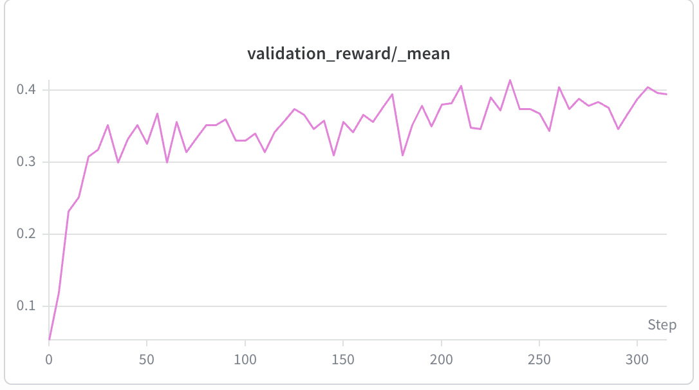
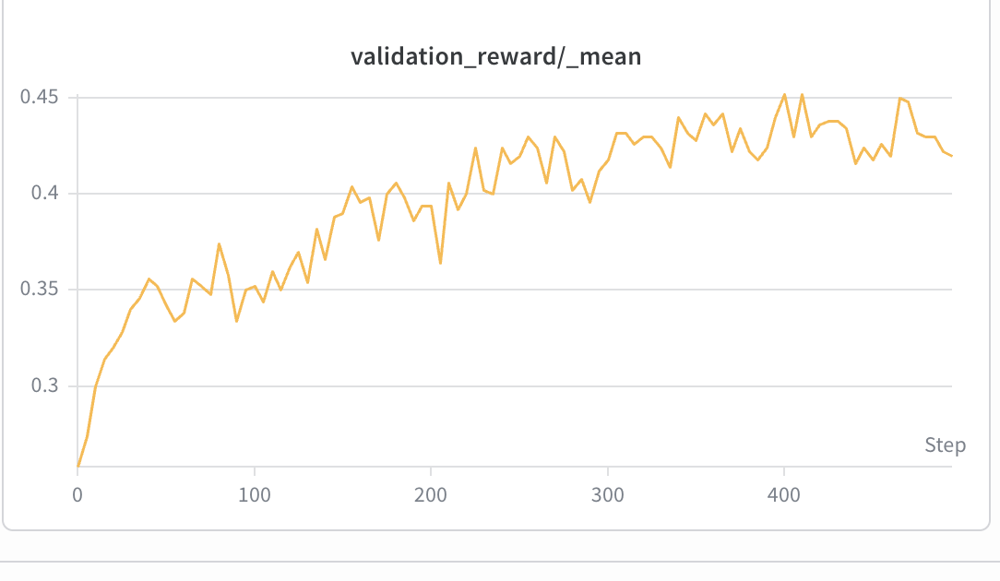

# Search-R1: multi-turn retrieval-augmented GRPO

A [Search-R1](https://github.com/PeterGriffinJin/Search-R1) example in torchtitan's
RL experiment. The model is given a `search` tool; it calls `search` (a standard tool
call) when it needs facts, gets the retrieved passages back as a `tool` message, and
replies with a final answer. Reward is exact-match (EM) against golden answers (optionally
plus a retrieval bonus).

Thinking is controlled purely by the renderer's `enable_thinking` flag (no prompt-injected
`<think>` tags). This recipe sets it to `False`: the task is short-answer factoid QA where
chain-of-thought doesn't help EM and would eat into the multi-turn token budget. Flip it to
`True` in the config for tasks that benefit from reasoning.

It is a multi-turn, tool-using RL example: the assistant takes a prompt and produces a
response, the env answers a `search` tool call with a `tool`-role message, and the
rollout continues until the model stops calling tools or the turn budget is hit. It
runs entirely on the framework's multi-turn rollouter (`rollout/rollouter.py`) and
continuous-batching generator — the only example-specific pieces are this folder plus
its config.

## Files
- `data.py` — `SearchR1Dataset` / `SearchR1Sample`: streams the NQ/HotpotQA parquet,
  downloaded from the HF dataset `PeterJinGo/nq_hotpotqa_train` (no preprocessing).
- `env.py` — `SearchR1Env(MessageEnv)`: defines the `search` `ToolSpec`, reads the
  renderer-parsed `tool_calls`, runs retrieval, and returns the passages as a `tool`
  message. The per-rollout turn budget is enforced by `TokenEnv.max_num_turns`.
- `rubric.py` — `RewardExactMatch`. **Default = pure-EM 0/1** on the final answer
  (correct → 1.0, else 0). Two opt-in levers put search on the gradient (anti
  closed-book reward hacking): `no_search_penalty` (a correct answer that never
  searched scores less) and `retrieval_score` (a wrong answer still gets partial
  credit if a search surfaced the golden answer).
- `rollouter.py` — wires datasets + env + rubric into a `Rollouter.Config`.

## Prerequisites

### 1. Data
Nothing to prepare — the NQ/HotpotQA parquet is pulled straight from the HF dataset
[`PeterJinGo/nq_hotpotqa_train`](https://huggingface.co/datasets/PeterJinGo/nq_hotpotqa_train)
on first use (train + NQ-test splits). To use a local copy instead, set the dataset
config's `data_path` to a parquet with `question` / `golden_answers` columns.

### 2. Local dense retrieval server
Start the dense retriever (e5 index over wiki-18) listening on
`http://127.0.0.1:8000/retrieve` **before** training, pinned to spare GPU(s) so it does
not clash with the RL GPUs:

```bash
python <search-r1>/local_dense_retriever/retrieval_server.py \
  --index_path $INDEX_PATH/e5_Flat.index \
  --corpus_path $CORPUS_PATH/wiki-18.jsonl \
  --topk 3 --retriever_name e5 --retriever_model intfloat/e5-base-v2 --faiss_gpu
```

Override `message_env.search_url` / `message_env.topk` in the config if needed.

## Run

```bash
# example run (Qwen3-1.7B), W&B on
python torchtitan/experiments/rl/train.py \
  --module torchtitan.experiments.rl.examples.search_r1 \
  --config rl_grpo_qwen3_1_7b_search_r1
```

Watch `validation_reward/_mean` (NQ test EM) trend up.

## Results

Validation exact-match (held-out NQ test split, greedy decoding) climbs steadily as the
policy learns to call `search` and answer concisely. The recipe keeps evolving, so each
curve below is a snapshot — the link goes to the exact recipe it was produced with.

**Qwen3-1.7B** — EM ~0.05 → ~0.41
([recipe @ `e28796e0`](https://github.com/pytorch/torchtitan/blob/e28796e0df801a5b5b30c34043cdd8bba14a6ea5/torchtitan/experiments/rl/examples/search_r1/config_registry.py#L41)):



**Qwen3-8B** — EM ~0.26 → ~0.45
([recipe @ `4b183e3a`](https://github.com/pytorch/torchtitan/blob/4b183e3aa26cce5da4689593ffd0cd419a32a32e/torchtitan/experiments/rl/examples/search_r1/config.py#L130)):


