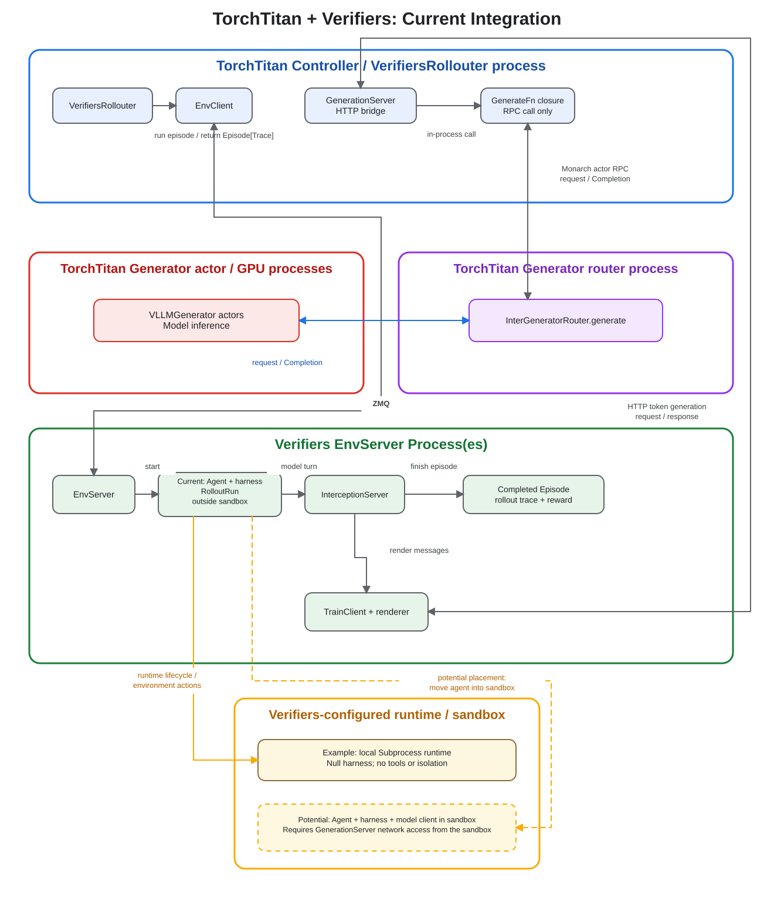

# Verifiers integration

This directory contains the optional bridge between TitanRL and
[Verifiers](https://github.com/PrimeIntellect-ai/verifiers). Other TitanRL
recipes do not import or require Verifiers.

The ownership boundary is:

- TitanRL loads samples, schedules rollout groups, routes generation, tracks
  policy versions, computes advantages, and trains the policy.
- Verifiers runs the environment, agent or tool loop, runtime, and task reward.
- The adapter converts samples and traces between the two systems.

Reusable bridge code lives in [`components/`](./components). Each experiment
has its own package and dependencies; [`dapo_math/`](./dapo_math) is the first
example.

## Integration flow



1. `components/data.py` loads a Verifiers taskset in the TitanRL controller,
   where TitanRL samples each rollout task. It converts the task's typed data
   to a plain dictionary because `VerifiersEnvClient` sends that data as
   msgpack over ZMQ to the separately spawned environment-server process. The
   server reconstructs the typed task before running the Verifiers environment.
2. `components/env_server.py` currently spawns and owns the Verifiers server as
   a separate local process on the TitanRL controller host. The configured
   Verifiers runtime is independent: we can select `SubprocessConfig`,
   `DockerConfig`, or `PrimeConfig` for the agent.
3. `components/generation_server.py` exposes TitanRL's `GenerateFn` through the
   HTTP token-generation protocol expected by Verifiers. It also retains the
   policy-version span and metrics that are absent from Verifiers traces.
4. `components/rollouter.py` sends samples to Verifiers and converts the
   returned trace graph into TitanRL `RolloutTurn` objects. TitanRL then applies
   its rubric and advantage estimator normally.

The training dataset is the single source of the environment taskset config.
`VerifiersRollouter.Config` copies it into the environment-server config, so an
experiment must not configure the same taskset a second time.

For CPU-heavy environments, increase the Verifiers worker-pool size first. A
future implementation could instead place the environment server in a Monarch
actor. That would require routable ZMQ and generation-server addresses plus
actor-owned startup and shutdown; the current integration does not provide
that placement mode.

## Add an experiment

Create one package per task, with its own dependency list:

```text
verifiers/
  components/
  my_task/
    __init__.py
    config_registry.py
    data.py
    requirements.txt
    rollouter.py
```

1. In `data.py`, define the Verifiers `Taskset` and `TasksetConfig`.
2. In `rollouter.py`, put that config in
   `VerifiersTaskDataset.Config.verifiers_taskset`. Configure the agent,
   harness, runtime, and worker pool, but leave
   `verifiers_env_server.environment.taskset` unset; `VerifiersRollouter`
   derives it from the training dataset.
3. In `config_registry.py`, select the rollouter from `Controller.Config`.
4. Register the experiment module in `torchtitan/experiments/__init__.py`.

Run the recipe with:

```bash
python -m torchtitan.experiments.rl.train \
  --module verifiers.my_task \
  --config <config-name>
```

See [DAPO Math](./dapo_math) for a complete single-turn example. This
integration pins Verifiers 0.3.1 and uses its `verifiers.v1` API.
