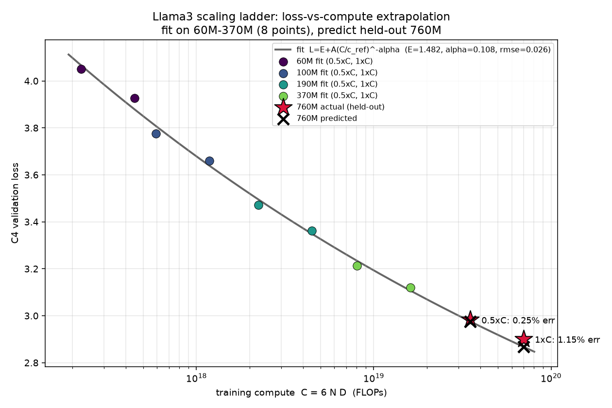
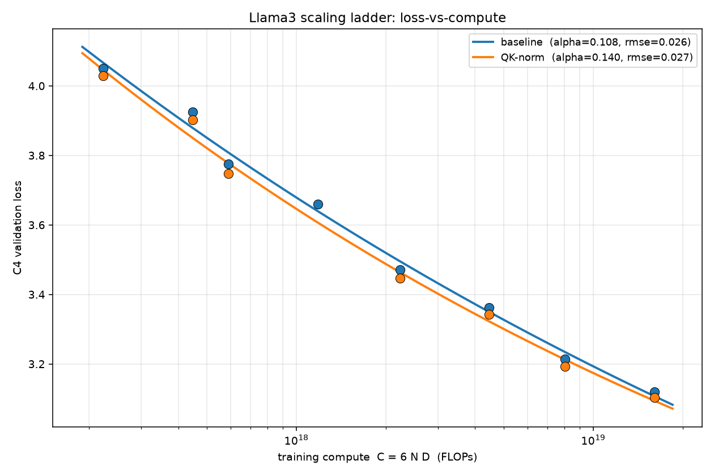
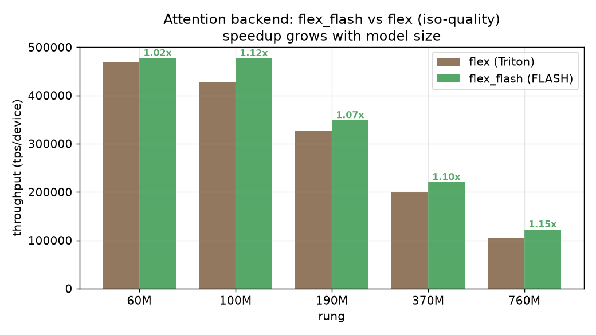
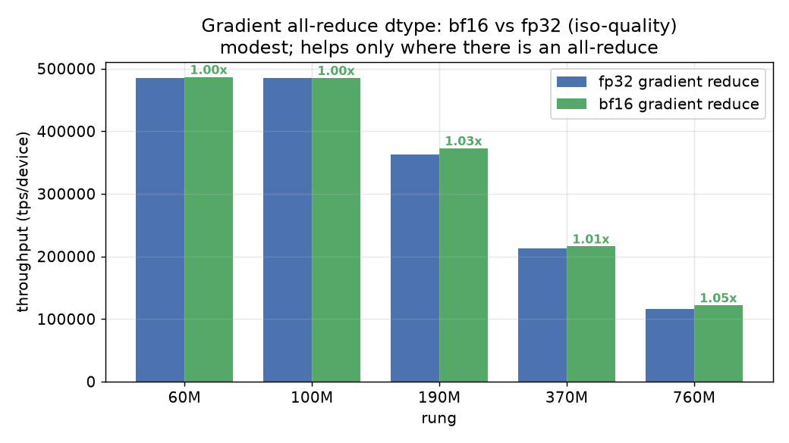
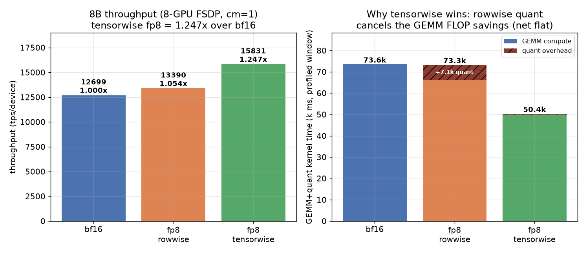
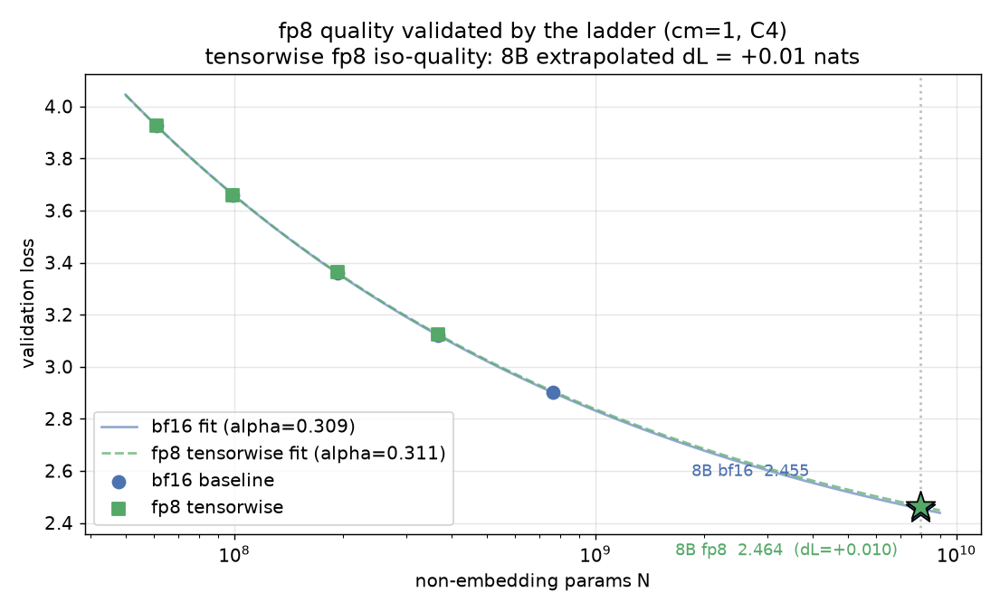

# Llama3 Scaling Ladder (WSD-S / Chinchilla)

An OLMo-style **scaling ladder** for TorchTitan: a family of Llama3 models from
small research sizes up to ~8B, each trained with Chinchilla-matched compute and
a WSD-S (Warmup-Stable-Decay, Simplified) learning-rate schedule, so that cheap
small-rung experiments predict good choices for expensive large-rung runs.

The design doc is [`DESIGN.md`](DESIGN.md); this README covers the *why*, the
OLMo-core <-> TorchTitan bridge, the code that was added, the rung family, and
the baseline extrapolation result.

## Why this is needed

Training a large model is expensive, and most design decisions (architecture
tweaks, hyperparameters, data choices) cannot be afforded at full scale. A
scaling ladder turns "guess and pray at 8B" into "measure on 60M-760M and
extrapolate": if a quantity follows a smooth loss-vs-compute trend across the
small rungs, you can both (a) **predict** a larger model's loss before paying for
it, and (b) **select** choices on cheap rungs that transfer up the ladder.

OLMo-core ships exactly this machinery. TorchTitan -- the PyTorch-native training
stack (FSDP2/DTensor/DCP, TP/PP/CP) -- did not. This experiment ports OLMo-core's
WSD-S / Chinchilla ladder onto TorchTitan's native stack so the same disciplined,
predictive workflow is available here, and so it can be driven by an automated
hillclimbing loop (human or agent), not just by hand.

## OLMo-core vs. TorchTitan: the gap, and how we bridge it

The *policy* (the scaling-law math and the WSD-S curve) is model-agnostic and was
ported verbatim. The *plumbing* differs substantially; the bridge is a set of
thin adapters over TorchTitan's existing abstractions.

| Concern | OLMo-core | TorchTitan | Bridge in this experiment |
|---|---|---|---|
| Run config | `RunConfigurator` family | `Trainer.Config` (no `JobConfig`); models are `ModelSpec` | `planner.py` emits a resolved `Trainer.Config` |
| Training duration | train-by-tokens (`Duration`) | strictly **step-based** (`step < training.steps`) | planner converts every token budget to steps |
| Batch size | tokens | **sequences** (`global_batch_size`), grad-accum derived | planner rounds the target token-batch to a valid sequence count |
| LR schedule | `WSDS` over tokens | `LRSchedulersContainer` (`LambdaLR`, per-step) | `WSDSScheduler` reproduces OLMo's `get_lr` as a step-indexed lambda (bit-identical curve) |
| Checkpointing | interval/duration list | `CheckpointManager` (interval modulo) | `LadderCheckpointManager` saves at explicit pre/post-decay steps |
| Validation | flexible | `Validator` is **freq-modulo only** | `LadderValidator` fires at the matched-Chinchilla post-decay steps |
| Optimizer | `SkipStepAdamW` (skips loss/grad spikes) | plain `AdamW` | plain `AdamW` with an embedding `weight_decay=0` group (divergence documented) |
| Plug-in mechanism | config classes | `Configurable._owner` auto-wiring | scheduler/checkpoint/validator are `Configurable` subclasses -- **no core edits** |
| Mesh degrees | -- | `ParallelDims.from_config` is pure arithmetic | planner computes the data-parallel degree at config-build time (no process group) |

The only sanctioned core touch is registering the experiment name in
`torchtitan/experiments/__init__.py`. Everything else lives in this folder and
**reuses** Llama3 (`Llama3Model`, `parallelize_llama`, `pipeline_llm`,
`Llama3StateDictAdapter`) and the public common builders.

Parameter accounting matches OLMo-core exactly: the ladder size is *non-embedding*
parameters, `ladder_params = total_params - vocab_size * dim`
(OLMo's `num_non_embedding_params`). All rungs use untied embeddings, so the
`lm_head` is counted.

## Salient code changes (high level)

Everything is under `torchtitan/experiments/scaling_ladders/`:

- `policy.py` -- WSD-S / Chinchilla policy: target batch size, training duration,
  peak LR, beta2, and Chinchilla periods. Ported from OLMo-core and
  unit-cross-checked against an inline copy of its formulas.
- `model.py` -- experiment-local Llama3 rungs (the table below), reusing
  `Llama3Model` and the public common builders; only the tiny per-layer init
  dicts are reproduced locally. `count_ladder_params` builds each rung on `meta`.
- `lr_scheduler.py` / `checkpoint.py` / `validate.py` -- `WSDSScheduler`,
  `LadderCheckpointManager` (explicit checkpoint steps), and `LadderValidator`
  (validation at matched-Chinchilla steps), each a `Configurable` subclass that
  plugs in without core edits.
- `planner.py` -- the single resolution path: policy + compute spec ->
  `Trainer.Config` and a plan dict. The same step-rounded period table drives
  *both* the scheduler's decay boundaries and the checkpoint steps, so the
  pre-decay checkpoint lands exactly where decay begins.
- `ladder.py` -- `Llama3Ladder`, the source of truth for rungs/policy/compute and
  the read-side API: `plan / trainer_config / status / metrics / sweep / compare`.
  It does not launch anything. Run identity is `(rung, overrides, seed)`, hashed
  into a unique `run_dir`.
- `launcher.py` -- the **one** launcher. `run_jobs` bin-packs rung jobs onto a
  node's GPUs (sequential = `run_rung`, N=1), each its own torchrun group; it
  resolves the schedule once (`build_spec`), writes the plan + all build knobs to
  `run_dir/launch_spec.json`, and spawns `torchrun ... train --config-file PATH`.
  OOM -> shrink `local_batch_size`; transient C4 flake -> retry; complete -> skip.
- `config_registry.py` / `train.py` / `cli.py` -- nullary default recipes for the
  native `run_train.sh` path; a ~15-line torchrun worker (`--config-file` ->
  `run_from_spec`); and a thin CLI over the ladder + launcher.
- `metrics.py` -- reads TensorBoard scalars back into structured per-checkpoint
  records and steady-state throughput (reusing the `scripts/loss_compare.py`
  approach).
- `showcase.py` / `run_perf_campaign.py` -- experiment drivers: loss-vs-compute
  fit + extrapolation, `compare_variants` for code-variant A/Bs, and
  `compare_perf` + a `--variant` campaign driver for iso-quality throughput A/Bs.

A nuance worth calling out: a worker run never rebuilds config from CLI flags --
the launcher resolves the schedule once and hands the worker one JSON spec, so a
new knob (attention backend, fp8, reduce dtype) is one spec key rather than a flag
threaded through five files, and the launched run cannot disagree with the plan.
Per-rung parallelism and `local_batch_size` are derived from each rung's memory
footprint (`auto_compute_spec`, with the launcher's OOM backoff as a safety net),
which is throughput-only -- the global batch, token budget, and loss are unchanged.

## The Llama3 ladder family

Eight rungs, all untied embeddings, Llama3 vocab `128256`, `head_dim = dim/n_heads`.
`ladder_params` is the non-embedding count built on `meta`; every rung is within
~2% of its nominal label.

| Rung | dim | layers | heads | kv heads | hidden dim | ladder_params |
|---|---:|---:|---:|---:|---:|---:|
| 60M  | 384  | 5  | 6  | 6  | 1536  | 61,051,008 |
| 100M | 512  | 8  | 8  | 8  | 2048  | 99,230,208 |
| 190M | 768  | 10 | 12 | 12 | 3072  | 192,888,576 |
| 370M | 1024 | 14 | 16 | 16 | 4096  | 366,244,864 |
| 760M | 1536 | 15 | 24 | 24 | 6144  | 763,279,872 |
| 1B   | 2048 | 11 | 32 | 32 | 8192  | 1,000,912,896 |
| 3B   | 3072 | 26 | 24 | 8  | 8192  | 3,011,410,944 |
| 8B   | 4096 | 34 | 32 | 8  | 14336 | 7,941,148,672 |

The policy (defaults: `tokens_per_param=20`, `chinchilla_multiple=4`,
`decay_fraction=0.1`, `seq_len=4096`) derives, per rung, the target token batch,
training steps, peak LR (`~ N^-1/3`), beta2, and the WSD-S period table. Because
WSD-S decays to zero at the end of every Chinchilla period, a single run yields a
*converged* post-decay checkpoint at each period (e.g. 0.5xC and 1xC), which the
read-back turns into matched-compute comparison points.

## Baseline experiment: loss-vs-compute extrapolation

The headline validation of the infrastructure: fit a Chinchilla curve on the
small rungs and predict a held-out larger rung's loss, then run it to check.

- **Fit** on 60M / 100M / 190M / 370M at `chinchilla_multiple=1` -- each run
  contributes its 0.5xC and 1xC post-decay validation loss, giving 8
  (compute, loss) points.
- **Held out**: 760M, predicted from the fit, then trained once to verify.
- Curve: `L(C) = E + A * (C / c_ref)^(-alpha)` with `C = 6 N D` (FLOPs).
- Real C4 train + c4_validation, 8x B200, FSDP, `torch.compile`, ~7.8 hr total.

Fitted curve: `E = 1.482`, `alpha = 0.108`, fit RMSE = `0.026`.

| Held-out point | predicted val loss | actual val loss | relative error |
|---|---:|---:|---:|
| 760M @ 0.5xC | 2.976 | 2.983 | **0.25%** |
| 760M @ 1xC   | 2.868 | 2.901 | **1.15%** |

A curve fit only on rungs up to 370M predicts the 760M validation loss to ~1%.
The falsifiable claim -- "predicted loss within tolerance" -- holds.



## Code-variant result: QK-norm (Flavor-Q)

A first demonstration of the ladder as a fitness function for an agent that edits
code: a worktree-isolated architecture change is trained on the small rungs and
judged by its loss-vs-compute curve against the *reused* baseline (no baseline
retraining). The first variant adds per-head RMSNorm on Q and K (qwen3-style
QK-norm) -- a ~2-line change to the attention config.

`compare_variants` reports the C4 val-loss delta at each matched `(rung, xC)`
(negative = QK-norm better):

| rung | 0.5xC | 1xC |
|---|---:|---:|
| 60M  | -0.021 | -0.023 |
| 100M | -0.028 | -- |
| 190M | -0.025 | -0.019 |
| 370M | -0.021 | -0.017 |

QK-norm is lower at every measured point (mean **-0.022** nats); the improvement
is uniform across rungs and horizons, so the ladder's verdict is **keep**. The
fitted curves: baseline `alpha=0.108`, QK-norm `alpha=0.140` (slightly steeper),
so the gap is roughly stable-to-widening with compute.

Caveats: single-seed (the baseline is seed 0, so this is one comparison, not a
noise band); the 100M @ 1xC validation point did not flush on that run; and there
is no large-rung (760M+) transfer confirmation yet.



## Performance experiments (iso-quality throughput)

The same ladder doubles as a fitness function for *performance* knobs: train a
baseline and a variant arm, then check the variant is faster **without** moving
the loss curve. `run_perf_campaign.py --variant V` drives this (short
`--max-steps` runs suffice, since steady-state throughput is reached in ~10
steps); `compare_perf` reports per-rung `throughput(tps)` speedup with a loss
guardrail. Results on an 8x B200 node (`throughput(tps)` is per device):

- **`flex_flash` attention -- ADOPTED.** Swapping `attn_backend` from the default
  Triton `flex` to the FlexAttention FLASH kernel is faster at every rung at
  numerically-identical loss (<=1e-4), and the speedup grows with model size:

  | rung (gpus) | 60M (1) | 100M (1) | 190M (2) | 370M (2) | 760M (4) |
  |---|---:|---:|---:|---:|---:|
  | flex_flash / flex | 1.02x | 1.12x | 1.07x | 1.10x | **1.15x** |

  (Requires flash_attn 2.8.4's CUTE kernels; the stock 2.8.3 is incompatible on
  this Blackwell + source-built-torch environment.)

  

- **bf16 gradient all-reduce -- modest win.** `reduce_dtype="bfloat16"` halves the
  gradient-comm bytes; iso-quality. It helps only multi-GPU rungs (1.00x on 1-GPU,
  which do no all-reduce), and only ~1.03-1.05x at 760M because the all-reduce is
  largely overlapped with the backward pass.

  

- **fp8 -- recipe- and scale-dependent; tensorwise wins at 8B.** At the small
  rungs (<=760M) fp8 is a net loss in every config (fp8-everywhere ~0.93x; MLP
  GEMMs only 0.915x): the GEMMs at dim <=1536 are below the fp8 crossover on
  B200's fast bf16, and fp8 on `lm_head` OOMs (it breaks `ChunkedCELoss`'s logit
  fusion, so `lm_head` stays bf16). At 8B (dim=4096), however, the GEMMs are large
  enough that the right recipe is a real win. On a full 8-GPU FSDP node the per-
  device throughput is: bf16 `12699` tps (baseline), fp8 rowwise `13390` tps
  (1.05x, marginal), fp8 tensorwise `15831` tps (**1.247x**). The rowwise result
  is flat because its per-row amax + power-of-2 scale quantization costs about as
  much as the fp8 GEMM FLOP savings, so the two cancel; tensorwise uses one amax
  per tensor (~13x cheaper quant), so the ~2x fp8 GEMM finally surfaces. About 45%
  of the step (fp32-reduce comm + attention) is precision-invariant and caps the
  ceiling. The recipe is selectable via the `fp8_recipe` knob (`rowwise` default |
  `tensorwise` | `rowwise_with_gw_hp`), threaded through the launch spec.

  

  A tensorwise-fp8 *quality* ladder (60M/100M/190M/370M, `chinchilla_multiple=1`,
  matched to the bf16 baseline) confirms it is iso-quality: per-rung val-loss
  delta (fp8 minus bf16) is `+0.0000 / -0.0015 / +0.0033 / +0.0037`, all
  within +-0.004 nats with no trend across 6x of N. Scaling-law fits
  `L(N) = E + A * N^(-alpha)` give bf16 `alpha=0.309` and fp8 `alpha=0.311`, an 8B
  extrapolated val-loss delta of **+0.0096 nats** -- negligible.

  

The "fast config" is therefore `flex_flash` (+ bf16-reduce on multi-GPU rungs),
plus `fp8_recipe=tensorwise` at 8B.

## Reproducing

```bash
# Dry-run plans for every rung (in-process, no GPU):
python -m torchtitan.experiments.scaling_ladders.cli dry-run-all

# Default-recipe single rung via the standard launcher:
NGPU=8 MODULE=scaling_ladders CONFIG=llama3_ladder_100m ./run_train.sh

# A performance campaign (baseline vs variant, then analyze + plot):
python -m torchtitan.experiments.scaling_ladders.run_perf_campaign \
    --variant flex_flash --phase run
python -m torchtitan.experiments.scaling_ladders.run_perf_campaign \
    --variant flex_flash --phase analyze
```

C4 streams from the HF hub, so training needs network egress configured.

## Status and next steps

- **Done:** the ladder infrastructure, CPU unit tests, the baseline
  loss-vs-compute extrapolation, the QK-norm code-variant comparison, and the
  performance experiments above (`flex_flash` adopted; tensorwise fp8 a 1.247x
  iso-quality win at 8B, fp8 still rejected at the small rungs).
  Launching is a single config-file-driven scheduler (no per-knob argv plumbing).
- **Next:** multi-seed noise bands and a larger-rung (760M+) transfer check for
  promising variants; the weight-decay hillclimb; downstream task evals.
- **Out of v1 scope:** Slurm/Beaker launcher, `SkipStepAdamW`, and changes to
  core `torchtitan.models.llama3` (see `DESIGN.md`).
