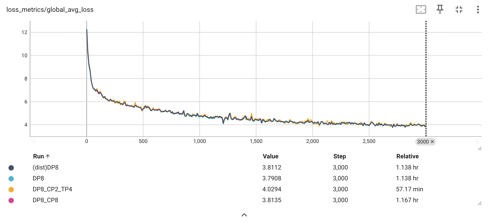

## TorchTitan & TorchComms Composability Testing

### Overview

This folder provides a framework for composability testing with TorchComms and distributed training in TorchTitan. It enables flexible experimentation with distributed communication primitives and various parallelism strategies in PyTorch.

TorchComms repo: https://github.com/meta-pytorch/torchcomms

Simple installation of TorchComms:
```bash
pip install --pre torch torchcomms --index-url https://download.pytorch.org/whl/nightly/cu128
```

If you want to compile torchcomms from source, please follow the instructions in the TorchComms repo.

### Quick Start

The following command uses Llama 3 as an example:

```bash
TEST_BACKEND=ncclx TRAIN_FILE=torchtitan.experiments.torchcomms.train MODEL=llama3 CONFIG=llama3_8b ./run_train.sh
```

### Features

#### Distributed Training Utilities
- Custom communicator backend initialization via `torchcomms.new_comm`
- Compose torchcomms with DeviceMesh via the wrapper API `torchcomms.init_device_mesh`

#### Parallelism Support
Locally tested with:
- **FSDP** (`fully_shard`) - Fully Sharded Data Parallel
- **TP** - Tensor Parallelism
- **PP** - Pipeline Parallelism
- **CP** - Context Parallelism
- **EP** - Expert Parallelism
- **compile** - `torch.compile` integration
- **Async TP** - Async TP integration

### Performance

**Setup**: Similar setting as [docs/converging.md](../../docs/converging.md) based on the `llama3_8b` config (see [config_registry.py](../../models/llama3/config_registry.py)), but `training.local_batch_size = 1`

| Run Name    | Parallelism        | Distributed Library | Remarks               |
| ----------- | ------------------ | ------------------- | --------------------- |
| (dist)DP8   | FSDP 8             | c10d.distributed    | Baseline              |
| DP8         | FSDP 8             | torchcomms          | 1D test set           |
| DP8_CP2_TP4 | FSDP 8, TP 4, CP 2 | torchcomms          | 3D test set           |
| DP8_CP8     | FSDP 8, CP 8       | torchcomms          | CP with larger degree |

**Results**:




### Known Issues

- **Memory Overhead** - TorchComms requires higher peak memory usage. As a workaround, we need to reduce `local_batch_size` to avoid out of memory error.
- **Pipeline Parallelism** - Pipeline Parallelism is not supported yet when PP degree is larger than 2.

## Roadmap

- [ ] Add N-D parallelism end-to-end performance and convergence tests
  - Test with additional models: DeepSeek-V3, Qwen3, Llama4, etc. on large scale
