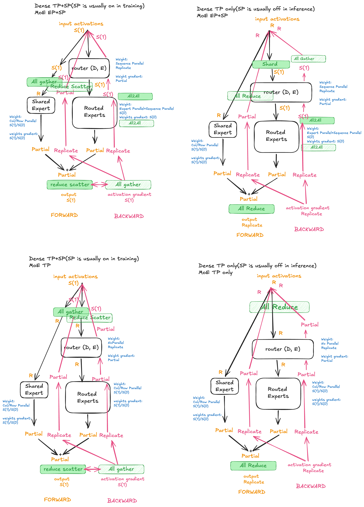

# MoE Sharding

Config-based sharding for MoE submodules, implemented in
[`moe_sharding.py`](moe_sharding.py).

## Overview

The diagram below shows the DTensor placement flow through the MoE layer
for all four parallelism configurations (EP on/off × SP on/off).

([Excalidraw source](https://excalidraw.com/#json=2abKr0m2s26fc6lyoF9Qq,MqMzUIoXWYJIfckHNOB7Sw))

## Configurations

"MoE input src → dst" shows the input redistribution at the MoE boundary.
"Routed expert weights" describes the routed expert weight placement.

| Config | Routed expert mesh | Routed expert weights | MoE input src → dst | MoE output |
|--------|-------------------|----------------------|---------------------|------------|
| EP on, SP on | sparse (EP/EFSDP) | `Shard(0)` on EP | `Shard(1)` → `Shard(1)` | `Partial` → `Shard(1)` |
| EP on, SP off | sparse (EP/EFSDP) | `Shard(0)` on EP | `Replicate` → `Replicate` | `Partial` → `Replicate` |
| EP off, SP on | dense (TP) | TP-sharded (colwise/rowwise) | `Shard(1)` → `Replicate` | `Partial` → `Shard(1)` |
| EP off, SP off | dense (TP) | TP-sharded (colwise/rowwise) | `Replicate` → `Replicate` | `Partial` → `Replicate` |

## Submodule sharding

- **MoE wrapper**: input/output redistribution between `sp_layout` and
  `desired_input_layouts`. Output is `Partial`, reduced to `sp_layout`
  at the boundary.
- **Router gate**: weights `Replicate`, output stays DTensor.
- **Shared experts** (w1/w2/w3): dense-family TP plan. Colwise for w1/w3,
  rowwise for w2. Output stays `Partial` — reduction happens once at
  the MoE boundary.
- **Routed experts** (`GroupedExperts`): `LocalMapConfig` converts DTensor
  inputs to local tensors at the module boundary. Expert computation
  runs on local tensors. Output wrapped back as `DTensor(Partial)`.
