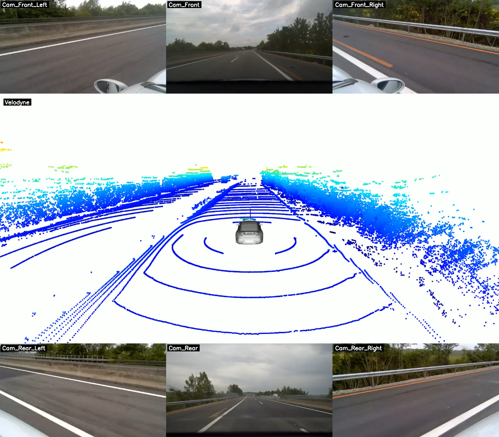

# FORVIA HELLA Dataset

A Pytorch Dataset for loading the KITTI-form dataset provided by FORVIA HELLA, with an integrated 3D visualization tool for point clouds and multi-camera views.

---

## 📁 Dataset Structure (KITTI-like format)

The dataset follows a KITTI-style directory layout:

```
/p/data1/nxtaim/proprietary/hella/HellaDataset/
├── <rec_id>/
│   ├── velodyne_points/
│   │   ├── data/                  # LiDAR point cloud (.bin)
│   │   └── timestamps.txt        # Timestamps for each LiDAR frame
│   ├── image_00/ ~ image_06/
│   │   ├── video.avi             # video of camera images
│   │   └── timestamps.txt        # Timestamps for each camera frame
│   ├── oxts/
│   │   ├── data/                 # OXTS data files (.txt with 30 float values each)
│   │   └── timestamps.txt        # Timestamps for OXTS
```
---

## 🚀 How to Start

### 1️⃣ Setup Python Environment
```bash
# generate a python env, ignore if already exist
python -m venv env_hella_dataset
```

```bash
# activate environment and install necessary packages
source /p/scratch/nxtaim-1/proprietary/hella/env_hella_dataset/bin/activate
pip install torch torchvision torchaudio --index-url https://download.pytorch.org/whl/cu121
pip install numpy pillow py7zr pandas matplotlib tqdm sympy

```

---

### 2️⃣ Run Dataset Loader

#### Usage
```bash
python hella_dataset.py --dataset_dir "D:/Datasets/Hella_dataset" --seq_list seq1 seq2 seq9 --sensors velodyne oxts cam0 cam1 cam2 cam3 cam4 cam5 cam6
```

#### Available Arguments
- `--dataset_dir`: Root directory of the dataset
- `--seq_list`: Space-separated list of sequence names (e.g., `seq1 seq2 seq9`)
- `--sensors`: Space-separated list of sensors (e.g., `velodyne oxts cam0-6`)

---


## 🧾 Data Format Per Sample

Each sample from the dataset contains the following:

| Key              | Type         | Shape            | Description                                               |
|------------------|--------------|------------------|-----------------------------------------------------------|
| `velodyne`       | `np.ndarray` | (N, 6)           | LiDAR point cloud: `[x, y, z, intensity, yaw, time]`     |
| `image_00`~`06`  | `np.ndarray` | (1080, 1920, 3)  | Rectified RGB camera images                               |
| `oxts`           | `np.ndarray` | (1, 30)          | Ego-motion measurements (30 floating point values)       |

### Camera Layout Mapping

| Key       | Position     | Description                    |
|-----------|--------------|--------------------------------|
| image_00  | Front        | Front center camera            |
| image_01  | Front Left   | Front left camera              |
| image_02  | Front Right  | Front right camera             |
| image_03  | Rear         | Rear center camera             |
| image_04  | Rear 2       | Secondary rear camera          |
| image_05  | Rear Left    | Rear left camera               |
| image_06  | Rear Right   | Rear right camera              |

---

### 3️⃣ DataViewer (Can only run in local currently)

The DataViewer provides real-time 3D visualization of point clouds with synchronized multi-camera views. It supports two modes of operation:

---

#### **Mode 1: Interactive Mode (Camera Setup) 🖱️**

Use this mode to interactively adjust the 3D camera view and save optimal viewing parameters. **This mode requires a display and should only be run on local machines with GUI support.**

**When to use:**
- First-time setup to find the perfect camera angle
- Adjusting visualization parameters for presentations
- Testing different viewpoints before batch rendering

**How to run:**
```bash
# On your LOCAL MACHINE with display
python demo.py --interactive
```

**Workflow:**
1. The visualization window opens showing the 3D point cloud with car model
2. Use your mouse to adjust the view:
   - **Left-click + drag**: Rotate view
   - **Right-click + drag**: Pan view
   - **Scroll wheel**: Zoom in/out
3. Press **'S'** key to save camera parameters to `camera.json`
4. The window closes and parameters are saved

**Output:**
- `camera.json`: Saved camera view parameters
- `preview_saved.png`: Screenshot of the saved view

---

#### **Mode 2: Render Mode (Video Generation) 🎬**

Use this mode to generate videos with pre-configured camera settings. **This is the default mode and is suitable for cluster/headless environments.**

**When to use:**
- Generating videos for presentations or documentation
- Batch processing multiple sequences
- Running on compute clusters without displays
- Automated visualization pipelines

**How to run:**


```bash

python demo.py --dataset_dir "/p/data1/nxtaim/proprietary/hella/HellaDataset" --seq_list seq15 --start_frame 0 --end_frame 100  --fps 20 --save_video True --output_video "output_seq15.mp4" --show_window False \
```

**⚠️ Important Notes for Cluster Usage:**
- **Never use `--interactive` on clusters** - they don't have display support
- Set `--show_window False` to disable visualization window
- Ensure `camera.json` exists (created from interactive mode on local machine)
- If `camera.json` is missing, a default top-down view will be used

---


### 4️⃣ Visualization Output



*Example visualization showing synchronized point cloud and multi-camera views from HELLA dataset*

**Features:**
- Real-time 3D point cloud visualization with Open3D
- Synchronized 6-camera views (Front Left/Center/Right, Rear Left/Center/Right)  
- Customizable viewpoints
- 3D car model overlay for reference


---

## 📋 Requirements

```txt
torch>=1.9.0
torchvision>=0.10.0
numpy>=1.21.0
pillow>=8.3.0
open3d>=0.13.0
opencv-python>=4.5.0
matplotlib>=3.4.0
tqdm>=4.62.0
```

---

## 🎯 Use Cases

1. **Dataset Loading**: Efficiently load and batch HELLA dataset for training
2. **Data Exploration**: Visualize point clouds and camera data interactively  
3. **Video Generation**: Create demonstration videos of autonomous driving data
4. **Algorithm Development**: Test perception algorithms with multi-modal sensor data
5. **Presentation**: Generate high-quality visualizations for research presentations

---

## 👥 Authors

- Zhaoze Wang: zhaoze.wang@forvia.com

- Changxu Zhang: changxu.zhang@forvia.com

- Christopher Grimm: christopher.grimm@forvia.com

- Claas Tebrügge: claas.tebruegge@forvia.com

© 2025 FORVIA HELLA. All rights reserved.
