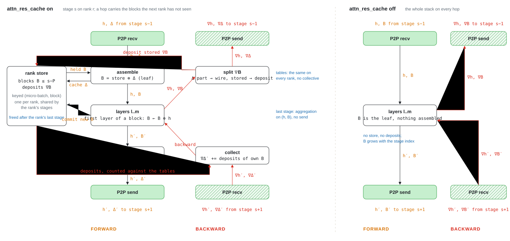

# Pipeline parallelism for the block attention residual

Kimi K3 carries a stack of block residuals alongside the hidden state, and a
pipeline hop has to carry that stack too. The split and the schedule are
core's, through `pipeline_with_first_last_stage_modules`
([`__init__.py`](__init__.py)); the stage that moves the stack is
[`stage.py`](stage.py), and the tables that decide what each hop carries are
[`layout.py`](layout.py).

## Overview

The figure shows one stage on one rank with the cache on, forward and backward,
and the same stage with the cache off. `h` is the hidden state, `B` the block
stack, `Δ` the blocks a hop carries, `∇` a gradient; P2P boxes are green, solid
forward and hatched backward; forward arrows are black and backward arrows red.

## The two transports

| `attn_res_cache` | a hop carries | the rank keeps | against a single device |
|---|---|---|---|
| on (default) | hidden `[T, D]` and the blocks the receiving rank has not seen, `[T, Nd, D]` | every block its earlier stages committed or received, per micro-batch, in `PPRankLocalCache`, released after its last stage's forward | the same values; the cached blocks' gradients are summed in another order, so not bitwise |
| off | hidden `[T, D]` and the whole stack `[T, N, D]` | nothing between hops | bitwise |

Plain `1F1B` has one stage per rank, so the rank store never holds anything
and the two transports are the same hop.

## What the stage does

- `assemble_stack`: the received delta and the held blocks become one leaf
  `[T, N, D]` in block order, and the stage's model part runs on it.
- `pack_outgoing_delta`: the columns the next rank lacks, `delta_to_send`,
  as views of the model's stack.
- Backward: `split_stack_grad` returns the received columns' gradient to the
  previous stage in wire order and deposits the held blocks' gradients in the
  store; the stage that committed a block collects them in
  `_retrieve_recv_grads`, `deposits_expected` many, else it raises.

## The routing tables

`BlockLayoutTables` is a pure function of the split and the stage-to-rank map,
the same on every rank: `commits_at(stage)`, `cache_at_entry(stage)`,
`delta_to_send(stage)` and `deposits_expected(block, stage)`. It walks stages
in index order and keeps a block on the rank that sees the stage next, the
loop-style assignment, stage `s` on rank `s % pp`; with the cache on,
`pipeline_kimi_k3` refuses any other map.
