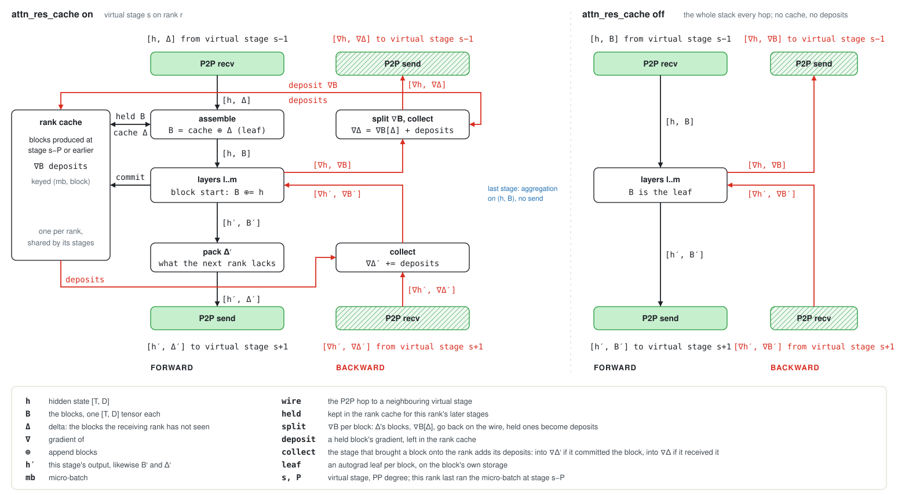
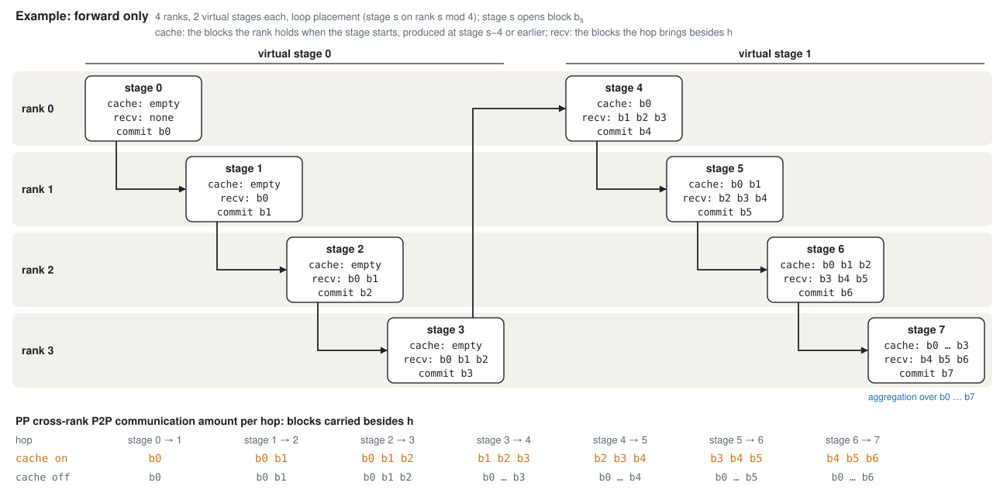

# Pipeline parallelism for the block attention residual

Kimi K3 carries its block residuals alongside the hidden state, one tensor per
block, and a pipeline hop has to carry them too. The split and the schedule are
core's, through `get_module_fqns_per_model_part` and `pipeline_llm`
([`__init__.py`](__init__.py)); the stage that moves the blocks is
[`stage.py`](stage.py), the rank cache is [`cache.py`](cache.py), and the
tables that decide what each hop carries are [`layout.py`](layout.py).

## Overview

One virtual stage on one rank, with `attn_res_cache` on and off. Forward in
black, backward in red; the P2P receive and send are the green boxes, solid
forward and hatched backward. The legend in the figure defines every symbol.
With the cache on, the stage sends back
$\nabla\Delta = \nabla B[\Delta] + \text{deposits}$: for each block it
received, the gradient its own backward computes, which includes what came
back in $\nabla\Delta'$, plus the deposits the rank's later stages left for
that block.

## Example

Forward only, with four ranks and two virtual stages each in loop placement,
the shape of the cache-based pipeline figure in the Attention Residuals paper,
and each stage opening one block. A rank holds every block produced at stage
`s - 4` or earlier, because that is where it last ran the micro-batch; a hop
brings the rest. From the second virtual stage on, a hop carries at most
`P - 1 = 3` blocks, where all of them would be 4 to 7.

## The two transports

| `attn_res_cache` | a hop carries | the rank keeps | against a single device |
|---|---|---|---|
| on (default) | hidden `[T, D]` and one `[T, D]` tensor for each block the receiving rank has not seen | each block its earlier stages committed or received, once per micro-batch in the rank cache: the received or committed tensor itself, released at the backward of the stage that brought it | the same values; the cached blocks' gradients are summed in another order, so not bitwise |
| off | hidden `[T, D]` and every block, one `[T, D]` tensor each | nothing between hops | bitwise |

Plain `1F1B` has one stage per rank, so both transports carry every block on
every hop; with the cache on, the rank cache holds a micro-batch's blocks until
that stage's backward, the same tensors the stage keeps for it anyway.

A pending P2P send keeps its tensor allocated until it is waited. Under
`Interleaved1F1B` the stage therefore waits a forward send at its own backward
of that micro-batch and an input-gradient send at the first forward on the rank
that proves the peer has used it, rather than at the end of the step, so a
released block is not kept alive by its send.

With the cache on, the placement must be the loop one, stage `s` on rank
`s mod P`, as in `Interleaved1F1B`; `pipeline_kimi_k3` refuses any other, such
as a V-shaped schedule's.
