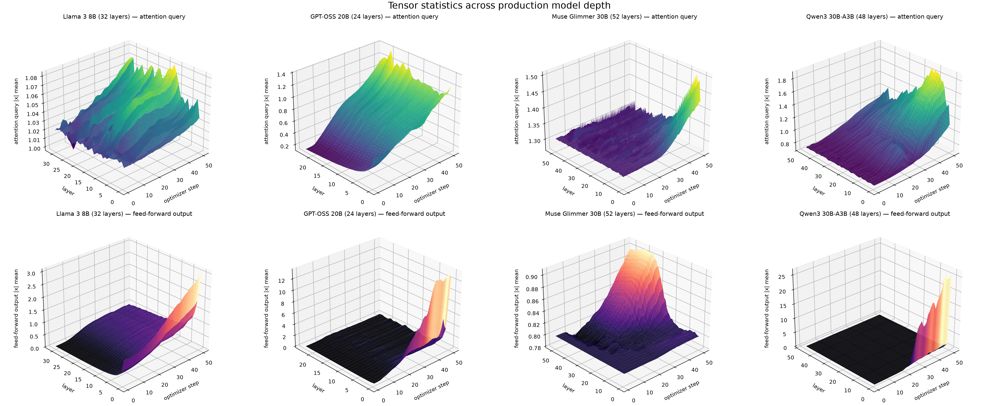

# TorchTitan tensor logging

Tensor metrics fall into two categories:

a. **Ordinary metrics (supported)** do not need topology-specific reduction logic, e.g. `max_gradient`.

b. **Topology-dependent metrics (follow-up)** whose meaning depends on TP, CP, DP, or EP must reconstruct the correct population first.

   For example, one sequence is split across two CP ranks and routed to two experts. Each vector is `[tokens sent to expert 0, tokens sent to expert 1]`:

   ```text
   CP rank 0 counts: [10,10]
   CP rank 1 counts: [0,20]

   imbalance(counts) = max(counts) / mean(counts)
   NAIVE:   generic population [10,10,0,20] -> 20/10 = 2.0
   CORRECT: CP SUM by expert [10,30]        -> 30/20 = 1.5
   ```

## Enable it

```bash
NGPU=8 MODULE=qwen3 CONFIG=qwen3_debugmodel ./run_train.sh \
  --metrics.enable-wandb \
  --metrics.tensor-logging.enabled \
  --metrics.tensor-logging.freq 5
  --metrics.tensor-logging.publish-filter-regex \
  '\.(?:numel|nonfinite_count|abs_mean|square_mean|abs_max)$'
```

The layer-by-step scalars can be constructed from logged values:



## Mental model for ordinary metrics

```text
Per model module
    register metrics
          |
trainer initialization
    resolve public model paths -> allocate in a buffer one fixed row per metric
          |
forward/backward
    update raw statistics in those rows
          |
selected logging step
    packed SUM + MAX -> two all-reduces -> derive metrics -> filter -> logger
```

### Register and record metrics in the module

Registration maps module-local metric names to rows in one shared buffers.

```python
class Attention(nn.Module):
    def __init__(self, ...):
        super().__init__()

        # Register metric names
        tensor_logging.register(self, ["scores"])
        tensor_logging.register_fwd_bwd(self, ["xq"])

    def forward(self, x):
        xq = self.query(x)
        scores = self.compute_scores(xq)

        # Record tensors under the names registered above.
        tensor_logging.log_fwd_bwd_stats(self, xq=xq)
        tensor_logging.log_stats(self, scores=scores)

        return self.apply_scores(scores)

# Resolve registered names and allocate their shared buffer rows.
tensor_logging_state = tensor_logging.init(
    model_parts,
    device=torch.device("cuda"),
)
```

### Initialize fixed metric buffers

Each module registers its metric names. `init(model_parts)` collects them and allocates two fixed GPU buffers: additive statistics with shape `[N_registered_metrics, 7]` and maxima with shape `[N_registered_metrics]`. Each `(module, metric_name)` maps to the same row in both buffers.

`register(self, ["scores"])` declares one metric name.
`register_fwd_bwd(self, ["xq"])` declares two metric names.

```text
<module>.scores     statistics of scores during the forward pass

<module>.xq.x       statistics of xq during the forward pass
<module>.xq.dx      statistics of the gradient arriving at xq during backward
```

Here `<module>` is the module's global model path.

Initialization therefore allocates three metric rows, one for each buffer key:

```text
BUFFER KEY              FIXED ROW

<module>.scores         0
<module>.xq.dx          1
<module>.xq.x           2
```

Each row accumulates seven statistics:

```text
n       element count
nf      nonfinite count
z       zero count
obs     number of tensor observations, e.g. 4 gradient-accumulation forwards
|a|     sum of absolute values
x2      sum of squared values
x4      sum of fourth powers
```

It also stores `abs_max`, the largest absolute value, in a separate maximum buffer.

The runtime allocates these buffers once:

```text
sum_statistics [3 registered metrics, 7 additive statistics]   FP32
maxima         [3 registered metrics]                          FP32

                      7 additive fields
                 <----------------------->
              +-----------------------------+
scores     0  | n  nf  z  obs  |a|  x2  x4 |
xq.dx      1  | n  nf  z  obs  |a|  x2  x4 |
xq.x       2  | n  nf  z  obs  |a|  x2  x4 |
              +-----------------------------+

maxima = [scores.abs_max, xq.dx.abs_max, xq.x.abs_max]
```

### Accumulate and collect on selected logging steps

**Eager:** On a non-logging step, the helper returns before launching the statistics operation.

**Compiled and CUDA-captured graphs:** The statistics operation remains in the reusable graph, but a device gate prevents it from reading the tensor or updating buffers.

In both cases, reduction across ranks is **skipped** in non-logging steps.

```python
# Trainer.train()
is_tensor_log_step = (
    metrics_processor.should_log(step)
    and step % tensor_logging_freq == 0
)

with tensor_logging.set_enabled(is_tensor_log_step):
    self.train_step(data_iterator)

# Trainer.train_step(), after forward/backward and the optimizer step
if self.tensor_logging is not None and tensor_logging.is_enabled():
    # Reduce buffers and derive the public metrics.
    tensor_metrics = self.tensor_logging.collect()
```

`collect()` is responsible for:

- reducing the packed buffers;
- copying them to CPU;
- deriving public metrics, such as `abs_mean = abs_sum / numel`;
- applying the publication filter and clearing the buffers.

```python
# ILLUSTRATIVE CODE
def collect(self) -> dict[str, int | float]:
    # Copy the preallocated step buffers before reducing them.
    sum_statistics = self.statistic_buffers.sum_statistics.clone()
    maxima = self.statistic_buffers.maxima.clone()

    # Two packed collectives cover every registered tensor metric.
    if dist.is_initialized():
        dist.all_reduce(sum_statistics, op=dist.ReduceOp.SUM)
        dist.all_reduce(maxima, op=dist.ReduceOp.MAX)

    # Copy each packed buffer to CPU once, then derive public values such as
    # abs_mean, rms, kurtosis, and abs_max for every registered row.
    sum_statistics = sum_statistics.cpu()
    maxima = maxima.cpu()
    metrics = derive_metrics(sum_statistics, maxima)

    # Filtering changes publication only; all registered rows were computed.
    metrics = apply_publication_filter(metrics, self._publish_filter)

    # The next selected step starts with empty buffers.
    self.statistic_buffers.clear()
    return metrics
```

For one `scores` row, derivation produces names such as:

```text
scores.numel
scores.nonfinite_count
scores.observation_count
scores.zero_frac
scores.abs_mean
scores.square_mean
scores.rms
scores.kurtosis
scores.abs_max
```

## Compatibility

`✓` supported and tested
`✗` rejected during setup

```text
Configuration                                                   Status
DP / TP / CP / EP                                               ✓
spmd_types backend                                              ✓
torch.compile(fullgraph=True)                                   ✓
Full activation checkpointing                                   ✓
CUDA graphs                                                     ✓
Gradient accumulation                                           ✓
Graph Trainer, in-process and PP disabled                       ✓
FaultTolerantTrainer / TorchFT                                  ✗

DP × CP × TP / EP + FullAC + spmd_types                         ✓
DP × PP × TP / EP + compile + FullAC + spmd_types               ✓

Pipeline parallel, 1F1B                                         ✓
Pipeline parallel, Interleaved1F1B                              ✓
Graph Trainer, precompiled and PP disabled                     ✓
Other pipeline schedules                                        ✗
Graph Trainer + pipeline parallel (GraphPP)                     ✗
```

## Execution details

### What work happens on non-logging steps?

```text
                              Eager off-step   Compiled/captured off-step   Logging step
`log_stats` is called              yes                    yes                   yes
Launch statistics kernel            no                    yes                   yes
Read tensor and compute stats       no                     no                   yes
Update statistic buffers            no                     no                   yes
Reduce and publish                  no                     no                   yes
```

On an eager off-step, `log_stats()` returns without launching the statistics kernel. In compiled or CUDA-captured execution, the retained kernel launches but reads `enabled=0` and exits before reading the logged tensor, computing statistics, or updating buffers.

### Why does cadence not change the graph or run reductions off-step?

The compiled or captured graph always contains the same statistics operation:

```text
enabled=0 -> launch kernel -> exit before reading the tensor
enabled=1 -> launch kernel -> read tensor and update buffers
```

Cadence changes only the device value `enabled`. This is runtime behavior inside one unchanged kernel, so it does not create a graph break or trigger recompilation.

The packed SUM and MAX all-reduces are outside the compiled or captured graph. On selected steps, trainer Python calls `collect()` after forward, backward, and the optimizer step. `collect()` runs one packed SUM, one packed MAX, copies both buffers to CPU, derives metrics, clears the buffers, and returns the metrics for publication. None of this runs on an off-step.

### How are backward statistics recorded?

`log_fwd_bwd_stats()` records `<name>.x` immediately and attaches an autograd hook. During backward, the hook receives the incoming cotangent and an ordered custom operation records `<name>.dx` in that metric's buffer row.

If the tensor does not require gradients, the forward `.x` statistics are still recorded but no `.dx` metric is observed.

### Why does activation checkpointing not double-count statistics?

Eager FullAC runs the original forward with the recompute flag false, so it records normally. `_mark_activation_checkpoint_recompute()` sets the flag only around the second forward; `log_stats()` and `log_fwd_bwd_stats()` see it and return before recording that recomputed value. Under compiled FullAC, the checkpoint policy marks the mutation operation `MUST_SAVE`, so recomputation does not execute the update again.

### Does PP divide metrics by pipeline degree?

No. The stage that owns a metric writes its row. Other stages contribute zero to additive fields and negative infinity to the maximum. WORLD SUM/MAX therefore reproduces the owning stage's values without dividing by PP degree.

### Which regular pipeline schedules support tensor logging?

Only `1F1B` and `Interleaved1F1B`. Tensor logging uses an explicit allowlist and fails during setup for ZBVZeroBubble, DualPipeV, or any other schedule until a focused test proves complete forward and backward metric coverage.

### Which Graph Trainer modes support tensor logging?

In-process non-PP Graph Trainer tracing is supported: tensor-logging buffers exist before the lazy trace, and replay uses the same buffers and device cadence flag. Precompiled non-PP artifacts are also supported.

GraphPP is rejected during setup because its copied stage-local FX forward graphs do not yet bind the live statistics buffers.

### What performance optimizations are used?

- Buffer rows are allocated once during `init()` and reused.
- On a non-logging compiled or captured step, the Triton kernel reads `enabled=0` and returns before reading the tensor.
- The Triton kernel reads contiguous storage. Common transposes and permutations become no-copy views; `.contiguous()` is used only when the layout still has gaps.
- Every additive field shares one SUM all-reduce and every maximum shares one MAX all-reduce, regardless of how many metrics are registered.
- The all-reduces and scalar derivation run only on logging steps and outside compiled or captured forward/backward.

## Current limitations

- The publication filter does not skip GPU collection.
- Publication is synchronous with the training step.
- Unsupported PP schedules and GraphPP fail during setup.
- FaultTolerantTrainer rejects tensor logging during setup.
