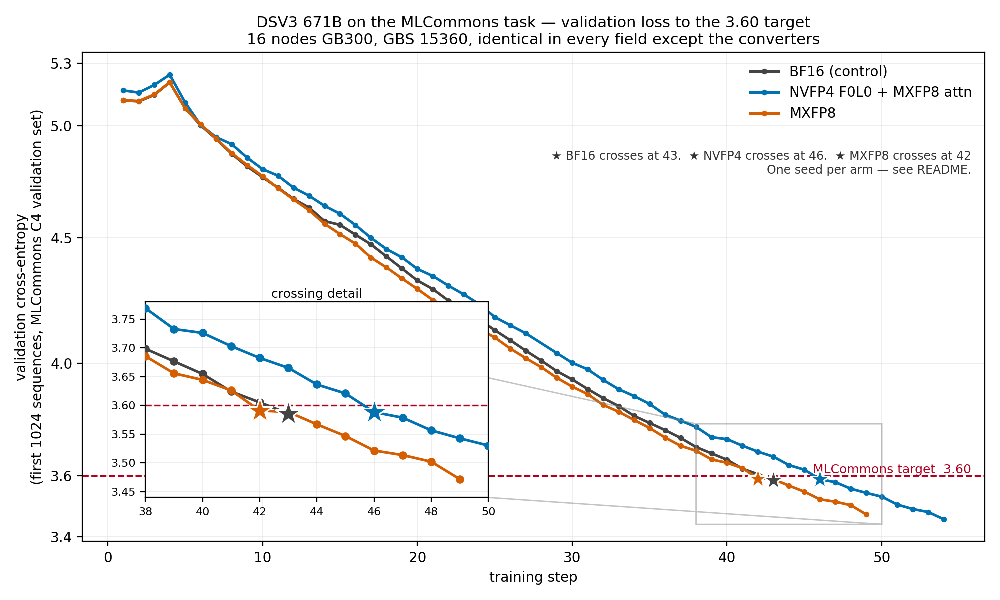

## Experimental NVFP4 Training on Blackwell GPUs

NVFP4 training dynamically quantizes linear GEMM activations, weights, and
gradients to NVFP4 through TorchAO's training prototype. The model weights and
distributed collectives remain in bf16. This reduces memory use and can improve
throughput on NVIDIA Blackwell GPUs.

> [!WARNING]
> NVFP4 training is experimental. It depends on a TorchAO prototype and has no
> backward-compatibility guarantees. NVFP4 training is not guarded by CI; the
> results below are evidence from a small set of 200M-token training runs, not
> broad numerical or performance validation.

### Requirements

- NVIDIA Blackwell SM100 or later GPU with CUDA.
- A PyTorch and TorchAO build that provides
  `torchao.prototype.moe_training.nvfp4_training`.
- `torch.compile` for competitive performance. The provided
  `llama3_8b_first_85_pct_layers_nvfp4` recipe enables model compilation automatically.
- Local GEMM dimensions divisible by 128. A Linear whose local in/out features
  are not a multiple of 128 (after TP sharding) is rejected by the NVFP4 kernels
  and must be excluded from the converter. The mixed recipe converts only
  decoder layers, so the token embeddings and LM head always remain in bf16.

### NVFP4 Training Recommendations

1. Use NVFP4 for most of pretraining.

2. Keep a small set of numerically sensitive linear layers in higher precision throughout training. As a general rule, **leave approximately the final 15% of decoder blocks in BF16**, and keep the LM head in BF16. The layer-selection policy follows [What Matters for NVFP4 Training? A Scaling Study of Low-Precision Pre-Training Recipes](https://openreview.net/pdf?id=jlkIyaG32w). This is also consistent with [Pretraining Large Language Models with NVFP4](https://arxiv.org/abs/2509.25149), which identifies the final blocks as the most precision-sensitive and recommends keeping a small fraction—fewer than approximately 15%—of the final layers in BF16. Its conservative 12B training run additionally kept the first two blocks in BF16.

3. When matching higher-precision training loss is important, Appendix D recommends “switching to high precision shortly before the onset of learning rate decay” for full loss recovery. A switch performed only at the very end can still improve loss, but may not completely close the gap because the learning rate is already small.

4. [Appendix D. Switching to Higher Precision](https://arxiv.org/abs/2509.25149) finds that most of the loss gap comes from quantization in the forward pass. Switching only the forward-pass GEMM inputs to BF16, while leaving Dgrad and Wgrad in NVFP4, reduced the paper's relative loss error from approximately 1.5% to 0.5%. The authors observed no corresponding benefit from a backward-only switch, and the forward-only policy placed only approximately 6% of total training computation in higher precision.

5. The current TorchTitan NVFP4 integration does not support independently switching Fprop to BF16 while retaining NVFP4 for Dgrad and Wgrad. The practical fallback is a full-BF16 finish, which is more expensive than the paper's preferred forward-only policy and approximates the Appendix D experiment.

* Save a TorchTitan checkpoint at the desired precision-switch boundary.
* Restart from that checkpoint with the NVFP4 converter or override disabled.
* Set the training dtype to BF16.
* Restore the model, optimizer, learning-rate scheduler, dataloader, and trainer-step state, and continue the same learning-rate schedule.

5. For maximum NVFP4 utilization, defer the switch until very near the end of training. A short BF16 finish can still improve loss, although it may not completely recover the higher-precision baseline because the learning rate is already small.

6. Skip the end-of-training switch when the NVFP4 model already meets the desired downstream quality.

The following recommendations are based on
* [Pretraining Large Language Models with NVFP4](https://arxiv.org/abs/2509.25149),
particularly Appendix D. Switching to Higher Precision
* [What Matters for NVFP4 Training? A Scaling Study of Low-Precision Pre-Training Recipes](https://openreview.net/pdf?id=jlkIyaG32w)

### Llama 3 8B Usage

Use the `llama3_8b_first_85_pct_layers_nvfp4` config for the supported Llama 3 8B recipe:

```bash
torchrun --standalone --nproc_per_node 4 \
  -m torchtitan.train \
  --module llama3 \
  --config llama3_8b_first_85_pct_layers_nvfp4 \
  --parallelism.tensor_parallel_degree 1 \
  --parallelism.data_parallel_shard_degree 4 \
  --training.num_tokens_per_microbatch_per_dp_rank 65536 \
  --training.max_context_length 2048 \
  --training.steps 763 \
  --dataloader.dataset c4 \
  --metrics.log_freq 10 \
  --optimizer.param-groups.0.optimizer-kwargs.lr 0.0003 \
  --hf-assets-path ./tests/assets/tokenizer
```

For the 32-layer Llama 3 8B model, layers 0-26 use NVFP4 and layers 27-31 remain bf16.


### Llama 3 8B 200M-Token Evidence

The following eager + `torch.compile` runs trained Llama 3 8B on C4 for 200M
tokens with global batch size 128 (local batch size 32, FSDP degree 4). Results
are reported at step 760.

| Run | Loss | Tokens/sec (per GPU) | Memory |
| --- | ---: | ---: | ---: |
| NVFP4 (bf16 tail) | 1.2715 | 30,040 | 110.95 GiB (60.2%) |
| MXFP8 | 1.2671 | 28,084 | 179.94 GiB (97.6%) |
| BF16 | 1.2738 | 21,919 | 174.49 GiB (94.7%) |

In this run nvfp4 remained faster and used less memory than both the MXFP8 and bf16 baselines, and its final loss is on par with them.


*Llama 3 8B training loss through 200M tokens at global batch size 128. All runs use eager execution with model compilation.*

### Qwen3 8B 200M-Token Evidence

The following eager + `torch.compile` runs trained Qwen3 8B on C4 for
200,015,872 tokens with global batch size 64 (local batch size 16, FSDP degree
4), sequence length 2048, and 1,526 optimizer steps. Results are reported at
the final logged step, 1,520. The mixed NVFP4 recipe converts layers 0-29 to
NVFP4 and leaves layers 30-35 plus the LM head in bf16.

#### Random Initialization

| Run | Loss | Tokens/sec (per GPU) | Peak Reserved Memory |
| --- | ---: | ---: | ---: |
| NVFP4 (bf16 tail) | 3.82986 | 26,732 | 78.63 GiB (42.67%) |
| MXFP8 | 3.81545 | 27,587 | 112.63 GiB (61.12%) |
| BF16 | 3.81439 | 20,913 | 112.88 GiB (61.25%) |

In this run, NVFP4 delivered 28% more throughput than bf16 while using 34.25
GiB (30%) less peak reserved memory. It was 3% slower than MXFP8 while using
34.00 GiB (30%) less memory. Its final logged loss was 0.01547 above bf16 and
0.01441 above MXFP8.


*Qwen3 8B random-initialization training loss through 200M tokens at global batch size 64.*

### DeepSeek-V3 671B MLPerf-Task Evidence

The following runs trained DeepSeek-V3 671B on 64 GB300 GPUs against the
MLCommons DeepSeek-V3 benchmark task, which measures **how many training steps a
recipe needs to bring validation cross-entropy below 3.60** starting from the
published BF16 checkpoint. The step count is the figure of merit; the loss value
is only the stopping condition. All three arms are identical in every field
except the converters.

| Arm | Steps to 3.60 | TFLOP/s per GPU | Tokens/sec per GPU | Peak Reserved Memory |
| --- | ---: | ---: | ---: | ---: |
| MXFP8 attention | 42 | 734.83 | 2,614 | 226.08 GiB (81.73%) |
| BF16 (control) | 43 | 618.06 | 2,198 | 227.26 GiB (82.16%) |
| NVFP4 F0L0 + MXFP8 attention | 46 | 825.10 | 2,935 | 220.02 GiB (79.54%) |

NVFP4 delivered 33% more throughput than the BF16 control while using 7.24 GiB
less peak reserved memory, and reached the target in 46 steps against the
control's 43 — a 7.0% step penalty. Combining both axes, NVFP4 reaches the
target in roughly 0.75 of the control's wall clock, so the step penalty does not
cancel the throughput gain. MXFP8 crossed one step *before* the control; with
one seed per arm that difference is inside single-seed noise and should be read
as no measurable convergence cost rather than an improvement.

TFLOP/s figures are medians over every training step of every round, reported as
medians rather than means because the first step of each round pays compilation
and autotuning. MFU is not reported for the quantized arms: TorchTitan prints
`mfu: N/A` for them, since the metrics component has no peak-FLOPS denominator
for those formats.



*DeepSeek-V3 671B validation cross-entropy to the 3.60 target. The inset shows
the crossing detail; stars mark the first step at or below the target.*

#### Configuration

- 16 nodes x 4 GB300 GPUs = 64 GPUs. Expert parallel degree 32, pipeline
  parallel 1, tensor parallel 1, context parallel 1,
  `data_parallel_shard_degree -1`.
- MoE communication backend `hybridep` at
  `non_blocking_capacity_factor 0.0375`, attention backend `flex`, full
  activation checkpointing, `--compile.components model,loss`, CUDA graph
  capture disabled.
- Local batch size 8, sequence length 4096, global batch size 15360 sequences
  via gradient accumulation 30 — 62.9M tokens per step.
- Learning rate 2.324e-5, warmup 4 steps, `decay_ratio 0.0`, real routing
  (`force_load_balance: false`). The capacity factor is 0.0375 rather than the
  exact fit 0.03125: real routing exceeds balanced demand, and an exact fit
  would make the NVFP4 arm drop more tokens than the other two, confounding
  precision with token-drop rate.
- Training on the single C4 `en/3.0.1` partition the reference pins in code,
  Megatron-preprocessed and pre-tokenized with the Llama 3.1 8B tokenizer:
  45,608,611 sequences / 20,994,193,570 tokens, consumed in a single pass with
  no re-reads. Validation on the reference's own holdout file over its first
  1024 packed sequences in original order. All arms start from the published
  MLCommons BF16 checkpoint loaded in HuggingFace format.
- MXFP8 arm: `MXFP8LinearConverter(fqns=["attention.wq", "attention.wo"])`,
  which by substring match covers `wq_a`, `wq_b`, and `wo`; `wkv_a`, `wkv_b`,
  and the dot-product attention stay BF16. NVFP4 arm: `NVFP4LinearConverter` on
  the FFN fqns plus `NVFP4GroupedExpertsConverter` on all 61 layers' routed
  experts — F0L0, no BF16 tail — with MXFP8 on the same 1D attention path.

> [!NOTE]
> These runs use one seed per arm, so a one- or two-step difference between arms
> is inside the noise a single seed can produce. TorchTitan restarts position
> IDs at every document boundary, giving document-aware attention, while the
> MLCommons reference runs with `reset_position_ids=False` and attends across
> document joins inside a packed sample. That difference is identical across all
> three arms here, so the relative ordering holds, but absolute step counts are
> not directly comparable to the reference's published numbers.

### Versioned Environment

The Llama results and instructions use the container's current upstream builds:

- PyTorch: `2.14.0a0+gitd9abf9e`
- TorchAO: `0.18.0+gitcb76f29`

### Known Limitations

- NVFP4 is a TorchAO prototype and is experimental.
- There is no NVFP4 end-to-end GPU training coverage in CI.
- It supports SM100 or later only.
- NVFP4 quantizes GEMMs only; tensor-parallel all-gather and reduce-scatter remain in bf16.
- The 200M-token results are limited to the documented Llama 3 8B and Qwen3 8B C4 configurations. Validate convergence and performance for each new model, parallelism, and hardware configuration.
- The DeepSeek-V3 671B results are a single seed per arm on one hardware and parallelism configuration.
