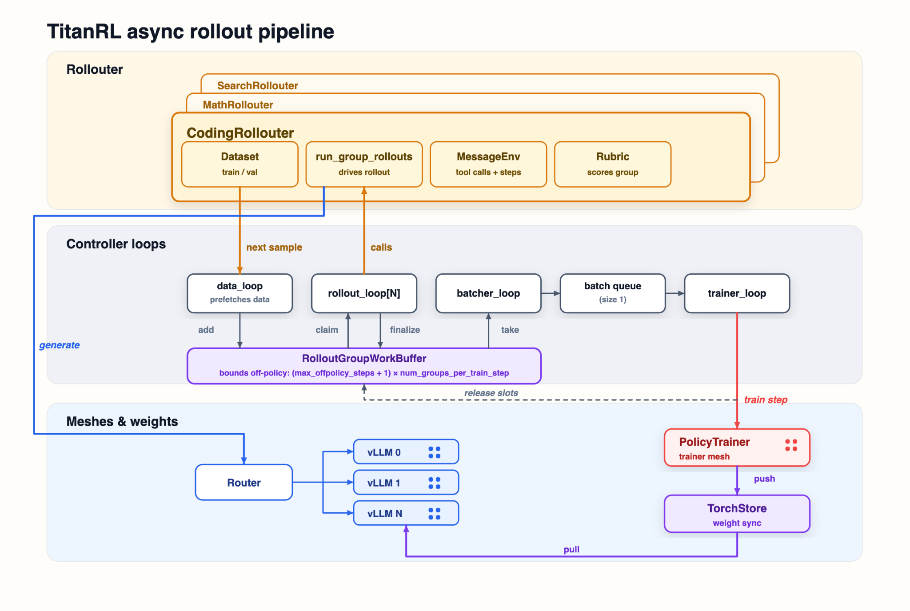

# TitanRL

TitanRL is a hackable RL library built for scaling and debugging experiments where correctness and numerics are not optional. Main advantages:

- **Unified model definition:** Most RL stacks connect a training model to a separate inference implementation. TitanRL runs (mostly) the same TorchTitan model inside the trainer and vLLM (the attention modules differ, but use the same underlying kernels), so new models and kernels generally need to be implemented only once. This makes new architecture research easier and removes a major source of potential training/inference mismatch bugs.
- **Batch invariance:** Trainer and inference engines can produce different logits for the same input. In batch-invariant mode, supported configurations produce **bitwise-identical** log probabilities across different data-parallel layouts. This lets developers debug correctness during on-policy training, where numerical differences would otherwise make bugs difficult to isolate.
- **One stack from pretraining to post-training.** Fork TorchTitan once and reuse its model definitions, kernels, and training components across the model lifecycle. This avoids wiring the same model across different libraries and enables faster development.

Together, the unified model, batch-invariant mode, and single training stack provide a base that developers can verify, reshape, and optimize for their needs.

Note: Unified-model performance varies by model, input shape, and parallelism: it can trail native vLLM in inference-only workloads but outperform it end to end in some RL configurations. Batch invariance trades throughput for exact numerics and can be used for debugging or controlled on-policy studies.

[Test status](#test-status) · [Model support](#model-support) · [Architecture](#architecture) · [Write an experiment](#write-an-experiment) · [DAPO Math](./examples/dapo_math) · [Verifiers](./examples/verifiers/dapo_math) · [Observability](#observability) · [Quick Start](#quick-start)

> **Note:** TitanRL is under active development. APIs and configurations may change.

## Test status

| Hardware | Integration Tests | Unit Tests |
| --- | --- | --- |
| NVIDIA GPU | [](https://github.com/pytorch/torchtitan/actions/workflows/integration_test_8gpu_rl.yaml?query=branch%3Amain) | [](https://github.com/pytorch/torchtitan/actions/workflows/unit_tests_rl.yaml?query=branch%3Amain) |

## Model support

Supported entries completed a two-step end-to-end RL run with a representative
debug model, including rollout generation, training, and weight synchronization.
Generator DP and TP were tested together at degree 2; EP was tested at degree 4
for MoE models. Generator sequence parallelism was disabled.

| Model | RL support |
|---|---|
| Llama 3 | ✅ Supported |
| Muse Glimmer | ✅ Supported |
| Qwen 3 | ✅ Supported |
| Qwen 3.5/3.6/3.8 | ✅ Supported (text only) |
| GPT-OSS | ✅ Supported |
| DeepSeek V3 | Not supported |
| DeepSeek V4 | Support coming soon |
| FLUX | Not supported |
| Kimi K2.7 | Not supported |
| Kimi K3 | Support coming soon |

## Architecture



The pipeline has three layers.

**1. Experiment logic.** A `Rollouter` composes training/validation data, a `MessageEnv`, a rubric, and a function to run rollouts. It should be flexible enough to express most custom patterns.

**2. Controller and dataflow.** Independent loops load data, produce rollouts, pack batches, and update the policy. `RolloutGroupWorkBuffer` connects them: `target_offpolicy_steps` sets its depth and so the mean policy age, `windowed_fifo_batches` bounds how far one slow group may exceed it (`None`, the default, leaves it unbounded; `1` is FIFO by batch; see [docs/windowed_fifo.md](docs/windowed_fifo.md)). Set `target_offpolicy_steps=0` for synchronous execution.

**3. Distributed execution.** A router sends requests to one or more vLLM generator replicas. `Trainer` runs on a separately configured TorchTitan mesh, and TorchStore publishes new weights back to the generators. Training and generation can be scaled independently for the workload.

Core and RL each expose a workflow-specific `Trainer`. Both compose the shared
`torchtitan.training_engine.TrainingEngine`, which owns distributed model execution,
optimization, checkpointing, profiling, GC, SDC replay, and CUDA graphs.

The distributed layer builds on two core components:

- **[Monarch](https://github.com/meta-pytorch/monarch) as the controller:** orchestrates trainers and generators on separate GPU meshes with asynchronous communication.
- **[TorchStore](https://github.com/meta-pytorch/torchstore) for weight synchronization:** efficiently publishes weights from the trainer to generators, including direct GPU-to-GPU RDMA transfers.

### Package organization

The package is organized by responsibility and dependency boundary:

- `trainer.py` and `generator.py` contain standalone services. They are usable
  without constructing Monarch actors.
- `components/` contains configurable RL dataflow components such as batching,
  training-sample construction, and the bounded work buffer.
- `rollout/` contains rollout execution, environments, advantages, and rollout
  data types. `rubric.py` and `renderer.py` remain at the package root as
  prominent user extension APIs.
- `distributed/` contains Monarch actor adapters, routing, and TorchStore weight
  synchronization. Actor wrappers should contain endpoint adaptation rather
  than domain behavior.
- `model/` contains model-side adapters required to run TorchTitan models in
  inference systems such as vLLM.
- `observability/` contains RL-specific metrics and rollout recording.
- `examples/` contains datasets, environments, rewards, integrations, and
  complete configuration recipes. Examples should configure reusable
  components directly; they should define subclasses only when behavior is
  actually customized.

Dependencies flow from domain components to standalone services, then to
distributed adapters and the controller. Rollout domain components must not
depend on Monarch or TorchStore, standalone services must not depend on
Monarch, and core TorchTitan must not acquire RL-only optional dependencies.

## Write an experiment

Most experiments configure four pieces:

- training and validation datasets;
- a `MessageEnv` for interaction, tools, and termination;
- a rubric for per-rollout or group reward;
- a `Rollouter` that composes them.

```python
rollouter = Rollouter.Config(
    train_dataset=MyDataset.Config(seed=42),
    validation_dataset=MyDataset.Config(seed=99),
    worker=RolloutWorker.Config(
        message_env=MyEnv.Config(),
        rubric=Rubric.Config(
            reward_fns=[RewardCorrect.Config(weight=1.0)]
        ),
    ),
)
```

Subclass `RolloutWorker` or `Rollouter` only when an experiment changes their
behavior. For example, the Verifiers integration keeps a custom
`VerifiersRollouter` because it owns an external environment server and a
different rollout protocol.

The default path handles rollout, scoring, batching, training, and weight sync.

That's it. Wire the rollouter into a config registry function:

```python
# my_project/my_experiment/config_registry.py
def my_experiment() -> Controller.Config:
    return Controller.Config(
        model=...,
        rollouter=rollouter,
        renderer=from_renderers(Qwen3RendererConfig(enable_thinking=False)),
        trainer=Trainer.Config(loss=..., ...),
        generator=VLLMGenerator.Config(...),
    )
```

Then run it by module and config name. CLI arguments override fields from the registry:

```bash
python -m torchtitan.rl.train \
  --module my_project.my_experiment \
  --config my_experiment \
  --dump-folder outputs/rl/my_experiment
```

## Experiments

### DAPO Math: reference experiment

Train on verifiable math with DAPO loss and Math-Verify rewards.

[Run DAPO Math](./examples/dapo_math)

### Verifiers: optional integration example

Run the DAPO Math workload with Verifiers managing the local rollout environment.

[Run Verifiers](./examples/verifiers/dapo_math)

### Search-R1: multi-turn tool use

Train a model to issue search queries, consume tool responses, and answer with an exact-match reward.

[Run Search-R1](./examples/search_r1)

## Quick Start
### Prerequisites

0. Create and activate environment with uv:
```bash
pip install uv
uv venv --python 3.12 titan-rl
source titan-rl/bin/activate
```

1. Install Monarch, TorchStore, and Renderers:
```bash
uv pip install -r torchtitan/rl/requirements.txt
uv pip install --no-deps "git+https://github.com/meta-pytorch/torchstore.git@main"
```

2. Install the Flash Attention kernels for your GPU architecture:
```bash
# Hopper (H100/H200, SM90): Flash Attention 3
uv pip install flash-attn-3 --extra-index-url=https://download.pytorch.org/whl/test/cu130

# Blackwell (GB200/GB300, SM100): Flash Attention 4
# Newer FA4 betas require apache-tvm-ffi>=0.1.12, but vLLM pins 0.1.11.
# Qwen3.5 hd256 paged attention requires the fixes in FA4 b31.
uv pip install "flash-attn-4[cu13]>=4.0.0b31"
```

TorchTitan selects FA4 on Blackwell, FA3 on Hopper, and the FA2 implementation
bundled with PyTorch on older GPUs such as A100.

3. Install batch-invariant ops if you need to run batch-invariant mode (Triton kernels for bitwise-reproducible training):
```bash
uv pip install --no-deps "git+https://github.com/thinking-machines-lab/batch_invariant_ops.git@main"
```

4. Install PyTorch and torchvision nightlies, pre-built vllm wheel (based on PyTorch nightly version), and torchcomms nightly.

`torchvision` is only needed because the current vllm nightly imports it during kernel warmup; TorchTitan RL does not otherwise require it.

```bash
# Install vllm with nightly torch and torchvision
uv pip install torch torchvision vllm torchcomms --pre \
--extra-index-url https://download.pytorch.org/whl/nightly/cu130 \
--index-strategy unsafe-best-match
```

**NOTE:** The pre-built vLLM wheels are only compatible with CUDA 13.0, though they should work with most older CUDA versions. Alternatively, you can install the corresponding vLLM pre-built wheels directly from https://download.pytorch.org/whl/nightly/cu130, for example: `uv pip install vllm-1.0.0.dev20260219+cu130-<suffix>.whl`. Ensure the build version number (e.g., `dev20260219`) matches your PyTorch nightly installation.


5. From the TorchTitan repository root, add the checkout to `PYTHONPATH`. Monarch-spawned RL worker processes inherit this environment variable, so they can import the local `torchtitan` package:
```bash
cd {your_local_torchtitan_root_path}
export PYTHONPATH="$PWD:${PYTHONPATH:-}"
```

6. Follow the [DAPO Math setup](./examples/dapo_math#setup) to install Math-Verify and download the Qwen3-4B checkpoint.

7. Run the DAPO Math reference experiment:
```bash
python -m torchtitan.rl.train \
  --module dapo_math \
  --config rl_dapo_qwen3_4b_math_8k
```

**NOTE:** The DAPO Math README documents checkpoint paths, expected outputs, and configuration variants.

**Metrics:** W&B is on by default — run `wandb login` first, or pass `--metrics.no-enable-wandb` to disable. TensorBoard is also supported via `--metrics.enable-tensorboard`.

## Trainer/generator consistency

Install the batch-invariant kernels shown in [Prerequisites](#prerequisites), then follow the [bitwise parity guide](./docs/bitwise_parity.md) for configuration, supported layouts, verification, and limitations.

For background, see [train/inference mismatch in asynchronous RL](https://yichuan-w.github.io/blog/GDN-train-inference-mismatch-asyncRL/) and [Defeating Nondeterminism in LLM Inference](https://thinkingmachines.ai/blog/defeating-nondeterminism-in-llm-inference/).

## Observability

TitanRL exposes four complementary views of a run:

- **System timelines.** The structured logger emits per-rank JSONL events. Its Gantt generator turns trace spans into a cross-actor timeline for finding idle time, overlap, and bottlenecks. [Read the structured logger guide](../observability/structured_logger/README.md).
- **Training curves.** Typed metrics from the rollout, controller, trainer, and loss are reduced once per step and sent to the console. [Read the RL metrics guide](./observability/metrics/README.md).
- **Inference engine health.** vLLM engine metrics can be written to JSONL or exported to an OTLP collector. [Read the vLLM engine metrics guide](./observability/metrics/README.md#vllm-engine-metrics).
- **Rollout inspection.** The rollout logger (`RolloutSampleRecorder`) writes selected training and validation rollouts to `rollout_samples.jsonl`. [Inspect the rollout recorder](./observability/rollout_recorder.py).

Together these answer four different debugging questions: what the distributed system was doing, how the run was learning, how the inference engine was performing, and what the model actually produced.

Reference recipes enable W&B by default. Run `wandb login` before launch, or pass `--metrics.no-enable-wandb` to disable it. Pass `--metrics.enable-tensorboard` to write TensorBoard metrics under the output directory.

The trainer supports the core `Profiler.Config`, including Kineto traces and
memory snapshots. Configure it under `--trainer.profiler`.

## Monarch specifics

### Actor endpoints use `@concurrent_endpoint`

**Every endpoint on a Monarch actor, e.g. `TrainerActor`, `VLLMGeneratorActor`, and `RolloutWorkerActor`, is declared with `@concurrent_endpoint`, not `@endpoint`.** New endpoints follow the same rule. The standalone `Trainer` and `VLLMGenerator` classes contain no Monarch dependency; their actor subclasses are thin transport adapters under `distributed/actors/`.

When messages are sent to an actor, the messages are put on this actor's internal queue first, and then dispatched to the corresponding endpoints sequentially. When a plain `@endpoint` is processing a message, it will block the actor from processing the next next message. `@concurrent_endpoint` on the other hand allows the actor to process messages concurrently. Under the hood, `@concurrent_endpoint` is a wrapper of `@endpoint`, but it runs each message in its own asyncio task, in order to avoid the blocking. The caveat is when an actor has both `@endpoint` and `@concurrent_endpoint` endpoints, `@endpoint` will block all the other endpoints, including `@concurrent_endpoint`. This could lead to surprising behaviors. More details can be found in [Monarch's documentation](https://meta-pytorch.org/monarch/stable/actors.html#concurrent-endpoints).

To avoid surprises, and since TorchTitanRL currently does not has a need for sequential processing, we require all endpoints to use `@concurrent_endpoint`. Note this does not bar us from using `@endpoint` in the future, as far as its usage can be justified. When we do that, the reason should be clearly stated in the endpoint's docstring.
