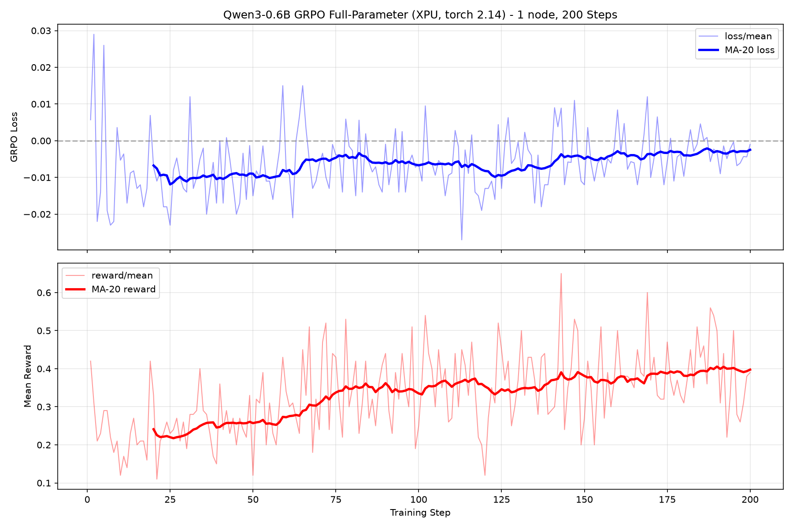
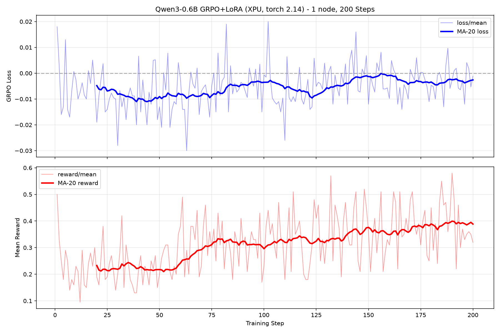
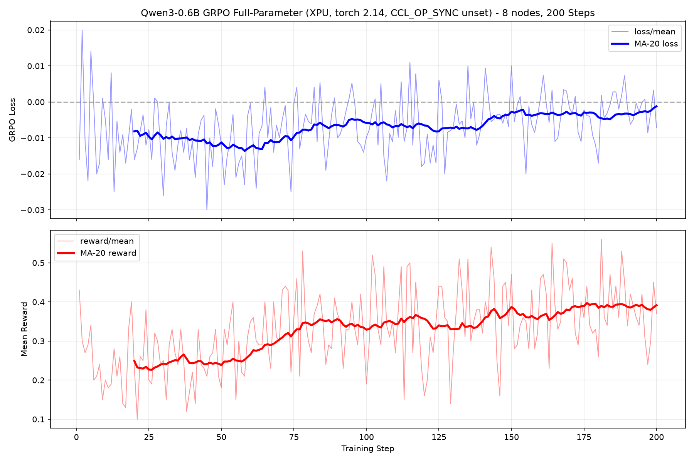
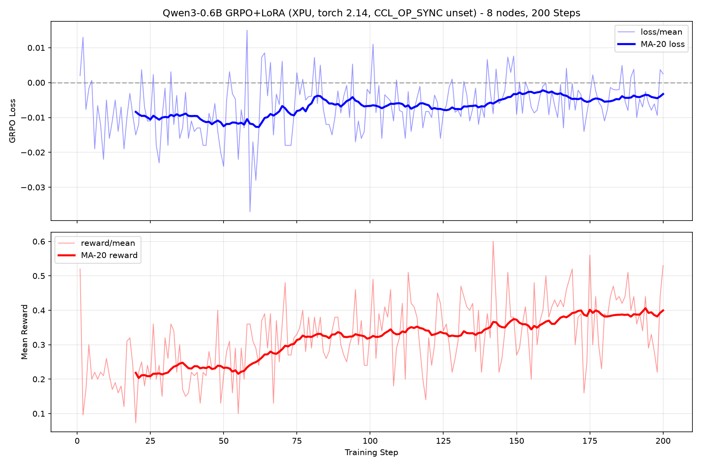

# Post-Training RL on Intel XPU: Progress and Plan

End-to-end GRPO reinforcement learning on Intel XPU (Borealis and Aurora) using
the full upstream pipeline: Monarch actors, TorchStore weight sync, vLLM
generation, FSDP2 training.

**On this branch the stack is torch 2.14.0+xpu / oneCCL 2022.** To build it and run
the launchers in `torchtitan/rl/scripts/xpu/`, follow
[xpu_torch214.md](xpu_torch214.md). This document records the torch 2.12 stack
(environment, interposer, launcher history and fixes) and the measured results;
the 2026-10-05 results section covers torch 2.14.

Two training arms are covered:

| Arm | Config | Trains | Extra requirement |
|-----|--------|--------|-------------------|
| **LoRA GRPO** | `rl_grpo_lora_qwen3_0_6b` | LoRA adapters only (<1% of params) | none |
| **Full GRPO** | `rl_grpo_full_qwen3_0_6b_flex` | every parameter | the RMSNorm `LD_PRELOAD` interposer -- see [Running full-parameter GRPO](#running-full-parameter-grpo) |

They are controlled twins: same flex attention, same 64-sequence global batch
(`num_groups_per_train_step=8` x `group_size=8`), same local batch (2 x 2048),
same lr, same sampling, same generator settings. The only difference is whether
a `LoRAConverter` is applied. Everything in this guide -- environment setup,
XPU-specific settings, known issues -- applies to both unless a section says
otherwise.

Multi-node results from this pipeline on Aurora -- the exp1-exp10 parallelism
sweep (config, loss/reward, trainer and generation throughput both global and
per GPU) plus every fix that was needed to get there -- are in
[docs/rl_aurora/RESULTS.md](../../../docs/rl_aurora/RESULTS.md). Regenerate its
numbers from the archived logs with `python3 extract_exp_metrics.py`. The fixes
are indexed here under
[Multi-node fixes](#multi-node-fixes-aurora--pbs); that document carries the
mechanism and the measurements.

## Prerequisites

Set these variables to match your local layout before following this guide
(example values are from guoqiong's setup on Borealis):

```bash
export TORCHTITAN_DIR=/home/guoqiong/git/torchtitan
export MONARCH_DIR=/home/guoqiong/git/monarch
export TORCHSTORE_DIR=/home/guoqiong/git/torchstore
export VLLM_DIR=/home/guoqiong/git/vllm
export HF_ASSETS_PATH=/home/guoqiong/models/Qwen3-0.6B       # Qwen3-0.6B weights
export ONEAPI_ENV_SCRIPT=/home/guoqiong/env-3.sh              # oneAPI 2025.3 + gcc-13.3
export CONDA_PREFIX_BASE=/home/guoqiong/miniforge3            # conda installation
```

Requirements:
- Borealis cluster access (UAN for builds, compute nodes for training)
- Intel XPU with 4 tiles (48GB each)
- oneAPI 2025.3 + gcc-13.3 (sourced via `$ONEAPI_ENV_SCRIPT`)
- Conda (miniforge3 or miniconda3)
- Qwen3-0.6B model weights downloaded locally

## Architecture

The pipeline uses Monarch's **actor** framework. A controller orchestrates
two actor groups via async endpoints:

```
+-----------------------------------------------------------------------+
|  Controller (Monarch async main loop)                [TorchTitan]     |
|  Orchestrates: generate prompts -> rollout -> score -> train -> sync  |
+-----------------------------------------------------------------------+
        |                                          |
        | rollout (Monarch async RPC)              | train (Monarch async RPC)
        v                                          v
+-------------------------------+    +-------------------------------+
|  VLLMGenerator                |    |  PolicyTrainer                |
|  XPU 0-1 (DP=2, TP=1)        |    |  XPU 2-3 (FSDP dp_shard=2)   |
|                               |    |                               |
|  Libraries:                   |    |  Libraries:                   |
|  - vLLM (inference engine)    |    |  - TorchTitan (training)      |
|  - vllm_xpu_kernels (attn)   |    |  - PyTorch FSDP2 (DP sync)    |
|  - Monarch (actor runtime)    |    |  - Monarch (actor runtime)    |
|                               |    |  - flex_attention (Triton)    |
|  Features:                    |    |  - LoRA (torchtitan)          |
|  - flash_attn backend         |    |                               |
|  - PagedAttention + KV-cache  |    |  Features:                    |
|  - Continuous batching        |    |  - GRPO loss computation      |
|  - ~53 tok/s generation       |    |  - AdamW optimizer            |
+-------------------------------+    |  - DCP checkpointing          |
                                     +-------------------------------+
        |                                          |
        | pull weights                             | push weights
        v                                          v
+-----------------------------------------------------------------------+
|  TorchStore (weight synchronization)                                  |
|  - CPU-staged shared memory transport (no RDMA on Borealis)           |
|  - xccl collective backend for XPU                                    |
|  - Trainer publishes updated weights after each step (LoRA adapters   |
|    in the LoRA arm, the whole model state in the full arm)            |
|  - Generator pulls fresh weights before each rollout                  |
+-----------------------------------------------------------------------+

Libraries involved: Monarch, vLLM, TorchStore, TorchTitan, PyTorch (FSDP2,
flex_attention, DCP, inductor/Triton), vllm_xpu_kernels
```

**The 3 components:**

| Component | What it is | Built with | Role |
|-----------|-----------|-----------|------|
| Controller | Plain Python async loop (not a Monarch actor) | TorchTitan | The main loop -- generates prompts, dispatches work to the actors, scores results. Runs on CPU. |
| VLLMGenerator | **Monarch actor** (separate process on XPU 0-1) | vLLM + vllm_xpu_kernels | Generates text completions from prompts (~53 tok/s). Called via `await generator.generate(prompts)`. |
| PolicyTrainer | **Monarch actor** (separate process on XPU 2-3) | TorchTitan + FSDP2 + flex_attention | Computes GRPO loss, updates weights (LoRA adapters or all parameters). Called via `await trainer.train_step(batch)`. |

Monarch spawns the two actors as separate processes on dedicated GPUs and
handles cross-process communication. The controller calls them like normal
async functions -- Monarch makes the process boundary transparent.

Weight sync between them is handled by **TorchStore** (shared memory, <1s per sync).

**Training loop (one step):**

1. **Generate** -- Controller sends prompts to VLLMGenerator, which produces
   completions per prompt
2. **Score** -- Controller evaluates each completion (reward = 0 or 1),
   computes GRPO advantages (better or worse than group average)
3. **Train** -- PolicyTrainer runs forward/backward pass, updates weights via
   GRPO loss + AdamW (LoRA adapters only, or every parameter in the full arm)
4. **Sync** -- Trainer pushes new weights to TorchStore, generator pulls
   them before next rollout (<1s)
5. **Repeat** -- Model improves each step by learning from its own outputs

---

## Entry Points

**Single node and multi node are genuinely different code paths**, not the same
run at two sizes. Pick your scale first; the two have separate run sections in
this guide:

| | Single node | Multi node |
|---|---|---|
| Launch path | `train.py` directly | `multinode_launcher.py` under `mpiexec`, one rank per node (rank 0 also runs the controller) |
| Node/mesh split | all tiles in one process group, no trainer/generator node split | launcher splits nodes half trainer / half generator |
| Fabric env | `FI_PROVIDER=tcp` is fine -- nothing leaves the node | the CXI/oneCCL block is **mandatory**; without it `tp=8` dies and `grad_norm` corrupts |
| `mpiexec` | not used | Cray PALS **by absolute path**, with `--cpu-bind none` |
| Typical use | smoke tests, numerics checks, interposer validation | real runs and anything measured |
| How to run | [Running on a single node](#running-on-a-single-node) | [Running on multiple nodes](#running-on-multiple-nodes) |

Everything else -- environment setup, XPU config, known issues -- is shared.

Crossed with the two training arms (LoRA and full-parameter) that gives four
concrete configurations, one launcher script each:

| | Single node | Multi node |
|---|---|---|
| **LoRA** | `run_grpo_lora_sn.sh` -- [section](#single-node-lora) | `run_grpo_lora_multinode.sh` -- [section](#multiple-nodes-lora) |
| **Full-parameter** | `run_grpo_sn.sh` -- [section](#single-node-full-parameter) | `run_grpo_multinode.sh` -- [section](#multiple-nodes-full-parameter) |

| Script | Arm | Scale | Notes |
|--------|-----|-------|-------|
| `run_grpo_lora_sn.sh` | LoRA | 1 node | cheapest full-pipeline smoke test |
| `run_grpo_sn.sh` | full | 1 node | sets `LD_PRELOAD`, prechecks the interposer |
| `run_grpo_lora_multinode.sh` | LoRA | any node count, 8 by default | the validated arm: 200/200 steps at 8 nodes |
| `run_grpo_lora_2n.sh` | LoRA | 2 nodes | PBS header only, execs `run_grpo_lora_multinode.sh` |
| `run_grpo_multinode.sh` | full | any node count, 8 by default | sets `LD_PRELOAD`; hangs ~1 pull in 120 (issue 9) |

The two `_sn` scripts and the two multinode ones differ only in arm, so the LoRA
arm is the right place to debug anything that is not specific to full-parameter
training.

---

## Repository Details

### vLLM

#### What it is

vLLM is a high-throughput LLM inference engine with continuous batching,
PagedAttention, and tensor parallelism. In the RL pipeline, it serves as
the **generator** -- producing rollout completions from prompts during
each training step. It runs as a Monarch actor on a dedicated GPU mesh.

#### Current status

vLLM already has XPU support in its main branch. Operational notes:

- `cudagraph.enable=False` is required (graph capture not supported on XPU)
- Auto-selected `flash_attn` backend works correctly
- `gpu_memory_limit=0.90` validated for co-location with trainer

#### What has been completed

- Validated vLLM on XPU with flash_attn backend (TP=1 and TP=2)
- Confirmed `vllm-xpu-kernels==0.1.10` wheel works with torch 2.12.0+xpu
- Measured throughput: ~53 tok/s on DP=2 (TP=1)
- Integrated as VLLMGenerator actor in the Monarch pipeline

#### Remaining work

- [ ] Test with larger models (Qwen3-1.7B, Qwen3-4B) on multiple nodes
- [ ] Benchmark TP=2 vs DP=2 throughput (TP=2 was 6.5 tok/s due to xccl overhead)

---

### Monarch

#### What it is

Monarch is Meta's distributed actor framework for orchestrating multi-GPU
workloads. In the RL pipeline, it provides:

- **ProcMesh**: spawns separate process groups for trainer and generator
  on non-overlapping GPU sets
- **Actor endpoints**: async RPC between controller, trainer, and generator
- **Bootstrapping**: environment setup (device affinity, backend init) per
  spawned process
- **HostMesh**: multi-node support via `attach_to_workers` + mesh slicing

#### What has been completed

XPU patches on `xpu-upstream` branch (off `pt/main`):

| File | Change |
|------|--------|
| `device_utils.py` | Replace CUDA scanning with `torch.accelerator.device_count()` |
| `proc_mesh.py` | Add XPU env vars to monitoring; generalize accelerator-init check |
| `job.py` | try/except telemetry imports with stubs |
| `setup.py` | Gate `distributed_sql_telemetry` behind `USE_TENSOR_ENGINE` |
| `test_xpu.py` | 17 tests (6 unit + 11 integration) |

Validation:
- 17/17 tests passing
- All 59 upstream tests pass unmodified
- Full RL pipeline (4 XPUs) running end-to-end

#### Remaining work

- [ ] Submit upstream PR
- [ ] Test multi-node ProcMesh on XPU (via multinode_launcher.py)
- [ ] Address potential review feedback on device-agnostic scope

---

### TorchStore

#### What it is

TorchStore is a distributed key-value store for PyTorch state dicts,
optimized for GPU-to-GPU weight transfer. In the RL pipeline, it provides:

- **Weight publish**: trainer pushes updated model weights after each step
- **Weight pull**: generator pulls fresh weights before each rollout
- **Transport layer**: RDMA (CUDA), shared memory (fallback), or xccl

On Borealis (no RDMA), it uses shared-memory transport with CPU-staged
copies: GPU -> CPU -> shared memory -> CPU -> GPU.

#### What has been completed

XPU patches on `xpu-upstream` branch:

| File | Change |
|------|--------|
| `shared_memory.py` | `pin_memory`/`unpin_memory` no-op on XPU; XPU sync |
| `gloo.py` | Register Gloo backend for XPU devices |
| `torchcomms/cache.py` | Accept any non-CPU device for indexing |
| `xccl.py` (NEW) | Full xccl transport implementation |

Validation:
- TorchStore roundtrip test (push/pull state dict): PASS
- `torchstore_rl.py` example (2 XPU): PASS
- `torchstore_spmd.py` example (2 XPU): PASS
- Full pipeline weight sync (trainer -> generator): PASS

#### Remaining work

- [ ] Submit upstream PR
- [ ] Add pytest for xccl transport
- [ ] Test cross-node transport (shared_memory is single-node only)

---

### TorchTitan (train.py)

**What `train.py` uses:**

| Component | Purpose | XPU Status |
|-----------|---------|------------|
| Monarch ProcMesh | Spawn trainer + generator on separate GPUs | Working |
| vLLM | Fast inference for rollout generation | Working |
| TorchStore | Weight sync: trainer pushes, generator pulls | Working |
| FSDP2 | Data-parallel gradient sync inside trainer | Working |
| flex_attention | Compiled attention kernels with block masks (training) | Working (max_autotune=False) |
| vLLM flash_attn | Inference attention with KV-cache (generation) | Working (vllm_xpu_kernels) |
| LoRA adapters | Parameter-efficient fine-tuning (<1% params), LoRA arm only | Working |
| DCP checkpoint | Distributed checkpoint save/load | Working |
| ConfigLoader | Python config recipe loading (`--module` / `--config`) | Working |

---

## XPU-Specific Configuration

| Setting | XPU Value | CUDA Default | Reason |
|---------|-----------|--------------|--------|
| `TORCHINDUCTOR_MAX_AUTOTUNE` | `0` | `1` | Backward configs exceed XPU register limits |
| `cudagraph.enable` | `False` | `True` | No XPU graph support in torch 2.12 |
| `trainer.parallelism` | `dp_shard=2, TP=1` | varies | TP triggers OUT_OF_RESOURCES on XPU |
| `renderer.enable_thinking` | `True` | `False` | False triggers XPU flex_decoding codegen bug |
| `gpu_memory_limit` | `0.9` | `0.9` | Same as upstream (0.6B model fits easily) |
| `expandable_segments` | **NOT SET** | `True` | Breaks oneDNN memory allocator on XPU |
| `ZE_AFFINITY_MASK` | `0,1,2,3` | N/A | Selects XPU tiles |
| `LD_PRELOAD` (full GRPO only) | RMSNorm interposer | unset | Stock XPU RMSNorm backward crashes on the weight gradient above 57344 rows |

---

## Environment Setup (Reproducible Recipe)

All builds must run on the UAN (login node), not compute nodes.

### Step 1: Create the conda env

```bash
source $ONEAPI_ENV_SCRIPT   # oneAPI 2025.3, gcc-13.3, XPU build flags
$CONDA_PREFIX_BASE/bin/conda create -n monarch python=3.12 -y
conda activate monarch
```

### Step 2: Install PyTorch XPU

```bash
pip install torch==2.12.0+xpu torchaudio==2.11.0+xpu torchvision==0.27.0+xpu \
    --index-url https://download.pytorch.org/whl/xpu
pip install triton-xpu==3.7.1
```

### Step 3: Install TorchStore

```bash
cd $TORCHSTORE_DIR
git checkout xpu-upstream   # PR: https://github.com/meta-pytorch/torchstore/pull/171
pip install -e . --no-deps --no-build-isolation
pip install pygtrie portpicker
```

`--no-deps` is required -- the `torchmonarch==0.4.1` pin in setup.cfg
conflicts with our editable Monarch install.

### Step 4: Install Monarch

```bash
cd $MONARCH_DIR
git checkout xpu-upstream   # PR: https://github.com/meta-pytorch/monarch/pull/4307
pip install -e python/ --no-deps --no-build-isolation
```

No Rust build needed -- the Python-only install covers the actor runtime
(Layer 1). If you see `ModuleNotFoundError: monarch.distributed_telemetry`,
add a try/except around that import in `python/monarch/_src/job/job.py`.

### Step 5: Install vLLM + XPU kernels

```bash
cd $VLLM_DIR
git checkout main
pip install -e . --no-deps --no-build-isolation

# vllm-xpu-kernels 0.1.10 -- installed from GitHub release wheel
pip install https://github.com/vllm-project/vllm-xpu-kernels/releases/download/v0.1.10/vllm_xpu_kernels-0.1.10-cp38-abi3-manylinux_2_28_x86_64.whl
```

The vllm_xpu_kernels wheel must match torch==2.12.0+xpu. If you see
`RuntimeError: Device string must not be empty`, the kernel wheel was built
against a different torch -- reinstall both in lockstep.

### Step 6: Install Monarch dependencies

Monarch declares these in `pyproject.toml` but since we install with
`--no-deps`, they must be installed manually:

```bash
pip install pyzmq pyarrow requests numpy pyre-extensions "typing-extensions>=4.12" \
    cloudpickle lark tabulate opentelemetry-api clusterscope "flask>=2.0" \
    xxhash py-spy aiohttp
```

### Step 7: Install HF / training deps

```bash
pip install transformers==5.9.0 datasets==4.7.0 tokenizers safetensors \
    einops pillow sentencepiece protobuf huggingface_hub \
    tensorboard wandb tqdm \
    --constraint <(echo "torch==2.12.0+xpu")
```

The `--constraint` prevents pip from pulling a non-XPU torch as a transitive dep.

### Step 8: Install TorchTitan

```bash
cd $TORCHTITAN_DIR
git checkout xpu-upstream   # PR: https://github.com/pytorch/torchtitan/pull/3890
pip install -e . --no-deps --no-build-isolation
```

### Version summary (validated 2026-07-07)

| Package | Version | Source |
|---------|---------|--------|
| torch | 2.12.0+xpu | pytorch.org/whl/xpu |
| triton-xpu | 3.7.1 | pip |
| vllm | editable | $VLLM_DIR main |
| vllm-xpu-kernels | 0.1.10 | GitHub release wheel |
| torchmonarch | editable | $MONARCH_DIR xpu-upstream |
| torchstore | editable | $TORCHSTORE_DIR xpu-upstream |
| torchtitan | editable | $TORCHTITAN_DIR xpu-upstream |
| transformers | 5.9.0 | pip |
| datasets | 4.7.0 | pip |

---

## Running on a single node

One node, 4 XPU tiles (2 trainer + 2 generator), no trainer/generator *node*
split -- `train.py` runs directly, with no `mpiexec` and no
`multinode_launcher.py`. Nothing leaves the node, so `FI_PROVIDER=tcp` is correct
and the CXI/oneCCL fabric block that multi node requires is **not** needed here.
Use this scale for smoke tests, numerics checks, and validating the interposer --
not for measured throughput.

Both single-node scripts must run on a compute node, not the UAN. Get one with
`qsub -I -l select=1 -l walltime=01:00:00 -A Intel-Aurora -q debug`, or just
`qsub` the script as a batch job -- each carries its own `#PBS -l select=1`
header.

### Single node, LoRA

`run_grpo_lora_sn.sh`. The cheapest thing in the repo that exercises the whole
pipeline, and the arm to reach for first.

```bash
cd $TORCHTITAN_DIR

# Batch (the script's own PBS header: select=1, 1 h, debug queue)
qsub torchtitan/rl/scripts/xpu/run_grpo_lora_sn.sh

# Or directly, on a compute node you already hold
bash torchtitan/rl/scripts/xpu/run_grpo_lora_sn.sh

# Overrides are environment variables
NUM_STEPS=50 bash torchtitan/rl/scripts/xpu/run_grpo_lora_sn.sh

# Any trailing argument is forwarded verbatim to the config CLI
bash torchtitan/rl/scripts/xpu/run_grpo_lora_sn.sh --override my_pkg.mod.fn
```

Defaults: `CONFIG=rl_grpo_lora_qwen3_0_6b`, `NUM_STEPS=10`,
`DUMP_FOLDER=outputs/rl_lora_1n`, log at
`torchtitan/rl/train_lora_1n.log`. **No interposer** -- LoRA freezes
the `qk_norm` weights, so its backward never asks for that weight gradient.

If you would rather run the pipeline by hand than use the script, this is
everything it sets:

```bash
#!/bin/bash
set -e

source /opt/aurora/26.26.0/oneapi/setvars.sh
source ~/miniforge3/etc/profile.d/conda.sh
conda activate monarch

# tcp is fine at one node; see the multi-node section for why cross-node runs
# must override these two.
export ZE_AFFINITY_MASK=0,1,2,3
export FI_PROVIDER=tcp
export CCL_ATL_OFI_PROVIDER=tcp
export TORCHINDUCTOR_CACHE_DIR=~/.cache/torchinductor_xpu
export TORCHINDUCTOR_MAX_AUTOTUNE=0
export VLLM_ENABLE_V1_MULTIPROCESSING=1
export HF_DATASETS_OFFLINE=1
export HF_HUB_OFFLINE=1

# The config CLI has no scalar field flags, so the per-job knobs are read from
# the environment by alphabet_sort_xpu.py.
export TITAN_XPU_HF_ASSETS_PATH=/flare/Aurora_deployment/intel/models/Qwen3-0.6B
export TITAN_XPU_NUM_STEPS=10

cd $TORCHTITAN_DIR
python3 -m torchtitan.rl.train \
    --module torchtitan_recipes.rl.alphabet_sort_xpu --config rl_grpo_lora_qwen3_0_6b \
    --output-dir=outputs/rl_lora_1n
```

### Single node, full-parameter

`run_grpo_sn.sh`. Same shape as the LoRA arm plus one hard prerequisite: the
`LD_PRELOAD` RMSNorm interposer must already be built, because full GRPO trains
the `qk_norm` weights. Build it first --
[Running full-parameter GRPO](#running-full-parameter-grpo) steps 1-3 -- or the
script aborts before spending the allocation.

```bash
cd $TORCHTITAN_DIR

# Batch
qsub torchtitan/rl/scripts/xpu/run_grpo_sn.sh

# Or directly, on a compute node you already hold
bash torchtitan/rl/scripts/xpu/run_grpo_sn.sh

# 200 steps, custom weights, interposer somewhere else
NUM_STEPS=200 \
HF_ASSETS_PATH=/flare/Aurora_deployment/intel/models/Qwen3-0.6B \
INTERPOSER=/path/to/libinterpose_layernorm.so \
bash torchtitan/rl/scripts/xpu/run_grpo_sn.sh

# Trailing arguments forwarded verbatim to the config CLI
bash torchtitan/rl/scripts/xpu/run_grpo_sn.sh --override my_pkg.mod.fn
```

Defaults: `CONFIG=rl_grpo_full_qwen3_0_6b_flex`, `NUM_STEPS=10`,
`DUMP_FOLDER=outputs/rl_full_1n`, log at
`torchtitan/rl/train_full_1n.log`.

Before launching the pipeline the script runs a precheck that (a) confirms
`libinterpose_layernorm.so` is actually mapped into the process and (b) drives a
65536-row RMSNorm weight-grad backward. A silently ineffective `LD_PRELOAD` would
otherwise just reproduce the old crash mid-run.

---

## Running on multiple nodes

Multi node adds `multinode_launcher.py` under `mpiexec`, one rank per node (rank 0
also hosts the controller). The launcher reads `PBS_NODEFILE`, splits the
allocation half trainer / half generator, and derives
`dp_shard = trainer_gpus / (TP * DP_REPLICATE)`. **Read the effective mesh from
the `Mesh split` log line, never from the requested flags.** Keep `TP` inside a
node: cross-node TP is correct but roughly 10x slower, so scale with `dp_shard`.

Three things are mandatory at this scale and irrelevant at one node. Each cost
real debugging time, so do not drop them:

1. **The CXI/oneCCL fabric env block.** Without it cross-node `tp=8` dies on
   `atl_ofi.cpp:1071 fi_cq_readerr err 5`, and `tp4`/`rep2` trains with a
   corrupted `grad_norm` (88-2464 against a healthy 0.05-0.15). The launcher
   scripts export it; if you hand-roll a command, copy it from them.
2. **Cray PALS by absolute path** (`/opt/cray/pals/1.8/bin/mpiexec`). `env-3.sh`
   puts Intel MPI's Hydra `mpiexec` first on `PATH`, and under Hydra a cross-node
   `tp=8` run dies in a oneCCL SEND fault.
3. **`--cpu-bind none`.** At `-ppn 1` PALS pins every rank *and its forked
   workers* to a single core, costing 4-6x and hitting the generator hardest. It
   masquerades as a fabric problem. Fastest triage is generator ITL: 50-56 ms
   means unpinned, 214-268 ms means this bug is live.

Both multi-node scripts carry a `#PBS -l select=8` header; a `-l select=N` on the
`qsub` command line overrides it, and the launcher picks up whatever it gets.

### Multiple nodes, LoRA

Note: new code change in https://github.com/songhappy/torchstore/tree/rl
and https://github.com/songhappy/torchtitan/tree/rl to make multiple node run and full GRPO

`run_grpo_lora_multinode.sh`, plus `run_grpo_lora_2n.sh` as a thin `select=2`
wrapper around it. This is the validated arm: 200/200 steps at 8 nodes,
25.4 s/step, reward 0.222 -> 0.355.

```bash
cd $TORCHTITAN_DIR

# 8 nodes (the script's own header)
qsub torchtitan/rl/scripts/xpu/run_grpo_lora_multinode.sh

# Any other node count
qsub -l select=4 torchtitan/rl/scripts/xpu/run_grpo_lora_multinode.sh
qsub -l select=2 -l walltime=00:30:00 torchtitan/rl/scripts/xpu/run_grpo_lora_multinode.sh

# 2 nodes with no flags at all (identical, just a different PBS header)
qsub torchtitan/rl/scripts/xpu/run_grpo_lora_2n.sh

# Overrides need -v to cross into the PBS job
NUM_STEPS=200 qsub -v NUM_STEPS torchtitan/rl/scripts/xpu/run_grpo_lora_2n.sh

# Interactive on an allocation you already hold
bash torchtitan/rl/scripts/xpu/run_grpo_lora_multinode.sh

# Use only the first 2 nodes of a larger allocation
NUM_NODES=2 bash torchtitan/rl/scripts/xpu/run_grpo_lora_multinode.sh
```

Defaults: `CONFIG=rl_grpo_lora_qwen3_0_6b`, `NUM_STEPS=150`,
`DUMP_FOLDER=outputs/rl_lora_multinode`, log at
`torchtitan/rl/train_lora_<N>n.log`. The `dp_shard` cap is the LoRA
rank, so LoRA scales further on `dp_shard` than the full arm does.

### Multiple nodes, full-parameter

`run_grpo_multinode.sh`, **8 nodes by default**. Needs the interposer, same as
the single-node full arm -- see
[Running full-parameter GRPO](#running-full-parameter-grpo). The launcher hands
it to the remote python via `env` inside `mpiexec` rather than exporting it in the
submitting shell.

```bash
cd $TORCHTITAN_DIR

# 8 nodes (the script's PBS header)
qsub torchtitan/rl/scripts/xpu/run_grpo_multinode.sh

# Different node count: -l select on the command line overrides the header
qsub -l select=4 torchtitan/rl/scripts/xpu/run_grpo_multinode.sh
qsub -l select=2 -l walltime=00:30:00 -q debug torchtitan/rl/scripts/xpu/run_grpo_multinode.sh

# Override distributed settings (-v forwards env into the PBS job)
TP=2 NUM_STEPS=20 qsub -l select=4 -v TP,NUM_STEPS \
    torchtitan/rl/scripts/xpu/run_grpo_multinode.sh

# Interactive on an existing allocation
qsub -I -l select=8 -l walltime=01:00:00 -A Intel-Aurora -q debug-scaling
bash torchtitan/rl/scripts/xpu/run_grpo_multinode.sh

# Use only the first 2 nodes of a larger allocation, with extra config-CLI flags
NUM_NODES=2 bash torchtitan/rl/scripts/xpu/run_grpo_multinode.sh \
    --override my_pkg.mod.fn
```

`qsub` forwards **no** trailing arguments, so under PBS reach the config CLI
through `EXTRA_ARGS` instead:

```bash
EXTRA_ARGS='--override my_pkg.mod.fn' qsub -v EXTRA_ARGS \
    torchtitan/rl/scripts/xpu/run_grpo_multinode.sh
```

Note that `--override` selects an alternative `Configurable` *implementation*; it
does not set field values. Scalars the CLI does not expose (`num_training_steps`,
`validation.num_samples`, `hf_assets_path`, the vLLM memory fraction) are read
from `TITAN_XPU_*` environment variables -- see `alphabet_sort_xpu.py`.

`run_grpo_multinode.sh` overrides, all environment variables (the LoRA multinode
script takes the same set minus `INTERPOSER`, with the LoRA defaults above):

| Variable | Default | Meaning |
|----------|---------|---------|
| `NUM_NODES` | all allocated nodes | use only the first N (errors if N exceeds the allocation) |
| `PPN` | `4` | XPU tiles per node |
| `TP` | `1` | trainer tensor parallel degree |
| `DP_REPLICATE` | `1` | trainer data parallel replicate degree |
| `CONFIG` | `rl_grpo_full_qwen3_0_6b_flex` | config registry entry |
| `NUM_STEPS` | `10` | GRPO training steps |
| `VAL_SAMPLES` | `0` | validation samples per eval |
| `HF_ASSETS_PATH` | `/flare/Aurora_deployment/intel/models/Qwen3-0.6B` | model weights |
| `DUMP_FOLDER` | `outputs/rl_full_multinode` | output directory |
| `INTERPOSER` | `.../rmsnorm_interposer/libinterpose_layernorm.so` | patched kernel |
| `MPIEXEC` | `/opt/cray/pals/1.8/bin/mpiexec` | PALS launcher (absolute path on purpose) |
| `TORCHINDUCTOR_CACHE_DIR` | `~/.cache/torchinductor_xpu` | set per run when validating arms concurrently; the script wipes this cache's `triton/` subdir |
| `EXTRA_ARGS` | empty | extra config-CLI flags, for `qsub -v` |

`NUM_STEPS`, `VAL_SAMPLES`, and `HF_ASSETS_PATH` are forwarded to the recipe as
`TITAN_XPU_NUM_STEPS`, `TITAN_XPU_VAL_SAMPLES`, and `TITAN_XPU_HF_ASSETS_PATH`
(plus `TITAN_XPU_GPU_MEMORY_LIMIT`, which only the single-node LoRA script sets).
The config CLI exposes no scalar field flags, so that environment hop is how they
reach `alphabet_sort_xpu.py`. `TP` and `DP_REPLICATE` instead become
`multinode_launcher.py` arguments, because trainer `dp_shard` is derived from them.

**This arm cannot currently be relied on to finish a long run.** It hangs in the
TorchStore weight pull at 8 nodes, roughly 1 pull in 120 -- active issue 9. Its
best result so far is 120/200 steps. LoRA is unaffected.

### Multi-node operational rules

Apply to both multi-node arms:

- **`qdel` the job the moment training finishes.** Teardown hangs after the last
  step -- a completed 200-step LoRA run burnt 2.5 h of its allocation printing
  nothing after `Closing: tearing down actors`. PBS then reports
  `Exit_status -29` (walltime kill) for a run that fully succeeded, so the exit
  code alone is misleading.
- **Checkpoint saving is off for 8-node runs.** The DCP save ran out of device
  memory inside oneCCL at `dp_shard=16`, so `alphabet_sort_xpu.py` pins
  `load_only=True`, which still loads the pretrained weights. **Never** drop the
  checkpointer instead to skip saves: `enable` also gates *loading*, so the run
  silently trains a random-initialized model.

---

## Running full-parameter GRPO

Everything above applies unchanged. Full GRPO needs **one extra thing that LoRA
does not**: a patched XPU RMSNorm backward kernel, supplied at runtime through
`LD_PRELOAD`.

### The key difference: LoRA vs full

| | LoRA GRPO | Full GRPO |
|---|---|---|
| Config | `rl_grpo_lora_qwen3_0_6b` | `rl_grpo_full_qwen3_0_6b_flex` |
| Trainable params | LoRA adapters only | all ~0.6B |
| `qk_norm` weights | frozen by `LoRAConverter` | trained |
| RMSNorm backward `output_mask` | `[True, False]` | `[True, True]` |
| `LD_PRELOAD` interposer | not needed | **REQUIRED** |
| Trainer -> generator payload | adapter tensors | full model state |

### Why the interposer is required

`LoRAConverter` freezes every norm layer, so the LoRA arm only ever asks
`aten::_fused_rms_norm_backward` for an *input* gradient (`output_mask=[True,
False]`). Full GRPO trains the `qk_norm` weights, so it also asks for the
*weight* gradient (`output_mask=[True, True]`) -- and the stock XPU kernel is
broken on that path above a row threshold:

```
RuntimeError: tensor does not have a device
```

`rms_norm_backward_kernel` passes `dgamma` as **both** the `dgamma` and `dbeta`
arguments of the shared `layer_norm_backward_kernel_impl`. The impl picks its
column-reduction arm by testing `dbeta->defined()`, so the alias makes RMSNorm
take the both-defined arm, which ends in `*dbeta = dbeta_blocks.sum(0)` on a
buffer allocated only under `if constexpr (!rms_norm)` -- i.e. never allocated
for RMSNorm. Below the threshold a simpler path is taken where every `dbeta`
write is properly guarded, so the alias is inert and nothing fails.

The threshold is `rows > xe_core_count * 1024`, which is **57344** on a Data
Center GPU Max 1550 tile (`xe_core_count = gpu_eu_count /
gpu_eu_count_per_subslice`, also exposed as `gpu_subslice_count`). For a per-head
`qk_norm`, `normalized_shape` is `head_dim` and

```
rows = local_batch_size * seq_len * (num_heads / tensor_parallel_degree)
```

The default full config (`local_batch_size=2`, `seq_len=2048`, 16 query heads,
TP=1) gives 65536 rows for `q_norm` -- over the bound, so it crashes at step 0.
The 8-KV-head `k_norm` at 32768 rows in the same backward succeeds, which is why
the failure looks arbitrary.

The fix is upstream in
[intel/torch-xpu-ops#4790](https://github.com/intel/torch-xpu-ops/pull/4790).
Until that lands in a wheel, the interposer compiles only that one translation
unit and lets the dynamic linker resolve `libtorch_xpu.so`'s PLT entry to the
patched copy. **Nothing in the conda env is modified** -- drop the `LD_PRELOAD`
and you are back on the stock wheel bit-for-bit, so earlier measurements stay
comparable.

### Full GRPO step 1: get the patched source

The patch is one hunk in
`src/ATen/native/xpu/sycl/LayerNormKernels.cpp`. Check out the PR branch:

```bash
cd ~/git
git clone https://github.com/intel/torch-xpu-ops.git    # if you don't have it
cd torch-xpu-ops
git fetch https://github.com/intel/torch-xpu-ops.git pull/4790/head:fix-rmsnorm-dbeta-alias
git checkout fix-rmsnorm-dbeta-alias
git log --oneline -1     # "Fix RMSNorm backward crash from aliasing dgamma into the dbeta slot"
```

The explicit URL is used because the PR lives on `intel/torch-xpu-ops`, which is
not necessarily your `origin`. To refresh the branch later, re-run the same
`git fetch` with `+pull/4790/head:fix-rmsnorm-dbeta-alias` (the `+` forces the
update).

The change itself, at the `rms_norm_backward_kernel` call site:

```cpp
// RMSNorm has no bias, so there is no dbeta. Pass an undefined tensor
// instead of aliasing dgamma into the dbeta slot.
Tensor unused_dbeta;
layer_norm_backward_kernel_impl<scalar_t, accscalar_t, scalar_t, true>(
    dY.contiguous(), X, rstd, rstd, gamma, M, N, dX, dgamma, &unused_dbeta);
```

### Full GRPO step 2: build `libinterpose_layernorm.so`

Run on a **login node (UAN)**; the build needs `icpx`, not a GPU. It takes
several minutes (AOT device codegen for `pvc`).

```bash
cd $TORCHTITAN_DIR/torchtitan/rl
bash build_rmsnorm_interposer.sh
```

The script sources oneAPI + the `monarch` conda env, then compiles the single
`.cpp` with the same flags the stock wheel uses. It writes to
`$TORCHTITAN_DIR/torchtitan/rl/rmsnorm_interposer/libinterpose_layernorm.so`
by default; pass an output directory to change that:

```bash
bash build_rmsnorm_interposer.sh /path/to/other/dir
```

`rmsnorm_interposer/` is not in the repo -- the `.so` is a 10 MB build artifact,
so it is gitignored and must be built once per environment. If a prior build was
archived (`~/aurora_rl_logs/artifacts/rmsnorm_interposer/libinterpose_layernorm.so`
on the Aurora setup), you can point `INTERPOSER` straight at it instead, but only
after re-running the step 3 `MATCH` check against the currently installed torch.

If `torch-xpu-ops` is not at `~/git/torch-xpu-ops`, edit `XPU_OPS` at the top of
the script. Three build details that must not be changed casually: `-I$XPU_OPS/src`
comes **first** so `Norm.h` and `SYCLContext.h` resolve to the patched tree;
`_GLIBCXX_USE_CXX11_ABI` is read off the installed torch rather than guessed; and
`-fno-fast-math -ffp-contract=fast` mirror `cmake/BuildFlags.cmake`.

### Full GRPO step 3: verify the build

`build_rmsnorm_interposer.sh` self-verifies and exits non-zero on failure. A good
build ends with:

```
=== verify the interposing symbol is exported ===
at::native::xpu::rms_norm_backward_kernel(at::Tensor const&, ...)

=== compare against the installed wheel's mangled name ===
ours   : _ZN2at6native3xpu24rms_norm_backward_kernelERKNS_6TensorE...
wheel  : _ZN2at6native3xpu24rms_norm_backward_kernelERKNS_6TensorE...
MATCH -- LD_PRELOAD will interpose correctly
```

`MATCH` is the check that matters: if the mangled names differ, the preload is
silently a no-op and the run reproduces the original crash. To re-verify by hand:

```bash
cd $TORCHTITAN_DIR/torchtitan/rl/rmsnorm_interposer
ls -l libinterpose_layernorm.so
nm -D --defined-only libinterpose_layernorm.so | grep rms_norm_backward_kernel | c++filt
```

End-to-end check that the preload takes effect inside a torch process and that
the previously fatal shape now survives (run on a **compute node**):

```bash
LD_PRELOAD=$TORCHTITAN_DIR/torchtitan/rl/rmsnorm_interposer/libinterpose_layernorm.so \
python3 -c "
import torch
assert 'libinterpose_layernorm.so' in open('/proc/self/maps').read(), 'LD_PRELOAD not active'
x = torch.randn(2, 2048, 16, 128, device='xpu', dtype=torch.bfloat16, requires_grad=True)
torch.nn.RMSNorm(128, eps=1e-6, dtype=torch.bfloat16).to('xpu')(x).sum().backward()
torch.xpu.synchronize()
print('65536-row RMSNorm weight-grad backward: OK')
"
```

Without the preload that same snippet raises `RuntimeError: tensor does not have
a device`. Both launcher scripts run this precheck automatically and refuse to
start the pipeline if it fails, so a bad build costs seconds instead of an
allocation.

### Full GRPO step 4: pass `INTERPOSER` to the training command

The variable is exported as `LD_PRELOAD` **before** `train.py` starts, so every
process it spawns -- trainer ranks, generator ranks, vLLM workers -- inherits it.
The crash happens inside a trainer rank's backward, not in the launching shell,
so exporting it only in the shell that calls `python3` is not enough; it must be
inherited.

```bash
INTERPOSER=$TORCHTITAN_DIR/torchtitan/rl/rmsnorm_interposer/libinterpose_layernorm.so
export LD_PRELOAD=$INTERPOSER

export TITAN_XPU_HF_ASSETS_PATH=$HF_ASSETS_PATH

python3 -m torchtitan.rl.train \
    --module torchtitan_recipes.rl.alphabet_sort_xpu --config rl_grpo_full_qwen3_0_6b_flex \
    --output-dir=outputs/rl_full_1n
```

Multi-node is the same value, but handed to the launched command via `env` inside
`mpiexec` rather than exported in the submitting shell, so it lands in each
node's python process without also being preloaded into `mpiexec` itself:

```bash
"$MPIEXEC" -n "$NUM_NODES" -ppn 1 --hosts "$ALL_NODES" --cpu-bind none --envall \
    env "LD_PRELOAD=$INTERPOSER" \
    python3 -m torchtitan.rl.multinode_launcher ...
```

Both launcher scripts do all of this for you and accept `INTERPOSER` as an
override if the `.so` lives elsewhere.

### Full GRPO step 5: run

With the `.so` built and verified, the run commands are the scale-specific ones:

- One node: [Running on a single node](#running-on-a-single-node) -- use
  `run_grpo_sn.sh`.
- Multi node: [Running on multiple nodes](#running-on-multiple-nodes) -- use
  `run_grpo_multinode.sh`, including its full env-var override table.

Both scripts default to the full-parameter config and set `INTERPOSER`
themselves; the only full-GRPO-specific prerequisite is that steps 1-4 above have
actually produced the `.so` at that path.

### Full-GRPO specific gotchas

- **Row budget.** If you change `local_batch_size`, `seq_len`, or `TP`, recompute
  `local_batch_size * seq_len * (num_heads / TP)`. Over 57344 you need the
  interposer; under it the stock kernel works (this is why probing at
  `local_batch_size=1` appeared to "fix" the crash while halving comparability).
- **The interposer replaces the whole translation unit**, so it also supplies the
  LayerNorm/RMSNorm *forward* kernels. Same source, same flags, and the norm
  regression suites pass under it -- but it is a validation vehicle. The shipping
  fix is the torch-xpu-ops commit.
- **Weight-sync payload.** Full GRPO pushes the entire model state to the
  generators each step instead of just adapter tensors, so per-step TorchStore
  traffic is far larger than in the LoRA arm.

---

## Known Issues and Fixed Bugs

### Active issues

1. **Inductor cache corruption** -- `CompiledFxGraph has no attribute
   compiled_fn_runner`. Fix: `rm -rf ~/.cache/torchinductor_xpu/`

2. **max_autotune backward crash** -- `TORCHINDUCTOR_MAX_AUTOTUNE=1`
   triggers error 40 (UR_RESULT_ERROR_OUT_OF_RESOURCES).
   Fix: `TORCHINDUCTOR_MAX_AUTOTUNE=0` (set in launch scripts).

3. **Exit code 139 (SIGSEGV)** -- benign oneCCL teardown crash. Run succeeded
   if you see step metrics.

4. **TP=2 on trainer** -- OUT_OF_RESOURCES during lm_head all_gather.
   Use FSDP dp_shard instead.

5. **flex_decoding autotune cold start** -- first run compiles ~75s per
   (Q_LEN, KV_LEN) shape. Dozens of shapes = tens of minutes on cold cache.
   Not a hang -- watch for `SingleProcess AUTOTUNE benchmarking` log lines.
   Fix: pin `TORCHINDUCTOR_CACHE_DIR=~/.cache/torchinductor_xpu` so reboots
   don't wipe the cache.

6. **Monarch atexit TimeoutError** -- `shutdown_context().get(timeout=1.0)`
   fires after successful completion. Benign; no impact on results.

7. **RMSNorm backward crash in full-parameter GRPO** -- `RuntimeError: tensor
   does not have a device` from `aten::_fused_rms_norm_backward` when the weight
   gradient is requested and rows exceed `xe_core_count * 1024` (57344 on a Max
   1550 tile). Affects full GRPO only; LoRA freezes the norms and never requests
   a weight gradient. Root cause and workaround:
   [Running full-parameter GRPO](#running-full-parameter-grpo). Upstream fix:
   [intel/torch-xpu-ops#4790](https://github.com/intel/torch-xpu-ops/pull/4790);
   until it lands in a wheel, use the `LD_PRELOAD` interposer.

8. **Cross-node `tp=8` stalls after a few steps** -- not a crash and not a fabric
   fault: the steps produced are healthy and `py-spy` shows the trainer idle in
   `asyncio select`, not blocked in a collective. Root cause open. Low priority --
   cross-node TP is also the slowest trainer mesh measured (~5x slower than FSDP
   at the same tile count), so the configuration has no performance case. Use
   `dp_shard`.

9. **Full-parameter 8-node runs still hang in the weight pull** -- **the top
   blocker for the full-parameter arm.** One generator node leader enters
   `ts.get_state_dict` and never returns; the other 15 ranks then die 30 min later
   on the gloo stagger barrier at `generator.py:1309` (`Timed out waiting
   1800000ms`). Fix 11 (torchstore replica dedup) made this far rarer -- job
   8731512 hung at step 3, job 8734220 got to step **120** -- but did not cure it.
   Roughly 1 pull in 120 still wedges, so a 200-step full-parameter run has about
   a coin-flip chance of finishing.

   Diagnosis notes, so the next attempt does not re-tread them: the step and the
   host both move between runs (step 3 / host 3, then step 120 / host 0), so it is
   not a fixed bad rank or a size threshold. The stuck leader logs
   `get_mapping` and never `get_batch`. The 600 s
   `TORCHSTORE_XCCL_TRANSFER_TIMEOUT` hedge **did not fire** during the 1800 s
   hang even though it was live, which places the stall *before* any
   `work.wait()` -- in request construction or process-group setup, not in the
   transfer. Next step is a `py-spy` dump of the stuck leader; tuning the timeout
   will not help. LoRA is unaffected and completes 200 steps.

### Fixed bugs

9. **expandable_segments corrupts XPU allocator** (fixed 2026-07-08) --
   `PYTORCH_CUDA_ALLOC_CONF=expandable_segments:True` corrupts the SYCL/Level
   Zero memory allocator on XPU. Tensors produce USM pointers that oneCCL
   classifies as "unknown", causing all collectives to fail with "invalid usm
   pointer type". Fix: `train.py` guards the env var behind
   `if "ZE_AFFINITY_MASK" not in os.environ`.

10. **FusedQKVLinear + TorchStore zero-reward bug** (fixed 2026-07-01) --
   `FusedQKVLinear._split_qkv_on_save` hook creates `.contiguous()` copies
   for state_dict. TorchStore's `get_state_dict` writes into these copies,
   but they don't share storage with the actual fused `wqkv` parameter.
   Generator never received updated weights -> zero reward. Fix: call
   `model.load_state_dict(model_sd, strict=False)` after `ts.get_state_dict`
   to trigger `_merge_qkv_on_load`. Also fixed LoRA target_modules from
   `["wq", "wkv", "wo"]` to `["wqkv", "wo"]`.

11. **FSDP collective deadlock in generation** (fixed 2026-06-18) -- when
   ranks emit EOS at different positions, breaking early races
   `dist.all_gather(rewards)` against another rank's FSDP all_gather on the
   same xccl process group. Fix: `dist.all_reduce(done_t, MIN)` per token;
   only break when every rank has emitted EOS.

12. **Eager flex_attention OOM on large seq_len** (fixed 2026-07-06) -- eager
    fallback materializes full `[B,H,L,L]` score matrix. With seq_len=2048
    this OOMs. Fix: use compiled flex_attention (Triton tiled kernel) which
    never materializes the full matrix. The earlier "seq_len limit" was a
    misdiagnosis -- compiled mode handles seq_len=2048 fine.

13. **GPU overlap between trainer and generator** (fixed 2026-07-06) --
    `PerHostProvisioner` set `CUDA_VISIBLE_DEVICES` but XPU ignores this.
    Without `ZE_AFFINITY_MASK` isolation, both processes shared the same
    tiles, causing OOM. Fix: provisioner now sets `ZE_AFFINITY_MASK` when
    XPU is detected.

14. **Monarch telemetry import crash** (fixed 2026-06-09) -- actors-only
    builds (no Rust tensor engine) crash on `from monarch._src.job.process
    import ProcessJob` because `monarch_distributed_telemetry` submodule
    isn't compiled. Fix: try/except around telemetry imports in `job.py`
    with stub that raises only if telemetry is actually called.

15. **vllm_xpu_kernels torch version mismatch** -- `RuntimeError: Device
    string must not be empty` means the kernels wheel was built against a
    different torch. The C++ ABI is unstable across versions. Fix: ensure
    `vllm-xpu-kernels` version matches `torch` exactly (currently both
    target torch 2.12.0+xpu).

### Multi-node fixes (Aurora / PBS)

Eleven changes took cross-node GRPO from "dies or silently corrupts gradients" to
"healthy and scaling". All eleven are already applied in the launch scripts and
the repo -- this is the index, not a checklist. Full mechanism, measurements, and
the wrong diagnoses on the way are in
[docs/rl_aurora/RESULTS.md](../../../docs/rl_aurora/RESULTS.md) Part 2, which
numbers them 1-11 as below.

16. **Launch via Cray PALS by absolute path** (RESULTS Fix 1) -- cross-node
    `tp=8` reached 0 steps with 8 oneCCL SEND faults
    (`atl_ofi.cpp:1071 ... err 5`). `env-3.sh` puts Intel MPI's Hydra `mpiexec`
    ahead of PALS on `PATH`, and Hydra never sets the job's Slingshot VNI. Fix:
    `MPIEXEC=/opt/cray/pals/1.8/bin/mpiexec`, absolute. Faults 8 -> 0. Note the
    "no VNI means TCP fallback at 37 MB/s" story was **refuted** -- a native
    oneCCL probe measured Hydra *faster*. Keep the switch, drop the bandwidth
    explanation.

17. **`export TMPDIR=/tmp`** (Fix 2) -- Monarch bootstrap died with `No such file
    or directory (os error 2)` at `/var/tmp/pbs.<jobid>/...`. PBS sets a per-job
    `TMPDIR` that exists **only on the head node**, and PALS `--envall` forwards
    it verbatim. Use plain `/tmp` (node-local and already world-writable), not a
    `mkdir`'d subdirectory.

18. **`unset HOSTNAME`** (Fix 3) -- `RuntimeError: Shared memory storage not
    found` on the first cross-node weight pull. torchstore decides locality by
    **env, not syscall**: `get_local_hostname()` reads `$HOSTNAME`, which
    `--envall` had made identical on every node, so a remote volume looked local.
    **General lesson, which paid off twice:** under `--envall`, anything reading
    identity or paths from env instead of a syscall misbehaves silently.

19. **The CXI/oneCCL scale-out env block** (Fix 4) -- `rep2 x tp4` on 4 nodes
    trained all 10 steps with **grad_norm 88-2464** against a healthy 0.05-0.15,
    while loss and reward looked completely normal. A corrupting transport, not a
    numerics bug: grad_norm went to 0.056-0.120 with **zero code change**. The
    block is at the top of every launch script. Use `CCL_WORKER_AFFINITY`, **not**
    `CCL_WORKER_COUNT` -- the latter measured 29% slower. Which single variable
    cured it was never bisected.

20. **`--cpu-bind none` on `mpiexec`** (Fix 5) -- everything 4-6x slow (generator
    ITL 214-268 ms instead of ~52) with **zero numerical signature**. PALS binds
    each rank to its own core slice, and at `-ppn 1` that slice is one core; every
    Monarch actor and vLLM worker forked from the launcher inherits the mask, so
    ~126 threads shared CPU 1 of 204. The `mpiexec` **parent** keeps the full
    mask, so a login-shell check never reveals it. **ITL is the fastest triage on
    this stack: 50-56 ms means unpinned, 214-268 ms means this bug is live.**

21. **Deleted the cross-node `dp_replicate` fold** (Fix 6) -- the launcher used to
    silently fold a cross-node `dp_replicate` axis onto `dp_shard`. Both premises
    measured false: the explosion it prevented was really item 18, and unfolded is
    no slower (+2.8%, inside noise). **Do not re-add it** --
    `multinode_launcher.py` says so at the site. Not to be confused with the
    `max_dp_shard` cap, which is kept. Read the effective mesh from the
    `Mesh split` log line, never from the requested flags.

22. **`max_autotune=False` for flex attention on XPU** (Fix 7) -- same root cause
    as active issue 2, at config level. Both RL configs must also re-create
    `FlexAttention._compiled_flex_attn`, because `torch.compile` captures options
    at definition time. Gotcha: `--compile.no-enable` does **not** stop
    flex_attention lowering, so `AUTOTUNE flex_attention` lines appear either way
    -- they are not evidence compile is on.

23. **Unconditional checkpoint deletion** (Fix 8) -- a run died at 0 steps on
    `Disk quota exceeded`. The `rm` must run **before** `mpiexec` (or via
    `trap ... EXIT`), because torchtitan force-saves at the last step and the
    operational rule is to qdel during the teardown hang -- so a post-`mpiexec`
    `rm` is skipped exactly when it is needed.

24. **torch-xpu-ops RMSNorm `dbeta` alias** (Fix 9) -- see active issue 7 above
    and [Running full-parameter GRPO](#running-full-parameter-grpo). Validated end
    to end at 8 nodes: the full-parameter run trained healthy steps with no
    crashes.

25. **`@concurrent_endpoint` on `VLLMGenerator.generate`** (Fix 10) -- vLLM showed
    `Running: 1` instead of the ~235 requests the controller fans out. A plain
    `@endpoint` runs each message body to completion before dequeuing the next, so
    the concurrent `generate()` RPCs serialized inside the actor. No isolated A/B
    exists, so no speedup is attributed to it.

26. **torchstore fetched every replicated shard once per replica** (Fix 11) --
    8-node full-parameter GRPO trained 3 healthy steps, then hung forever in the
    step-4 weight pull. Log signature: three generator leaders logged
    `get_mapping=4 get_batch=4` while the fourth logged `get_batch=3`.
    `_expand_tensor_slices` requested every region from every volume offering it,
    but under `dp_replicate` each shard is stored once **per replica** with
    identical content -- so a `dp_replicate=4 x dp_shard=4` mesh contacted **16
    volumes instead of 4**, opening 16 concurrent XCCL process groups per leader
    (64 cluster-wide) and moving 6.0 GB per pull instead of 1.5 GB. Fix: dedup
    regions by `(offsets, local_shape)` across a key's volumes in
    `torchstore/client.py`; the two bare `work.wait()` calls in
    `transport/xccl.py` are now bounded by `TORCHSTORE_XCCL_TRANSFER_TIMEOUT`
    (600 s) so a future stall raises with a `store_key` instead of hanging.

    Three things worth carrying forward. **The logged GB/s cannot show this** --
    `LatencyTracker` divides *logical* state-dict bytes by wall time, so 4x
    redundant wire traffic is invisible; do not read those numbers as wire rates.
    **Puts were never evidence about XCCL** -- item 17's `unset HOSTNAME` makes
    each trainer rank local to its own volume, so puts take SharedMemory and never
    touch XCCL. And **"LoRA syncs less" is false** -- `put_state_dict` pushes the
    whole merged state dict, 1.52 GB in both arms; 2- and 4-node runs survived
    because `dp_replicate` was at most 2 there, and 4 only arises at 8 nodes.
    The fix is uncommitted in the editable `~/git/torchstore` checkout, so a
    torchstore reinstall would silently revert it.

---

## Performance (2026-07-07 sweep)

| Config | Throughput (tok/s) | Notes |
|--------|-------------------|-------|
| Baseline (DP=2 gen, FSDP=2 train) | 4,140 | Single node, 4 tiles |
| TP=2 generator | 2,298 | xccl overhead dominates |
| Batch=4 | 3,222 | Memory pressure |

---

## Performance (2026-08-04 sweep, 8 nodes)

Both arms at 8 nodes on Aurora, after all eleven
[multi-node fixes](#multi-node-fixes-aurora--pbs). The 2-node and 4-node
parallelism sweep (exp1-exp8) is in
[docs/rl_aurora/RESULTS.md](../../../docs/rl_aurora/RESULTS.md); this section is
the 8-node pair and the LoRA-vs-full comparison.

### Configuration

Controlled twins: identical batch, lr, sampling, and generator settings; the only
intended difference is the `LoRAConverter`. `multinode_launcher.py` splits the
allocation half trainer, half generator, so 8 nodes is 16 trainer tiles + 16
generator tiles in both.

| | LoRA GRPO | Full GRPO |
|---|---|---|
| config | `rl_grpo_lora_qwen3_0_6b` | `rl_grpo_full_qwen3_0_6b_flex` |
| job | 8733894 | 8731512 |
| trains | LoRA rank 32, alpha 64, `wqkv`+`wo` | all 751.6M params |
| trainer mesh | `dp_shard=16` | **`dp_replicate=4 x dp_shard=4`** |
| generator mesh | `dp=16`, `tp=1` | `dp=16`, `tp=1` |
| global batch | 8 groups x 8 = 64 seqs/step | same |
| local batch | 2 x 2048 | same |
| optimizer | AdamW, lr 2e-6, 5 warmup | same |
| loss | GRPO, `max_offpolicy_steps=3` | same |
| sampling | temp 1.0, top_p 0.95, `max_tokens=512` | same |
| steps completed | **50** (requested 150) | **3** (requested 200) |
| queue / walltime | `debug-scaling`, 1 h cap | `capacity`, 6 h |

**The meshes are not the same, and it is not a config difference.** The
`max_dp_shard` cap is the LoRA rank when LoRA is on and 4 otherwise, so 16 trainer
tiles give the LoRA arm a flat `dp_shard=16` while the full arm spills onto
`dp_replicate=4` (`Capping dp_shard at 4, dp_replicate=4`). That spill is what
exposed fix 26 -- read the mesh from the `Mesh split` log line, never from the
flags.

### Throughput

`perf/trainer/tokens_per_second_*` is **global** (opposite of core torchtitan's
per-device `throughput(tps)`); per-GPU divides by the 16 tiles of that role, never
by the job total. Step 1 pays torch.compile and the first weight push, so
everything is over steps 2..N. `fwd_bwd` is compute only (arithmetic mean);
`full_step` is wall clock including waiting on the generator, and is **bimodal**
rather than noisy, so it is a harmonic mean (= total tokens / total time).

Generator figures are reconstructed, not read directly: `inter_token_latency_ms`
and `decode_time_ms` are **per request** -- vLLM reports one sampled sequence and
drops the other 7 group siblings -- so aggregate = per-sequence rate x the
concurrency the engine actually held (`inflight_requests_at_completion`).

| | trainer fwd_bwd global | fwd_bwd per-GPU | trainer full_step global | full_step per-GPU | s/step | gen per-seq | gen agg global | gen per-GPU |
|---|---|---|---|---|---|---|---|---|
| LoRA 8n | 36479 | 2280 | 1999 | 125 | 23.3 | 16.8 | 3182 | 199 |
| Full 8n | 34287 | 2143 | 9361 | 585 | n/a | 22.0 | 5419 | 339 |
| exp5 4n LoRA (reference) | 21137 | 2642 | 2629 | 329 | 21.6 | 18.8 | 4463 | 558 |

Units tok/s except `s/step` (wall clock, steps 2..N) and `gen per-seq` (tok/s for
one sequence). Supporting generator detail:

| | ITL (ms) | inflight | decode (s) | queue (ms) |
|---|---|---|---|---|
| LoRA 8n | 59.4 | 189 | 25.7 | 6.6 |
| Full 8n | 45.5 | 247 | 19.4 | 2.0 |

**Full GRPO's compute cost over LoRA is ~6%, not a multiple** -- 34287 vs 36479
global fwd_bwd, on 16 tiles each. Training 751.6M parameters instead of rank-32
adapters barely moves the forward/backward, because the backward through the
frozen base model dominates either way and LoRA's saving is confined to the
optimizer and the weight update.

**Do not read the Full 8n `full_step` (9361) as a steady-state number.** Only 3
steps exist, and `max_offpolicy_steps=3` had pre-filled the rollout buffer, so
those steps drained a queue rather than waiting on generation. It is 4.7x the LoRA
figure for that reason alone. The `fwd_bwd` and generator columns are comparable;
`full_step` and `s/step` are not, and the 150-step re-run (job 8734008) is what
will produce them.

**2 nodes -> 4 nodes -> 8 nodes does not scale on `full_step`.** Trainer `fwd_bwd`
does scale (exp3 13837 at 4 tiles -> exp5 21137 at 8 -> 36479 at 16, i.e. 76% then
86% marginal efficiency), but per-GPU `full_step` *falls* the whole way: 661 (2n)
-> 329 (4n) -> 125 (8n). The pipeline is generator-bound, and the generator is not
bound by generator tiles either -- `inflight` is set by the controller's fan-out
(64 sequences x the 3-step off-policy buffer), so 16 gen tiles held only 189
concurrent requests where 8 tiles held 237. **Per gen-GPU throughput therefore
drops from 558 (4n) to 199 (8n) for negative aggregate gain: at 8 nodes the
generator half is mostly idle capacity.** Raising `num_groups_per_train_step`,
`group_size`, or `max_offpolicy_steps` is the experiment that would move
end-to-end throughput; adding nodes is not.

The LoRA arm's ITL of 59.4 ms is at the top of the healthy 50-56 ms band and its
`inflight` is the lowest measured, both consistent with a generator starved of
work rather than a slow one. Startup was ~6 min (first log 21:21:25, step 1 at
21:27:35); the full arm's was ~12 min.

### Loss, reward, and health

10-50 steps at lr 2e-6 on alphabet-sort with a 0-1 rubric reward is a plumbing
check, not a convergence run. Read these as "healthy, and in family with the
2-node and 4-node runs", not as learning curves.

| | reward first -> last (mean) | loss mean | grad_norm range | entropy | `logprob_diff/max` |
|---|---|---|---|---|---|
| LoRA 8n (50 steps) | 0.32 -> 0.22 (0.224) | -0.0093 | **0.040-0.140** | 0.57 -> 0.51 | 0.82 |
| Full 8n (3 steps) | 0.41 -> 0.29 (0.300) | -0.0104 | **0.300-0.440** | 0.54 -> 0.54 | 1.54 |
| LoRA reference band (exp1-exp8) | -- | -0.003 to -0.009 | 0.056-0.150 | ~0.57 -> 0.45 | 0.72-1.39 |

**grad_norm 0.040-0.140 is the acceptance test for the LoRA stack, and the 8-node
run is inside it.** For context on why that band matters: the same mesh family
measured **88-2464** before the CXI/oneCCL env fix (fix 19), with loss and reward
looking completely normal -- so grad_norm is the only metric that catches a
corrupting transport.

Full GRPO's grad_norm of 0.30-0.44 is **expected, not a regression**: the norm is
taken over all 751.6M parameters instead of rank-32 adapters, so a 3-5x larger
value is the arithmetic, not a health signal. Its loss and reward are in family
with the LoRA runs. Compare full-arm runs only against other full-arm runs.

Reward drifting down over the run with entropy also falling is sampling noise on a
64-sequence batch; it happens identically in every run in both arms at this lr and
is not a mesh- or arm-dependent signal.

---

## Performance (2026-10-05, torch 2.14, 200 steps, 1 and 8 nodes)

Both arms at 1 node and at 8 nodes, 200 steps each, on the **torch 2.14.0+xpu /
oneCCL 2022.1.1** stack: oneAPI/SYCL 2026.1, vLLM upstream `main` (083060d04),
torchtitan `c2bfcaaa0` (the rebased `torchtitan/rl` tree), no RMSNorm interposer
(the stock torch 2.14 kernel passes the 65536-row weight-grad backward). **Every run
completed 200/200 steps** -- including the full-parameter arm at 8 nodes, which on
the torch 2.12 stack stopped at 120.

The weight pull carries two workarounds for oneCCL bugs, both on in the XPU
recipe: `storage_volumes_in_own_procs` (a storage volume hosted by an FSDP
trainer process broadcasts no data from tiles 1-3, because oneCCL fixes a
process's on-node position at its first communicator, [#222](https://github.com/uxlfoundation/oneCCL/issues/222)) and
`sequential_initial_pull` (concurrent communicator creation in one process fails
in oneCCL's topology discovery, [#225](https://github.com/uxlfoundation/oneCCL/issues/225)). The launchers add `SYCL_UR_USE_LEVEL_ZERO_V2=1`
against an intermittent `ur_die` abort of the v1 Level Zero adapter, and unset
`CCL_WORKER_AFFINITY`, on which oneCCL 2022 aborts.

**The 8-node runs must also unset `CCL_OP_SYNC`** ([Fix 12 in RESULTS.md](../../../docs/rl_aurora/RESULTS.md#fix-12----unset-ccl_op_sync-on-oneccl-2022)).
With `CCL_OP_SYNC=1` -- in the launchers since fix 19, harmless on oneCCL 2021 -- oneCCL 2022 turns
every cross-node `all_reduce` above 4 MiB into a no-op that reports success
([#223](https://github.com/uxlfoundation/oneCCL/issues/223)). The full arm's
8-node mesh is `dp_replicate=4 x dp_shard=4`, so its first 8-node run (job
8904891) never averaged gradients across nodes: four replicas trained
independently while loss, reward and grad_norm looked normal. **That run is
invalid** and is kept below only as the "before" row. It was re-run with
`CCL_OP_SYNC` unset (job 8905380). The LoRA arm (`dp_shard=16`, one group spanning
the nodes, no cross-node all_reduce) and both 1-node runs were not affected; LoRA
at 8 nodes was re-run unset too (job 8905381), so the recommended setting is
covered in both arms.

### Configurations and outcomes

| | Full, 1 node | LoRA, 1 node | Full, 8 nodes | LoRA, 8 nodes |
|---|---|---|---|---|
| job | 8904955 | 8904956 | **8905380** (8904891 invalid) | **8905381** (8904922) |
| trainer tiles / mesh | 2 / `dp_shard=2` | 2 / `dp_shard=2` | 16 / `dp_replicate=4 x dp_shard=4` | 16 / `dp_shard=16` |
| generators | 2 x 1 tile | 2 x 1 tile | 16 x 1 tile | 16 x 1 tile |
| vLLM `max_num_seqs` / `gpu_memory_limit` | 128 / 0.85 | 128 / 0.90 | 16 / 0.85 | 16 / 0.85 |
| `CCL_OP_SYNC` | unset (single node) | unset (single node) | unset | unset |
| steps | **200/200** | **200/200** | **200/200** | **200/200** |
| wall time, launch -> step 200 | 50 min | 54 min | 48 min | 61 min |
| reward, first 10 -> last 10 (max) | 0.248 -> 0.342 (0.650) | 0.251 -> 0.354 (0.580) | 0.263 -> 0.360 (0.560) | 0.240 -> 0.362 (0.600) |
| cross-node weight transfers | n/a (shared memory) | n/a (shared memory) | 12819 byte-exact, 0 mismatch | 51213 byte-exact, 0 mismatch |

Everything else is the [common configuration](../../../docs/rl_aurora/RESULTS.md#common-configuration): 64
sequences per step, local batch 2 x 2048, AdamW lr 2e-6, temperature 1.0, top_p
0.95, `max_tokens=512`, checkpoint `load_only`. The full arm's 8-node mesh is the
same `dp_replicate=4 x dp_shard=4` spill as in the 2026-08-05 runs. The transfer
counts come from a study-only hook that checksums both sides of every XCCL
transfer; the few transfers short of the 12864 / 51456 of a full run belong to
the final pull, cut off when the job stops itself after step 200.

### Throughput

Conventions as in [Trainer throughput](../../../docs/rl_aurora/RESULTS.md#trainer-throughput) and
[Generation throughput](../../../docs/rl_aurora/RESULTS.md#generation-throughput): steps 2..200, `fwd_bwd`
arithmetic mean, `full_step` harmonic mean, per-GPU = global / tiles of that
role, per-seq = 1000 / ITL, aggregate = per-seq x mean concurrent requests. **One
change:** this stack logs `inflight_requests_at_completion` only as a per-step
maximum per generator, so mean concurrency is measured from the generators'
`generate_start`/`generate_end` events (summed request time in the window /
window length). The two torch 2.12 rows are the 2026-10-03 reference runs (same
configs and meshes, 10 steps), re-analyzed the same way.

| run | trainer fwd_bwd global | fwd_bwd per-GPU | trainer full_step global | full_step per-GPU | s/step | gen ITL (ms) | gen per-seq | gen agg global | gen per-GPU |
|---|---|---|---|---|---|---|---|---|---|
| Full 1n | 8716 | 4358 | 3276 | 1638 | 13.3 | 43.2 | 23.1 | 3401 | 1700 |
| LoRA 1n | 11214 | 5607 | 2977 | 1489 | 14.6 | 49.6 | 20.2 | 3089 | 1544 |
| **Full 8n** (8905380) | **22063** | 1379 | 3447 | 215 | 12.6 | 42.7 | 23.4 | 3583 | 224 |
| **LoRA 8n** (8905381) | **45032** | 2814 | 2619 | 164 | 16.5 | 54.7 | 18.3 | 2721 | 170 |
| Full 8n, `CCL_OP_SYNC=1` (8904891, **invalid**) | 7336 | 459 | 3204 | 200 | 13.5 | 42.1 | 23.7 | 3280 | 205 |
| LoRA 8n, `CCL_OP_SYNC=1` (8904922) | 40344 | 2521 | 2606 | 163 | 16.6 | 55.0 | 18.2 | 2705 | 169 |
| torch 2.12 Full 8n (8901636, 10 steps) | 32411 | 2026 | 2804 | 175 | 18.7 | 50.6 | 19.8 | 2208 | 138 |
| torch 2.12 LoRA 8n (8901637, 10 steps) | 39799 | 2487 | 2282 | 143 | 22.6 | 58.6 | 17.1 | 1561 | 98 |

Mean concurrent requests 147 / 153 / 153 / 149; decode 17.2 / 19.8 / 17.1 /
21.7 s; queue 14.0 / 15.8 / 1.2 / 1.4 ms (Full 1n / LoRA 1n / Full 8n / LoRA 8n).
The 10-step torch 2.12 rows include the start-up ramp, so only their `fwd_bwd`
and ITL are steady-state comparable.

**Every run is generator-bound, and 8 nodes buy nothing over 1.** Generation is
2700-3600 tok/s and `full_step` 2600-3500 tok/s in all four, so a step takes 13-17
s at either scale, with ~150 concurrent requests set by the controller's fan-out
regardless of tile count. Per-GPU throughput of both roles is ~8x lower at 8
nodes -- the same conclusion as the exp1-exp8 sweep.

**`CCL_OP_SYNC=1` was also the 8-node `fwd_bwd` slowdown.** Unsetting it took the
full arm from 7336 to 22063 tok/s (3.0x) and LoRA from 40344 to 45032 (+12%).
The full arm is still ~30% below the 10-step torch 2.12 figure (32411); LoRA is
13% above it. Both are hidden end to end by the generator bottleneck.

Per-sequence generation is faster on the new stack: 23.4 vs 19.8 tok/s in the
full arm (+18%), 18.3 vs 17.1 in LoRA (+7%).

### Loss, reward, and health

| run | loss mean | grad_norm range | entropy first -> last | `logprob_diff/max` mean (max) |
|---|---|---|---|---|
| Full 1n | -0.0061 | 0.130-0.550 | 0.53 -> 0.40 | 0.58 (3.91) |
| LoRA 1n | -0.0053 | 0.018-0.083 | 0.48 -> 0.46 | 0.59 (2.60) |
| Full 8n (8905380) | -0.0066 | 0.120-0.590 | 0.45 -> 0.46 | 0.56 (1.41) |
| LoRA 8n (8905381) | -0.0067 | 0.014-0.071 | 0.47 -> 0.41 | 0.60 (2.03) |
| Full 8n, `CCL_OP_SYNC=1` (invalid) | -0.0074 | 0.046-0.290 | 0.47 -> 0.47 | 0.66 (2.13) |
| LoRA 8n, `CCL_OP_SYNC=1` | -0.0069 | 0.016-0.087 | 0.53 -> 0.42 | 0.60 (2.75) |

Reward rises under the 20-step moving average in every valid run (MA-20 0.24 ->
0.40, 0.23 -> 0.39, 0.25 -> 0.39, 0.22 -> 0.40) and stays non-zero throughout, so
there is no trace of the zero-weight pull the workarounds address. The invalid
full run learned visibly worse (MA-20 0.23 -> 0.34, 1407 of 3256 rollouts
completed against 1694 of 3308 once gradients were averaged), but **nothing in
its loss, reward or grad_norm flagged it** -- its grad_norm was simply lower than
the valid run's. Only an exact-value check of the collective caught the bug (Fix 12 in
RESULTS.md). LoRA grad_norm (0.014-0.087) sits below the 0.040-0.140 band of the earlier
runs but nowhere near the 88-2464 signature of a corrupting transport (fix 19 above); the
full arm is 3-5x higher, as expected for a norm over all parameters.






The `CCL_OP_SYNC=1` runs are charted in `docs/rl_aurora/grpo_full_0_6b_200_8n_torch214.png`
(invalid) and `grpo_lora_0_6b_200_8n_torch214.png`.

Artifacts: `~/aurora_rl_logs/exp200_20261004/` -- one folder per run (the
`*_nosync` folders are the re-runs) with the PBS script and stdout, the gzipped
train log, `structured_logs`, `rollout_samples.jsonl` and the transfer check,
plus `analyze.py` (the tables above, also written to `metrics.json`) and
`plot_loss_reward.py` (the charts).

---

## Overall Project Status

**Status: LoRA is production-usable at 8 nodes. Full-parameter is not.**

Validated 2026-07-07: mean reward tracks upward across steps with
AlphabetSort task using Qwen3-0.6B + LoRA. Full upstream architecture
(Monarch + TorchStore + vLLM + FSDP2) runs end-to-end on 4 Intel XPUs.

Updated 2026-08-05, 8 nodes, 200 steps requested per arm:

- **LoRA: 200/200 steps** (job 8734219), 25.4 s/step, reward 0.222 -> 0.355.
  The first full-length run on this stack, and per-step time does not degrade
  over 200 steps. This arm is ready for real experiments.
- **Full-parameter: 120/200 steps** (job 8734220), 21.3 s/step, reward
  0.216 -> 0.346, then hung in the weight pull -- active issue 9. Note it is
  *slightly faster per step* than LoRA, so LoRA's benefit here is not
  throughput; `put_state_dict` pushes the whole merged state dict either way.

Updated 2026-10-05, torch 2.14 stack, 200 steps per run
([section](#performance-2026-10-05-torch-214-200-steps-1-and-8-nodes)):

- **Both arms 200/200 at 1 node and at 8 nodes** (jobs 8904955, 8904956,
  8905380, 8905381), 13-17 s/step, every 8-node weight transfer byte-exact.
- **`CCL_OP_SYNC` must be unset on oneCCL 2022**: with it, cross-node all_reduce
  is a silent no-op, so the first 8-node full-parameter run (8904891) trained four
  independent replicas and is invalid. Unsetting it also took 8-node full
  `fwd_bwd` from 7336 to 22063 tok/s.

Both arms learn at comparable rates, so the remaining gap is reliability, not
convergence. The full-parameter arm additionally needs the RMSNorm interposer in
place. See [docs/rl_aurora/RESULTS.md](../../../docs/rl_aurora/RESULTS.md) for
the full measurements and every fix behind them.
